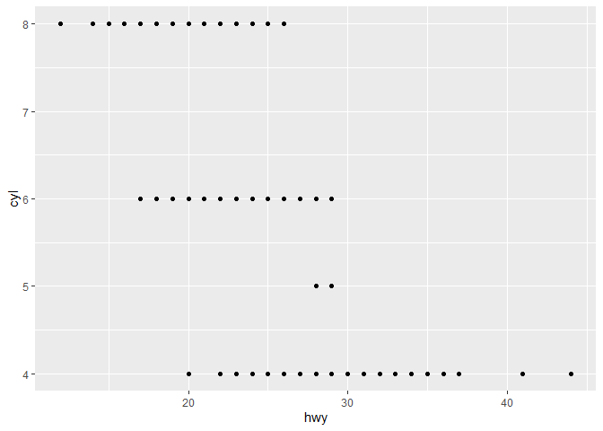

R4DS Study Group - Week 1
================
Pierrette Lo
4/7/2020

## This week’s assignment

  - Chapter 1 (Welcome - Introduction)
  - Chapter 2 (Explore - Introduction)
  - Chapter 3.1 - 3.2 (First Steps)

### Notes

On typing code:

  - It’s good practice to type in code yourself, rather than just
    copying & pasting
  - Certain things will autofill, e.g. (), "", etc. while you’re typing
  - Tooltips will show when you start to type a function
  - Pop-up suggestions may also show – you can select using up/down
    arrow and Enter
  - You can insert line breaks in your code to make it more readable.
    Hit Enter to start a new line, and the prompt will change from \> to
    +

RStudio “dark mode”:

  - Tools \> Global options \> Appearance

R vocabulary:

  - Dataframe = table; tibble = dataframe with special features
  - Objects and variables = nouns
  - Functions = verbs

How to read a Help page:

  - e.g. `?mpg`
  - Title: short description
  - Description: more detail
  - Usage: what to type
  - Format (for datasets): what is in the dataset
  - Arguments (required vs default): what are the options you can use
    with the function
  - Details: more about how the function works
  - Value: what is the output of the function
  - Examples

### Following along with Chapter 3 text

Load tidyverse (you’ll see several warning messages that can be
ignored):

``` r
library(tidyverse)
```

    ## Warning: package 'tidyverse' was built under R version 3.6.1

    ## -- Attaching packages -- tidyverse 1.3.0 --

    ## v ggplot2 3.2.1     v purrr   0.3.3
    ## v tibble  3.0.0     v dplyr   0.8.3
    ## v tidyr   1.0.0     v stringr 1.4.0
    ## v readr   1.3.1     v forcats 0.4.0

    ## Warning: package 'ggplot2' was built under R version 3.6.1

    ## Warning: package 'tibble' was built under R version 3.6.3

    ## Warning: package 'tidyr' was built under R version 3.6.1

    ## Warning: package 'purrr' was built under R version 3.6.1

    ## Warning: package 'dplyr' was built under R version 3.6.1

    ## -- Conflicts ----- tidyverse_conflicts() --
    ## x dplyr::filter() masks stats::filter()
    ## x dplyr::lag()    masks stats::lag()

Take a look at the built-in `mpg` dataset:

``` r
mpg
```

    ## # A tibble: 234 x 11
    ##    manufacturer model    displ  year   cyl trans   drv     cty   hwy fl    class
    ##    <chr>        <chr>    <dbl> <int> <int> <chr>   <chr> <int> <int> <chr> <chr>
    ##  1 audi         a4         1.8  1999     4 auto(l~ f        18    29 p     comp~
    ##  2 audi         a4         1.8  1999     4 manual~ f        21    29 p     comp~
    ##  3 audi         a4         2    2008     4 manual~ f        20    31 p     comp~
    ##  4 audi         a4         2    2008     4 auto(a~ f        21    30 p     comp~
    ##  5 audi         a4         2.8  1999     6 auto(l~ f        16    26 p     comp~
    ##  6 audi         a4         2.8  1999     6 manual~ f        18    26 p     comp~
    ##  7 audi         a4         3.1  2008     6 auto(a~ f        18    27 p     comp~
    ##  8 audi         a4 quat~   1.8  1999     4 manual~ 4        18    26 p     comp~
    ##  9 audi         a4 quat~   1.8  1999     4 auto(l~ 4        16    25 p     comp~
    ## 10 audi         a4 quat~   2    2008     4 manual~ 4        20    28 p     comp~
    ## # ... with 224 more rows

Look at the help page for `mpg`:

``` r
?mpg
```

Run the code to make a plot:

``` r
ggplot(data = mpg) + 
  geom_point(mapping = aes(x = displ, y = hwy))
```

<!-- -->

### Chapter 3 exercises

See
<https://jrnold.github.io/r4ds-exercise-solutions/data-visualisation.html>
for more detailed solutions.

1.  Run `ggplot(data = mpg)`. What do you see?

<!-- end list -->

``` r
ggplot(data = mpg)
```

<!-- -->

Just an empty plot - the other components haven’t been specified yet.

2.  How many rows are in `mpg`? How many columns?

<!-- end list -->

``` r
mpg
```

    ## # A tibble: 234 x 11
    ##    manufacturer model    displ  year   cyl trans   drv     cty   hwy fl    class
    ##    <chr>        <chr>    <dbl> <int> <int> <chr>   <chr> <int> <int> <chr> <chr>
    ##  1 audi         a4         1.8  1999     4 auto(l~ f        18    29 p     comp~
    ##  2 audi         a4         1.8  1999     4 manual~ f        21    29 p     comp~
    ##  3 audi         a4         2    2008     4 manual~ f        20    31 p     comp~
    ##  4 audi         a4         2    2008     4 auto(a~ f        21    30 p     comp~
    ##  5 audi         a4         2.8  1999     6 auto(l~ f        16    26 p     comp~
    ##  6 audi         a4         2.8  1999     6 manual~ f        18    26 p     comp~
    ##  7 audi         a4         3.1  2008     6 auto(a~ f        18    27 p     comp~
    ##  8 audi         a4 quat~   1.8  1999     4 manual~ 4        18    26 p     comp~
    ##  9 audi         a4 quat~   1.8  1999     4 auto(l~ 4        16    25 p     comp~
    ## 10 audi         a4 quat~   2    2008     4 manual~ 4        20    28 p     comp~
    ## # ... with 224 more rows

Typing name of dataset - first line of output tells you number of rows x
columns

Or you can try the below functions to summarize or count rows and
columns

``` r
structure(mpg)
glimpse(mpg)
nrow(mpg)
ncol(mpg)
```

3.  What does the `drv` variable describe? Read the help for `?mpg` to
    find out.

<!-- end list -->

``` r
?mpg
```

drv = drive system of car

Categorical variable = finite number of categories/groups, not
necessarily ordered

Continuous variable = infinite number of possible values (e.g. numbers,
time)

4.  Make a scatterplot of `hwy` vs `cyl`.

<!-- end list -->

``` r
ggplot(data = mpg) +
  geom_point(mapping = aes(x = hwy, y = cyl))
```

<!-- -->

5.  What happens if you make a scatterplot of `class` vs `drv`? Why is
    the plot not useful?

<!-- end list -->

``` r
ggplot(data = mpg) +
  geom_point(mapping = aes(x = class, y = drv))
```

<!-- -->

Both `class` and `drv` are categorical - the scatterplot only tells you
when the categories overlap, but not how many datapoints are in each.

See solutions manual for examples of better ways to visualize 2
categorical variables.
