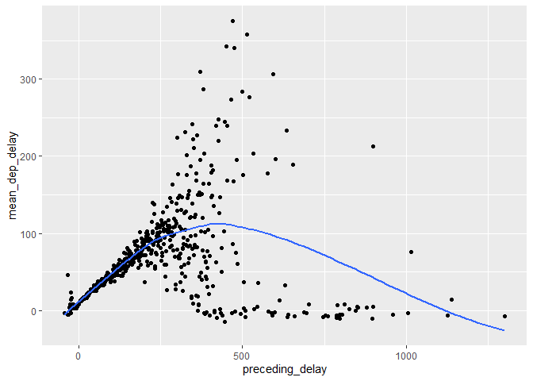
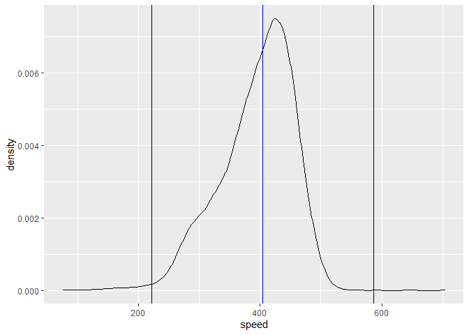

R4DS Study Group - Week 10
================
Pierrette Lo
6/12/2020

  - [This week’s assignment](#this-weeks-assignment)
  - [Ch 5:6 Summarize (cont’d)](#ch-56-summarize-contd)
  - [Ch 5:7 Grouped mutates & filters](#ch-57-grouped-mutates-filters)

## This week’s assignment

  - The rest of Chapter 5 (5.5 through 5.7)

<!-- end list -->

``` r
library(tidyverse)
library(nycflights13)
```

## Ch 5:6 Summarize (cont’d)

> 5.  Which carrier has the worst delays? Challenge: can you disentangle
>     the effects of bad airports vs. bad carriers? Why/why not? (Hint:
>     think about `flights %>% group_by(carrier, dest) %>%
>     summarise(n())`)

  - Assume “delayed” = arriving 15+ min late
  - Assume “worst” = largest average arrival delay (could also do
    proportion of flights with arrival delays \>= 15 min, for example)
  - Left join with `airlines` dataframe to get carrier names

<!-- end list -->

``` r
flights %>%
  group_by(carrier) %>% 
  summarize(avg_arr_delay = mean(arr_delay, na.rm = T)) %>% 
  arrange(desc(avg_arr_delay)) %>% 
  ungroup() %>% 
  left_join(airlines, by = "carrier") %>% 
  select(-carrier)
```

    ## # A tibble: 16 x 2
    ##    avg_arr_delay name                       
    ##            <dbl> <chr>                      
    ##  1        21.9   Frontier Airlines Inc.     
    ##  2        20.1   AirTran Airways Corporation
    ##  3        15.8   ExpressJet Airlines Inc.   
    ##  4        15.6   Mesa Airlines Inc.         
    ##  5        11.9   SkyWest Airlines Inc.      
    ##  6        10.8   Envoy Air                  
    ##  7         9.65  Southwest Airlines Co.     
    ##  8         9.46  JetBlue Airways            
    ##  9         7.38  Endeavor Air Inc.          
    ## 10         3.56  United Air Lines Inc.      
    ## 11         2.13  US Airways Inc.            
    ## 12         1.76  Virgin America             
    ## 13         1.64  Delta Air Lines Inc.       
    ## 14         0.364 American Airlines Inc.     
    ## 15        -6.92  Hawaiian Airlines Inc.     
    ## 16        -9.93  Alaska Airlines Inc.

What about the effect of airports? Could be the origin or the
destination airports (or both) causing delays -\> try comparing delays
by route (origin + dest)?

Average delay per carrier per route:

``` r
(carrier_route_delays <- flights %>% 
  group_by(carrier, origin, dest) %>% 
  summarize(avg_arr_delay = mean(arr_delay, na.rm = T)) %>% 
  arrange(desc(avg_arr_delay)) %>% 
  ungroup() %>% 
  left_join(airlines, by = "carrier") %>% 
  select(name, everything(), -carrier))
```

    ## # A tibble: 439 x 4
    ##    name                     origin dest  avg_arr_delay
    ##    <chr>                    <chr>  <chr>         <dbl>
    ##  1 ExpressJet Airlines Inc. JFK    ATL           128  
    ##  2 ExpressJet Airlines Inc. LGA    XNA           119  
    ##  3 United Air Lines Inc.    EWR    STL           110  
    ##  4 SkyWest Airlines Inc.    LGA    ORD           107  
    ##  5 Endeavor Air Inc.        LGA    MSP           100  
    ##  6 ExpressJet Airlines Inc. LGA    MSY            72.5
    ##  7 SkyWest Airlines Inc.    EWR    DTW            68.5
    ##  8 ExpressJet Airlines Inc. LGA    ATL            63  
    ##  9 United Air Lines Inc.    EWR    RDU            56  
    ## 10 ExpressJet Airlines Inc. EWR    CAE            44.6
    ## # ... with 429 more rows

I’m not sure how to parse this in a useful manner, with so many
combinations.

My idea was to list the rows with the greatest average delay for each
route:

``` r
carrier_route_delays %>% 
  group_by(origin, dest) %>% 
  top_n(1, avg_arr_delay) %>% 
  arrange(origin, dest)
```

    ## # A tibble: 223 x 4
    ## # Groups:   origin, dest [223]
    ##    name                     origin dest  avg_arr_delay
    ##    <chr>                    <chr>  <chr>         <dbl>
    ##  1 ExpressJet Airlines Inc. EWR    ALB           14.4 
    ##  2 United Air Lines Inc.    EWR    ANC           -2.5 
    ##  3 ExpressJet Airlines Inc. EWR    ATL           19.5 
    ##  4 United Air Lines Inc.    EWR    AUS            4.28
    ##  5 ExpressJet Airlines Inc. EWR    AVL            8.80
    ##  6 United Air Lines Inc.    EWR    BDL           22.6 
    ##  7 ExpressJet Airlines Inc. EWR    BNA           17.7 
    ##  8 JetBlue Airways          EWR    BOS            6.87
    ##  9 United Air Lines Inc.    EWR    BQN           10.9 
    ## 10 ExpressJet Airlines Inc. EWR    BTV           12.2 
    ## # ... with 213 more rows

I also realized that we should perhaps have filtered for `arr_delay > 0`
since flights that arrive early aren’t that problematic.

In case you’re interested, the solutions manual linked to an interesting
[article](https://fivethirtyeight.com/features/the-best-and-worst-airlines-airports-and-flights-summer-2015-update/)
on FiveThirtyEight that ran this analysis on airlines/airports across
the US, using the same raw data source that the `nycflights13` data came
from.

> 6.  What does the `sort` argument to `count()` do? When might you use
>     it?

`sort = T` sorts the output of count in descending order. It’s the
equivalent of `count()` followed by `arrange(desc())`.

## Ch 5:7 Grouped mutates & filters

### Notes:

  - A “vignette” is part of the documentation for a package. It is
    usually longer and more user-friendly than the “help” manual, and
    might provide a detailed example, or explain the workings behind a
    particular aspect of the package. There may be more than one
    vignette per package.

  - See what vignettes are available for a package using
    `browseVignettes("packageName")`

  - Here is the link to the vignette on window functions mentioned in
    the text:
    <https://cran.r-project.org/web/packages/dplyr/vignettes/window-functions.html>

  - Filtering expressions are computed *within groups*, so the results
    may be different on grouped vs. ungrouped data

Example - grouped:

  - group flights by destination
  - filter for destinations where `mean(dep_delay)` was \>30 min
  - `filter` calculates `mean(dep_delay)` for each destination group
  - listing the `distinct` destinations returns 3 airports

<!-- end list -->

``` r
flights %>% 
  group_by(dest) %>% 
  filter(mean(dep_delay, na.rm = T) > 30) %>% 
  distinct(dest)
```

    ## # A tibble: 3 x 1
    ## # Groups:   dest [3]
    ##   dest 
    ##   <chr>
    ## 1 TUL  
    ## 2 OKC  
    ## 3 CAE

Example - ungrouped:

  - no grouping
  - filter does not return any results because the mean(dep\_delay) for
    the entire dataset is 12.6 min

<!-- end list -->

``` r
flights %>% 
  filter(mean(dep_delay, na.rm=T) > 30) %>% 
  distinct(dest)
```

    ## # A tibble: 0 x 1
    ## # ... with 1 variable: dest <chr>

### Exercises

> 1.  Refer back to the lists of useful mutate and filtering functions.
>     Describe how each operation changes when you combine it with
>     grouping.

The [solutions
manual](https://jrnold.github.io/r4ds-exercise-solutions/transform.html#exercise-5.7.1)
has a comprehensive list of functions and how they behave with grouping,
along with examples comparing grouped vs. non-grouped data.

Functions affected by grouping:

  - Summary functions (mean, median, sum, std, etc.)
  - Offset functions (lead, lag)
  - Cumulative & rolling aggregate functions (cumsum, cumprod, etc.)
  - Ranking functions (min\_rank, row\_number, etc.)

Functions not affected by grouping:

  - Arithmetic operators (+, -, \*, /, ^)
  - Logical operators (\<, \>, ==, \!=)
  - Modular arithmetic operators (%/%, %%)
  - Log functions (log, log10, log2)
  - `arrange()`

> 2.  Which plane (`tailnum`) has the worst on-time record?

Based on mean arr\_delay:

``` r
flights %>% 
  group_by(tailnum) %>% 
  summarize(mean_arr_delay = mean(arr_delay, na.rm = T)) %>% 
  arrange(desc(mean_arr_delay))
```

    ## # A tibble: 4,044 x 2
    ##    tailnum mean_arr_delay
    ##    <chr>            <dbl>
    ##  1 N844MH            320 
    ##  2 N911DA            294 
    ##  3 N922EV            276 
    ##  4 N587NW            264 
    ##  5 N851NW            219 
    ##  6 N928DN            201 
    ##  7 N7715E            188 
    ##  8 N654UA            185 
    ##  9 N665MQ            175.
    ## 10 N427SW            157 
    ## # ... with 4,034 more rows

The [solutions
manual](https://jrnold.github.io/r4ds-exercise-solutions/transform.html#exercise-5.7.2)
also suggests that “on time” could be defined by proportion of flights
not delayed or cancelled.

It also suggests that you get a more robust answer by only looking at
planes that flew \>= 20 flights.

> 3.  What time of day should you fly if you want to avoid delays as
>     much as possible?

``` r
flights %>% 
  mutate(time_of_day = case_when(
    between(dep_time, 1, 600) ~ "early_morning",
    between(dep_time, 601, 1200) ~ "late_morning",
    between(dep_time, 1201, 1800) ~ "afternoon",
    between(dep_time, 1801, 2400) ~ "evening")
    ) %>%
  group_by(time_of_day) %>% 
  summarize(mean_arr_delay = mean(arr_delay, na.rm = T))
```

    ## # A tibble: 5 x 2
    ##   time_of_day   mean_arr_delay
    ##   <chr>                  <dbl>
    ## 1 afternoon               6.00
    ## 2 early_morning          10.4 
    ## 3 evening                24.8 
    ## 4 late_morning           -3.67
    ## 5 <NA>                  NaN

Looks like late morning flights have the least delay.

Or, as described in the
[solutions](https://jrnold.github.io/r4ds-exercise-solutions/transform.html#exercise-5.7.3),
you can get more granular and break it down by hour:

``` r
flights %>% 
  group_by(hour) %>% 
  summarize(mean_arr_delay = mean(arr_delay, na.rm = T)) %>% 
  arrange(mean_arr_delay)
```

    ## # A tibble: 20 x 2
    ##     hour mean_arr_delay
    ##    <dbl>          <dbl>
    ##  1     7         -5.30 
    ##  2     5         -4.80 
    ##  3     6         -3.38 
    ##  4     9         -1.45 
    ##  5     8         -1.11 
    ##  6    10          0.954
    ##  7    11          1.48 
    ##  8    12          3.49 
    ##  9    13          6.54 
    ## 10    14          9.20 
    ## 11    23         11.8  
    ## 12    15         12.3  
    ## 13    16         12.6  
    ## 14    18         14.8  
    ## 15    22         16.0  
    ## 16    17         16.0  
    ## 17    19         16.7  
    ## 18    20         16.7  
    ## 19    21         18.4  
    ## 20     1        NaN

7 am seems to be the best time to travel. The top 5 times are all late
morning (6 am-12 pm), so that agrees with the first solution.

> 4.  For each destination, compute the total minutes of delay. For each
>     flight, compute the proportion of the total delay for its
>     destination.

Assuming a “flight” is one observation (ie. one row):

``` r
flights %>% 
  filter(arr_delay > 0) %>% 
  group_by(dest) %>% 
  mutate(total_delay = sum(arr_delay),
         prop_delay = arr_delay/total_delay) %>% 
  arrange(dest, desc(prop_delay))
```

    ## # A tibble: 133,004 x 21
    ## # Groups:   dest [103]
    ##     year month   day dep_time sched_dep_time dep_delay arr_time sched_arr_time
    ##    <int> <int> <int>    <int>          <int>     <dbl>    <int>          <int>
    ##  1  2013     7    22     2145           2007        98      132           2259
    ##  2  2013    12    14     2223           2001       142      133           2304
    ##  3  2013    10    15     2146           2001       105      106           2248
    ##  4  2013     7    23     2206           2007       119      116           2259
    ##  5  2013    12    17     2220           2001       139      120           2304
    ##  6  2013     7    10     2025           2007        18      105           2259
    ##  7  2013     7    30     2212           2007       125       57           2259
    ##  8  2013     7    28     2038           2007        31       56           2259
    ##  9  2013    12     8     2049           2001        48       58           2304
    ## 10  2013     9     2     2212           2007       125       48           2259
    ## # ... with 132,994 more rows, and 13 more variables: arr_delay <dbl>,
    ## #   carrier <chr>, flight <int>, tailnum <chr>, origin <chr>, dest <chr>,
    ## #   air_time <dbl>, distance <dbl>, hour <dbl>, minute <dbl>, time_hour <dttm>,
    ## #   total_delay <dbl>, prop_delay <dbl>

Note: Even though you have grouped by destination, you still need to
arrange by destination, otherwise arrange() will sort `prop_delay` over
the entire dataset.

See
[solutions](https://jrnold.github.io/r4ds-exercise-solutions/transform.html#exercise-5.7.4)
for an alternative where a “flight” is defined as destination + origin +
carrier + flight number.

> 5.  Delays are typically temporally correlated: even once the problem
>     that caused the initial delay has been resolved, later flights are
>     delayed to allow earlier flights to leave. Using lag(), explore
>     how the delay of a flight is related to the delay of the
>     immediately preceding flight.

Data wrangling:

  - Note that you have to `arrange()` before `group_by()` since
    `arrange()` acts on the entire dataset
  - Group by `origin`, since only flights at same origin airport can
    affect each other
  - Create new column that lists the delay of the immediately preceding
    flight
  - Filter out rows where `dep_delay` or `preceding_delay` are NA

<!-- end list -->

``` r
delay_lag <- flights %>% 
  arrange(origin, month, day, dep_time) %>% 
  group_by(origin) %>% 
  mutate(preceding_delay = lag(dep_delay, n = 1)) %>% 
  filter(!is.na(dep_delay), !is.na(preceding_delay))
```

Then for each value of `preceding_delay`, calculate the mean `dep_delay`
and plot

``` r
delay_lag %>%
  group_by(preceding_delay) %>% 
  summarize(mean_dep_delay = mean(dep_delay)) %>% 
  ggplot(aes(x = preceding_delay, y = mean_dep_delay)) +
  geom_point() +
  geom_smooth(se = F)
```

    ## `geom_smooth()` using method = 'loess' and formula 'y ~ x'

<!-- -->

So preceding delay has a strong effect of increasing current delay for
delays \< 2 hours, then a weaker effect for delays 2-8 hours, then
pretty much no effect for the largest delays.

> 6.  Look at each destination. Can you find flights that are
>     suspiciously fast? (i.e. flights that represent a potential data
>     entry error). Compute the air time of a flight relative to the
>     shortest flight to that destination. Which flights were most
>     delayed in the air?

My approach was to create a new variable for speed (distance /
air\_time), and then find which values are outside +/- 3 sd of the mean.

``` r
flights_speed <- flights %>% 
  filter(!is.na(air_time)) %>% 
  mutate(speed = distance / (air_time / 60)) %>% 
  arrange(desc(speed))

# 404 mph - median is less sensitive to outliers than mean
median_speed <- median(flights_speed$speed)

# 61 mph
sd_speed <- sd(flights_speed$speed)
```

Visualize the data, with lines for mean and +/- 3 sd (99.7% of data)

``` r
flights_speed %>% 
  ggplot(aes(x = speed)) +
  geom_density() +
  geom_vline(aes(xintercept = median_speed), color = "blue") +
  geom_vline(aes(xintercept = median_speed - (sd_speed * 3))) +
  geom_vline(aes(xintercept = median_speed + (sd_speed * 3)))
```

<!-- -->

Now find flights outside of the 95% confidence interval:

``` r
flights_speed %>% 
  filter(speed > (median_speed + sd_speed * 3))
```

    ## # A tibble: 5 x 20
    ##    year month   day dep_time sched_dep_time dep_delay arr_time sched_arr_time
    ##   <int> <int> <int>    <int>          <int>     <dbl>    <int>          <int>
    ## 1  2013     5    25     1709           1700         9     1923           1937
    ## 2  2013     7     2     1558           1513        45     1745           1719
    ## 3  2013     5    13     2040           2025        15     2225           2226
    ## 4  2013     3    23     1914           1910         4     2045           2043
    ## 5  2013     1    12     1559           1600        -1     1849           1917
    ## # ... with 12 more variables: arr_delay <dbl>, carrier <chr>, flight <int>,
    ## #   tailnum <chr>, origin <chr>, dest <chr>, air_time <dbl>, distance <dbl>,
    ## #   hour <dbl>, minute <dbl>, time_hour <dttm>, speed <dbl>

This doesn’t necessarily mean there was a data entry error, but it’s a
good place to start investigating. None of these flights really seem
that much faster than the typical cruising airspeed for a long-distance
commercial passenger aircraft, which according to Google is 547-575 mph.

Calculate air time of flight relative to shortest flight to that
destination. Which flights were most delayed in the air?

``` r
flights %>% 
  group_by(origin, dest) %>% 
  mutate(shortest_air_time = min(air_time, na.rm = T),
         air_time_delay = air_time - shortest_air_time,
         air_time_delay_percent = (air_time_delay / shortest_air_time) * 100) %>% 
  arrange(desc(air_time_delay_percent))
```

    ## Warning in min(air_time, na.rm = T): no non-missing arguments to min; returning
    ## Inf

    ## # A tibble: 336,776 x 22
    ## # Groups:   origin, dest [224]
    ##     year month   day dep_time sched_dep_time dep_delay arr_time sched_arr_time
    ##    <int> <int> <int>    <int>          <int>     <dbl>    <int>          <int>
    ##  1  2013     6    17     1652           1700        -8     1856           1815
    ##  2  2013     6    10     1356           1300        56     1646           1414
    ##  3  2013     6    29      755            800        -5     1035            909
    ##  4  2013     6    24     1932           1920        12     2228           2047
    ##  5  2013     7    23     1617           1605        12     1833           1740
    ##  6  2013     3    12     1607           1500        67     1803           1608
    ##  7  2013     1    21     1851           1900        -9     2034           2012
    ##  8  2013     6    10     1429           1400        29     1650           1512
    ##  9  2013     7    23     1200           1200         0     1428           1317
    ## 10  2013     5    21     1709           1700         9     1937           1819
    ## # ... with 336,766 more rows, and 14 more variables: arr_delay <dbl>,
    ## #   carrier <chr>, flight <int>, tailnum <chr>, origin <chr>, dest <chr>,
    ## #   air_time <dbl>, distance <dbl>, hour <dbl>, minute <dbl>, time_hour <dttm>,
    ## #   shortest_air_time <dbl>, air_time_delay <dbl>, air_time_delay_percent <dbl>

The most delayed flight relative to the shortest possible flight was
US2136 from LGA to BOS. It took 410% longer than the shortest flight on
that route.

See the [solutions
manual](https://jrnold.github.io/r4ds-exercise-solutions/transform.html#exercise-5.7.6)
for a much more detailed response.

> 7.  Find all destinations that are flown by at least two carriers. Use
>     that information to rank the carriers.

1.  Get airports that are flown to by \>=2 carriers
2.  Rank carriers that fly to the most destinations (assuming that’s
    what they meant by “rank” - it wasn’t clear)
3.  Bring in full names from `airlines` dataframe

<!-- end list -->

``` r
flights %>% 
  group_by(dest) %>% 
  mutate(n_carriers = n_distinct(carrier)) %>% 
  filter(n_carriers >= 2) %>% 
  group_by(carrier) %>% 
  summarize(n_dests = n_distinct(dest)) %>% 
  arrange(desc(n_dests)) %>% 
  left_join(airlines, by = "carrier") %>% 
  select(carrier, name, n_dests)
```

    ## # A tibble: 16 x 3
    ##    carrier name                        n_dests
    ##    <chr>   <chr>                         <int>
    ##  1 EV      ExpressJet Airlines Inc.         51
    ##  2 9E      Endeavor Air Inc.                48
    ##  3 UA      United Air Lines Inc.            42
    ##  4 DL      Delta Air Lines Inc.             39
    ##  5 B6      JetBlue Airways                  35
    ##  6 AA      American Airlines Inc.           19
    ##  7 MQ      Envoy Air                        19
    ##  8 WN      Southwest Airlines Co.           10
    ##  9 OO      SkyWest Airlines Inc.             5
    ## 10 US      US Airways Inc.                   5
    ## 11 VX      Virgin America                    4
    ## 12 YV      Mesa Airlines Inc.                3
    ## 13 FL      AirTran Airways Corporation       2
    ## 14 AS      Alaska Airlines Inc.              1
    ## 15 F9      Frontier Airlines Inc.            1
    ## 16 HA      Hawaiian Airlines Inc.            1

> 8.  For each plane, count the number of flights before the first delay
>     of greater than 1 hour.

This question was really confusing to me. I didn’t understand the
purpose and went down a completely wrong path, and then spent forever
trying to understand the solutions
([here](https://jrnold.github.io/r4ds-exercise-solutions/transform.html#exercise-5.7.8)
and
[here](https://brshallo.github.io/r4ds_solutions/05-data-transformations.html#grouped-mutates)).

The basic purpose of this question is to learn how to use the `cumsum()`
function. This function records the cumulative sum as you go down a
column. If the column is numeric, it will add up the numbers. If you
give it a logical condition, it will sum the rows where condition = T
(ie. 1), so it’s like counting cumulative number of rows.

You can use this to set up a “counter” with the condition `dep_delay` \>
60, so each row with `dep_delay` \< 60 gets a 0, until it encounters a
`dep_delay` \> 60 and gives it a 1.

Then filter for `flight_counter == 0`, which gives you all the rows
where dep\_delay was 60 or less, then count the rows.

``` r
flights %>%
  select(tailnum, month, day, dep_time, dep_delay) %>% 
  filter(!is.na(dep_delay)) %>% 
  arrange(tailnum, month, day, dep_time) %>% 
  group_by(tailnum) %>% 
  mutate(flight_counter = cumsum(dep_delay > 60)) %>% 
  filter(flight_counter == 0) %>% 
  summarise(n_flights = n())
```

    ## # A tibble: 3,803 x 2
    ##    tailnum n_flights
    ##    <chr>       <int>
    ##  1 N0EGMQ         53
    ##  2 N10156          9
    ##  3 N102UW         25
    ##  4 N103US         46
    ##  5 N104UW          3
    ##  6 N105UW         22
    ##  7 N107US         20
    ##  8 N108UW         36
    ##  9 N109UW         48
    ## 10 N110UW         15
    ## # ... with 3,793 more rows
