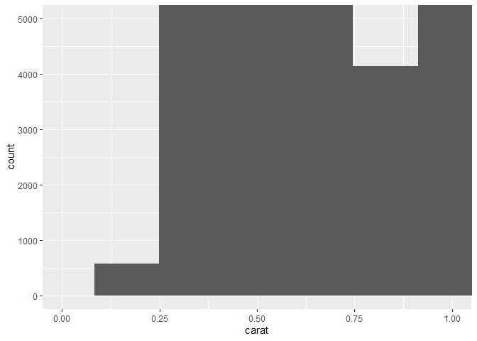
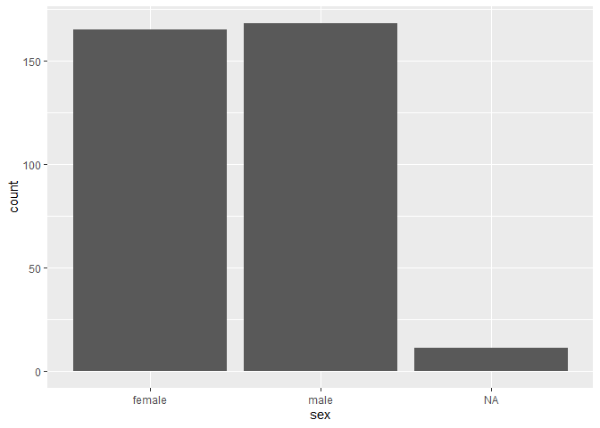

R4DS Study Group - Week 14
================
Pierrette Lo
7/10/2020

  - [This week’s assignment](#this-weeks-assignment)
  - [Ch 7:3 Variation](#ch-73-variation)
  - [Ch 7:4 Missing values](#ch-74-missing-values)

## This week’s assignment

  - Chapter 7.1-7.4

<!-- end list -->

``` r
library(tidyverse)
```

### Notes

  - The [{skimr}](https://github.com/ropensci/skimr) package is super
    useful for EDA, with more summary statistics in a nicer format than
    with `summary()`.

  - Bonus: check out the new [Palmer
    Penguins](https://github.com/allisonhorst/palmerpenguins) dataset -
    packaged by Alison Horst, who also created some fun artwork to go
    with it.

<!-- end list -->

``` r
# install {palmerpenguins} before using for the first time using the command below:
# remotes::install_github("allisonhorst/palmerpenguins")

library(palmerpenguins)

# take a look at first few rows of the data

head(penguins)
```

    ## # A tibble: 6 x 7
    ##   species island bill_length_mm bill_depth_mm flipper_length_~ body_mass_g sex  
    ##   <fct>   <fct>           <dbl>         <dbl>            <int>       <int> <fct>
    ## 1 Adelie  Torge~           39.1          18.7              181        3750 male 
    ## 2 Adelie  Torge~           39.5          17.4              186        3800 fema~
    ## 3 Adelie  Torge~           40.3          18                195        3250 fema~
    ## 4 Adelie  Torge~           NA            NA                 NA          NA <NA> 
    ## 5 Adelie  Torge~           36.7          19.3              193        3450 fema~
    ## 6 Adelie  Torge~           39.3          20.6              190        3650 male

Then get summary statistics with {skimr}

``` r
library(skimr)
```

    ## Warning: package 'skimr' was built under R version 3.6.3

``` r
skim(penguins)
```

|                                                  |          |
| :----------------------------------------------- | :------- |
| Name                                             | penguins |
| Number of rows                                   | 344      |
| Number of columns                                | 7        |
| \_\_\_\_\_\_\_\_\_\_\_\_\_\_\_\_\_\_\_\_\_\_\_   |          |
| Column type frequency:                           |          |
| factor                                           | 3        |
| numeric                                          | 4        |
| \_\_\_\_\_\_\_\_\_\_\_\_\_\_\_\_\_\_\_\_\_\_\_\_ |          |
| Group variables                                  | None     |

Data summary

**Variable type: factor**

| skim\_variable | n\_missing | complete\_rate | ordered | n\_unique | top\_counts                 |
| :------------- | ---------: | -------------: | :------ | --------: | :-------------------------- |
| species        |          0 |           1.00 | FALSE   |         3 | Ade: 152, Gen: 124, Chi: 68 |
| island         |          0 |           1.00 | FALSE   |         3 | Bis: 168, Dre: 124, Tor: 52 |
| sex            |         11 |           0.97 | FALSE   |         2 | mal: 168, fem: 165          |

**Variable type: numeric**

| skim\_variable      | n\_missing | complete\_rate |    mean |     sd |     p0 |     p25 |     p50 |    p75 |   p100 | hist  |
| :------------------ | ---------: | -------------: | ------: | -----: | -----: | ------: | ------: | -----: | -----: | :---- |
| bill\_length\_mm    |          2 |           0.99 |   43.92 |   5.46 |   32.1 |   39.23 |   44.45 |   48.5 |   59.6 | ▃▇▇▆▁ |
| bill\_depth\_mm     |          2 |           0.99 |   17.15 |   1.97 |   13.1 |   15.60 |   17.30 |   18.7 |   21.5 | ▅▅▇▇▂ |
| flipper\_length\_mm |          2 |           0.99 |  200.92 |  14.06 |  172.0 |  190.00 |  197.00 |  213.0 |  231.0 | ▂▇▃▅▂ |
| body\_mass\_g       |          2 |           0.99 | 4201.75 | 801.95 | 2700.0 | 3550.00 | 4050.00 | 4750.0 | 6300.0 | ▃▇▆▃▂ |

## Ch 7:3 Variation

### Notes

  - *categorical* variable = bar chart
  - *continuous* variable = histogram
  - use `binwidth` in `ggplot()` and `cut_width()` in `count()` to bin a
    continuous variable into discrete intervals.

Example:

``` r
# without cut_width - get count for every possible value of carat

diamonds %>% 
  count(carat)
```

    ## # A tibble: 273 x 2
    ##    carat     n
    ##    <dbl> <int>
    ##  1 0.2      12
    ##  2 0.21      9
    ##  3 0.22      5
    ##  4 0.23    293
    ##  5 0.24    254
    ##  6 0.25    212
    ##  7 0.26    253
    ##  8 0.27    233
    ##  9 0.28    198
    ## 10 0.290   130
    ## # ... with 263 more rows

``` r
# with cut_width - more manageable number of groups

diamonds %>% 
  count(cut_width(carat, 0.5))
```

    ## # A tibble: 11 x 2
    ##    `cut_width(carat, 0.5)`     n
    ##    <fct>                   <int>
    ##  1 [-0.25,0.25]              785
    ##  2 (0.25,0.75]             29498
    ##  3 (0.75,1.25]             15977
    ##  4 (1.25,1.75]              5313
    ##  5 (1.75,2.25]              2002
    ##  6 (2.25,2.75]               322
    ##  7 (2.75,3.25]                32
    ##  8 (3.25,3.75]                 5
    ##  9 (3.75,4.25]                 4
    ## 10 (4.25,4.75]                 1
    ## 11 (4.75,5.25]                 1

`geom_freqpoly()` gives you a histogram with lines instead of bars -
better for comparing different groups

``` r
# bars

diamonds %>% 
  ggplot(aes(x = carat, fill = cut)) +
  geom_histogram()
```

    ## `stat_bin()` using `bins = 30`. Pick better value with `binwidth`.

<!-- -->

``` r
# lines

diamonds %>% 
  ggplot(aes(x = carat, colour = cut)) +
  geom_freqpoly()
```

    ## `stat_bin()` using `bins = 30`. Pick better value with `binwidth`.

<!-- -->

### Exercises

> 1.  Explore the distribution of each of the `x`, `y`, and `z`
>     variables in diamonds. What do you learn? Think about a diamond
>     and how you might decide which dimension is the length, width, and
>     depth.

A simple summary:

``` r
diamonds %>% 
  select(x:z) %>% 
  summary()
```

    ##        x                y                z         
    ##  Min.   : 0.000   Min.   : 0.000   Min.   : 0.000  
    ##  1st Qu.: 4.710   1st Qu.: 4.720   1st Qu.: 2.910  
    ##  Median : 5.700   Median : 5.710   Median : 3.530  
    ##  Mean   : 5.731   Mean   : 5.735   Mean   : 3.539  
    ##  3rd Qu.: 6.540   3rd Qu.: 6.540   3rd Qu.: 4.040  
    ##  Max.   :10.740   Max.   :58.900   Max.   :31.800

A more detailed summary using the {skimr} package:

``` r
skimr::skim(diamonds, x:z)
```

|                                                  |          |
| :----------------------------------------------- | :------- |
| Name                                             | diamonds |
| Number of rows                                   | 53940    |
| Number of columns                                | 10       |
| \_\_\_\_\_\_\_\_\_\_\_\_\_\_\_\_\_\_\_\_\_\_\_   |          |
| Column type frequency:                           |          |
| numeric                                          | 3        |
| \_\_\_\_\_\_\_\_\_\_\_\_\_\_\_\_\_\_\_\_\_\_\_\_ |          |
| Group variables                                  | None     |

Data summary

**Variable type: numeric**

| skim\_variable | n\_missing | complete\_rate | mean |   sd | p0 |  p25 |  p50 |  p75 |  p100 | hist  |
| :------------- | ---------: | -------------: | ---: | ---: | -: | ---: | ---: | ---: | ----: | :---- |
| x              |          0 |              1 | 5.73 | 1.12 |  0 | 4.71 | 5.70 | 6.54 | 10.74 | ▁▁▇▃▁ |
| y              |          0 |              1 | 5.73 | 1.14 |  0 | 4.72 | 5.71 | 6.54 | 58.90 | ▇▁▁▁▁ |
| z              |          0 |              1 | 3.54 | 0.71 |  0 | 2.91 | 3.53 | 4.04 | 31.80 | ▇▁▁▁▁ |

Observations:

  - According to the help (`?diamonds`), `x` = length, `y` = width, `z`
    = depth
  - Looking at the summary, `x` and `y` are very similar dimensions,
    whereas `z` is smaller (makes sense when you imagine the shape of a
    typical diamond)
  - Both `y` and `z` have max values (58.9 and 31.8, respectively) that
    look like they could be errors
  - The min values for all 3 variables are 0, which is probably also an
    error.

I also looked at the data graphically (see
[Chapter 12](https://r4ds.had.co.nz/tidy-data.html#pivoting) for info on
“pivoting” a table into a longer format):

``` r
diamonds %>% 
  pivot_longer(x:z, names_to = "dimension", values_to = "dim_in_mm") %>% 
  ggplot(aes(x = dim_in_mm)) +
  geom_histogram(binwidth = 0.1) +
  facet_wrap(~dimension, scales = "free")
```

<!-- -->

Observations:

  - The x-axis for `y` and `z` also indicate the presence of large
    outliers.

Let’s zoom in on the x-axis to get a better idea of variability between
these groups:

``` r
diamonds %>% 
  pivot_longer(x:z, names_to = "dimension", values_to = "dim_in_mm") %>% 
  ggplot(aes(x = dim_in_mm)) +
  geom_histogram(binwidth = 0.1) +
  facet_wrap(~dimension, scales = "free") +
  coord_cartesian(xlim = c(0, 10))
```

<!-- -->

  - It looks like `z` has the least variability, and again `x` and `y`
    are very similar once you remove the outliers.
  - The data look “spiky” - maybe because people tend to round to
    certain numbers instead of being precise?

> 2.  Explore the distribution of price. Do you discover anything
>     unusual or surprising? (Hint: Carefully think about the binwidth
>     and make sure you try a wide range of values.)

``` r
summary(diamonds$price)
```

    ##    Min. 1st Qu.  Median    Mean 3rd Qu.    Max. 
    ##     326     950    2401    3933    5324   18823

With smaller binwidths, you start to notice a gap around $1500 (this is
not apparent with larger binwidths).

``` r
diamonds %>% 
  ggplot(aes(x = price)) + 
  geom_histogram(binwidth = 500)
```

<!-- -->

``` r
diamonds %>% 
  ggplot(aes(x = price)) + 
  geom_histogram(binwidth = 100)
```

<!-- -->

``` r
diamonds %>% 
  ggplot(aes(x = price)) + 
  geom_histogram(binwidth = 10) +
  coord_cartesian(xlim = c(0, 2500))
```

<!-- -->

I dont know why there are no diamonds that cost $1500 - another error?

Also, if you decrease the binwidth further, the data again look “spiky”.
My theory is that there are certain numbers that people use for price
(e.g. ending in ‘99’) because it “looks better”.

> 3.  How many diamonds are 0.99 carat? How many are 1 carat? What do
>     you think is the cause of the difference?

``` r
diamonds %>% 
  ggplot(aes(x = carat)) +
  geom_histogram(binwidth = 0.01) +
  coord_cartesian(xlim = c(0.99, 1))
```

<!-- -->

There are almost no diamonds that are 0.99 carats. I assume this is
because people have a tendency to round up. It’s interesting to see how
a dataset consisting of hard numbers can still be so subjective\!

> 4.  Compare and contrast coord\_cartesian() vs xlim() or ylim() when
>     zooming in on a histogram. What happens if you leave binwidth
>     unset? What happens if you try and zoom so only half a bar shows?

  - Default binwidth is 30 if you don’t specify

  - `xlim()` and `ylim()` zoom in and remove data that fall outside the
    limits (you will get a warning message indicating how many data
    points were removed)

  - `coord_cartesian()` zooms in without removing data

  - `coord_cartesian()` calculates binwidths and counts first, then
    zooms in, so some bars may be cut off

  - `xlim()` and `ylim()` remove data *before* calculating binwidths and
    counts, so bars are never cut off

<!-- end list -->

``` r
diamonds %>% 
  ggplot(aes(x = carat)) +
  geom_histogram() +
  coord_cartesian(xlim = c(0, 1), ylim = c(0, 5000))
```

    ## `stat_bin()` using `bins = 30`. Pick better value with `binwidth`.

<!-- -->

``` r
diamonds %>% 
  ggplot(aes(x = carat)) +
  geom_histogram() +
  xlim(0, 1) +
  ylim(0, 5000)
```

    ## `stat_bin()` using `bins = 30`. Pick better value with `binwidth`.

    ## Warning: Removed 17502 rows containing non-finite values (stat_bin).

    ## Warning: Removed 3 rows containing missing values (geom_bar).

<!-- -->

## Ch 7:4 Missing values

### Exercises

> 1.  What happens to missing values in a histogram? What happens to
>     missing values in a bar chart? Why is there a difference?

I used the `penguins` dataset here because it contains missing values
(`diamonds` does not).

In a bar chart – which is used for categorical variables – NAs are
considered to be their own category.

``` r
penguins %>% 
  ggplot(aes(x = sex)) +
  geom_bar()
```

<!-- -->

In a histogram, the continuous `x` variable is first grouped into bins,
then the number of observations in each bin is counted. NAs don’t belong
in any of the bins, so they get dropped (note warning message telling
you how many data points were removed).

``` r
penguins %>% 
  ggplot(aes(x = flipper_length_mm)) +
  geom_histogram()
```

    ## `stat_bin()` using `bins = 30`. Pick better value with `binwidth`.

    ## Warning: Removed 2 rows containing non-finite values (stat_bin).

<!-- -->

> 2.  What does na.rm = TRUE do in mean() and sum()?

This argument is needed to ignore NAs when calculating the mean or sum.

Without `na.rm = TRUE`:

``` r
mean(penguins$flipper_length_mm)
```

    ## [1] NA

With `na.rm = TRUE`:

``` r
mean(penguins$flipper_length_mm, na.rm = TRUE)
```

    ## [1] 200.9152

As an aside, I just learned that using `T` and `F` instead of `TRUE` or
`FALSE` is bad practice\! `TRUE` (1) and `FALSE` (0) are “reserved” in
R, i.e. set in stone - you can’t edit them to have other values. You can
overwrite T and F and get some wacky results if you’ve forgotten you did
this. So always write out `TRUE` and `FALSE`. Sorry for misleading you
all before\!

``` r
T <- 5      # this works

T <- FALSE  # this also works

TRUE <- 5   # this doesn't
```

    ## Error in TRUE <- 5: invalid (do_set) left-hand side to assignment
