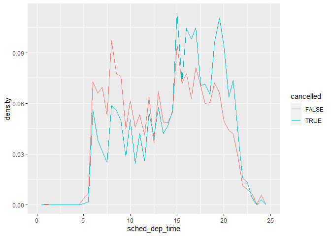

R4DS Study Group - Week 15
================
Pierrette Lo
7/17/2020

  - [This week’s assignment](#this-weeks-assignment)
  - [Ch 7:5 Covariation](#ch-75-covariation)

## This week’s assignment

  - Chapter 7.5-7.8

<!-- end list -->

``` r
library(tidyverse)
```

## Ch 7:5 Covariation

### Exercises - 7:5:1 Categorical + Continuous

> 1.  Use what you’ve learned to improve the visualisation of the
>     departure times of cancelled vs. non-cancelled flights.

  - I copied the below code from the text in section 7.4 and modified it
  - Remember you can use `::` to call a function from a package without
    loading the package
  - Note that performing `mutate()` on an existing column
    (e.g. `sched_dep_time` below) will change that column\! I prefer to
    make a new column with a different name to prevent confusion.

<!-- end list -->

``` r
nycflights13::flights %>% 
  mutate(
    cancelled = is.na(dep_time),
    sched_hour = sched_dep_time %/% 100,
    sched_min = sched_dep_time %% 100,
    sched_dep_time = sched_hour + sched_min / 60
  ) %>% 
  # ggplot(mapping = aes(sched_dep_time)) + 
  #   geom_freqpoly(mapping = aes(colour = cancelled), binwidth = 1/4)
  ggplot(aes(x = cancelled, y = sched_dep_time)) +
  geom_boxplot()
```

<!-- -->

This plot makes it more clear that cancelled flights tend to occur later
in the day.

> 2.  What variable in the diamonds dataset is most important for
>     predicting the price of a diamond? How is that variable correlated
>     with cut? Why does the combination of those two relationships lead
>     to lower quality diamonds being more expensive?

I decided to ignore `x`, `y`, `z`, `table`, and `depth` since they are
all measurements of size, and I think `carat` is the most widely used
size-related variable.

First plot the categorical variables (all ordered factors) vs. `price`.
(You could plot each separately, but I used `pivot_longer` to get them
all in one facetted plot.) (Also note that `pivot_longer` only works
with columns of the same data type, so I couldn’t include `carat`.)

``` r
diamonds %>% 
  select(cut, color, clarity, price) %>% 
  pivot_longer(cols = -price, names_to = "variable", values_to = "value") %>% 
  ggplot(aes(x = value, y = price)) +
  geom_boxplot() +
  facet_wrap(~ variable, scales = "free")
```

<!-- -->

Also plot continuous variable (`carat`) vs. `price`:

``` r
diamonds %>% 
  ggplot(aes(x = carat, y = price)) +
  geom_point() +
  geom_smooth(method = "lm", se = FALSE)
```

    ## `geom_smooth()` using formula 'y ~ x'

<!-- -->

It looks like carat has the strongest relationship with price.

Next, look at carat vs. cut:

``` r
diamonds %>% 
  ggplot(aes(x = cut, y = carat)) + 
  geom_boxplot()
```

<!-- -->

Looks like the diamonds with the worst cut (Fair) also tend to be the
biggest (i.e. most expensive), so that explains why if you just plot cut
vs. price, it looks like lower-quality diamonds cost more.

**BONUS:**

The {patchwork} package is super cool for arranging separate plots. Very
useful if you’re trying to make a figure for a paper.

Much more info [here](https://patchwork.data-imaginist.com/), but below
is a small example of using {patchwork} instead of my facetted plot
above.

``` r
library(patchwork)
```

    ## Warning: package 'patchwork' was built under R version 3.6.2

``` r
# Make separate plots and save them as objects

p1 <- diamonds %>% 
  ggplot(aes(x = carat, y = price)) +
  geom_point() +
  geom_smooth(method = "lm", se = FALSE)

p2 <- diamonds %>% 
  ggplot(aes(x = cut, y = price)) +
  geom_boxplot()

p3 <- diamonds %>% 
  ggplot(aes(x = color, y = price)) +
  geom_boxplot()

p4 <- diamonds %>% 
  ggplot(aes(x = clarity, y = price)) +
  geom_boxplot()

# Then arrange them using {patchwork} notation

p1 + (p2 / p3 / p4)
```

    ## `geom_smooth()` using formula 'y ~ x'

<!-- -->

> 3.  Install the ggstance package, and create a horizontal boxplot. How
>     does this compare to using coord\_flip()?

In older versions of {ggplot2}, the categorical variable for a bar or
box plot always needed to be on the x axis, and you would need to use
`coord_flip()` if you wanted to make the plot horizontal. However, in
these plots the vertical axis is still considered to be the x axis,
which could get confusing.

A recent update to {ggplot2} has removed this requirement, so you can
just plot the categorical variable on the y axis - no need for mental
gymnastics or installing a separate package.

``` r
# diamonds %>%
#   ggplot(aes(x = cut)) +
#   geom_bar() +
#   coord_flip()

diamonds %>% 
  ggplot(aes(y = cut)) + 
  geom_bar()
```

<!-- -->

> 4.  One problem with boxplots is that they were developed in an era of
>     much smaller datasets and tend to display a prohibitively large
>     number of “outlying values”. One approach to remedy this problem
>     is the letter value plot. Install the lvplot package, and try
>     using geom\_lv() to display the distribution of price vs cut. What
>     do you learn? How do you interpret the plots?

This package isn’t on CRAN, so you’ll need to install from GitHub
(instructions [here](https://github.com/hadley/lvplot)). You’ll also
need to have package {devtools} installed first.

The statistical methods are described in the help (`?geom_lv`).

``` r
# install.packages("devtools")
# devtools::install_github("hadley/lvplot")

library(lvplot)

diamonds %>% 
  ggplot(aes(x = cut, y = price)) +
  geom_lv(fill = "orange")
```

<!-- -->

> 5.  Compare and contrast geom\_violin() with a facetted
>     geom\_histogram(), or a coloured geom\_freqpoly(). What are the
>     pros and cons of each method?

Freqpoly makes it easier to compare different cuts for a specific price.
However it’s a bit difficult to interpret the overall differences. Using
`y = ..density..` helps a bit as it gives them the same scale
(proportions of 1).

``` r
diamonds %>% 
  ggplot(aes(x = price, y = ..density.., color = cut)) +
  geom_freqpoly()
```

    ## `stat_bin()` using `bins = 30`. Pick better value with `binwidth`.

<!-- -->

A violin plot is like a boxplot that shows density. Violin plots and
facetted histograms are better than freqpoly for comparing overall
distributions, but worse for trying to compare a specific price point.

``` r
diamonds %>% 
  ggplot(aes(x = cut, y = price)) +
  geom_violin()
```

<!-- -->

``` r
diamonds %>% 
  ggplot(aes(x = price, y = ..density..)) +
  geom_histogram() +
  facet_wrap(~ cut)
```

    ## `stat_bin()` using `bins = 30`. Pick better value with `binwidth`.

<!-- -->

> 6.  If you have a small dataset, it’s sometimes useful to use
>     geom\_jitter() to see the relationship between a continuous and
>     categorical variable. The ggbeeswarm package provides a number of
>     methods similar to geom\_jitter(). List them and briefly describe
>     what each one does.

Beeswarm plot is like a jittered scatterplot + violin plot.

Sample plots using {ggbeeswarm} can be found
[here](https://github.com/eclarke/ggbeeswarm)

It’s hard to see anything on these plots when the dataset is too large,
so I used `sample_n` to get a random sample (could also use
`sample_frac`):

``` r
# install.packages("ggbeeswarm")

library(ggbeeswarm)
```

    ## Warning: package 'ggbeeswarm' was built under R version 3.6.3

``` r
diamonds %>%
  sample_n(size = 1000) %>% 
  ggplot(aes(x = cut, y = price)) +
  geom_quasirandom(alpha = 0.5)
```

<!-- -->

Unrelated to beeswarm plots -

With a small-ish dataset, I like to use boxplot (with outliers hidden) +
scatterplot. I think the boxplot is more recognizable to scientists and
having the points gives more information about the distribution.

I also like to make the box width proportional to number of observations
in each category.

``` r
diamonds %>%
  sample_n(size = 500) %>% 
  ggplot(aes(x = cut, y = price)) +
  geom_boxplot(outlier.shape = NA, varwidth = TRUE, color = "darkred") +
  geom_jitter(alpha = 0.5, width = 0.2)
```

<!-- -->
