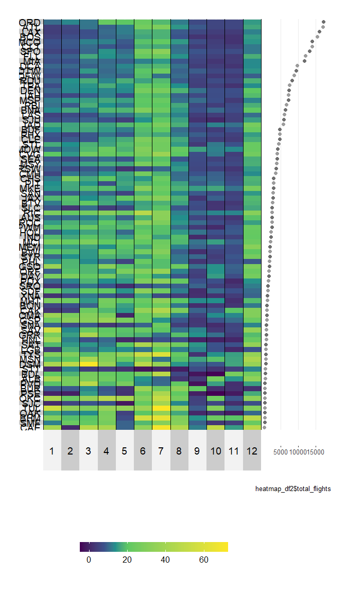

R4DS Study Group - Week 16
================
Pierrette Lo
7/24/2020

  - [This week’s assignment](#this-weeks-assignment)
  - [Ch 7:5 Covariation](#ch-75-covariation)

## This week’s assignment

  - Chapter 7.5-7.8

<!-- end list -->

``` r
library(tidyverse)
```

## Ch 7:5 Covariation

### Notes - 7:5:2 Categorical + Categorical

  - The [{seriation}](https://github.com/mhahsler/seriation) package
    mentioned in the text basically allows clustering of data in
    different ways, and then you can plot the clustered data with the
    visualization tool of your choice.
  - If you just want a heatmap with built-in functions for supervised or
    unsupervised clustering, I recommend
    [{pheatmap}](https://davetang.org/muse/2018/05/15/making-a-heatmap-in-r-with-the-pheatmap-package/)
    or [{superheat}](https://rlbarter.github.io/superheat/). These
    packages also allow you to add annotations or side plots.
  - {d3heatmap} (mentioned in the text) is no longer actively
    maintained. Try
    [{heatmaply}](https://github.com/talgalili/heatmaply) for
    interactive heatmaps

### Exercises

> 1.  How could you rescale the count dataset above to more clearly show
>     the distribution of cut within colour, or colour within cut?

To look at the distribution of cut within color, group by color, and
then calculate the proportion of each cut within each color-group.

Note that you can add the aesthetic `fill = prop` to either the main
`ggplot()` call or the `geom_tile()` layer. In this case, I like it in
the `geom_tile` layer because it’s relevant to that layer and it will be
easy to remember what I was trying to do when I come back to my code
later.

``` r
diamonds %>% 
  group_by(color) %>% 
  count(cut) %>% 
  mutate(prop = n / sum(n)) %>% 
  ggplot(aes(x = color, y = cut)) +
  geom_tile(aes(fill = prop)) +
  labs(fill = "proportion\ncut in\neach color")  # change legend name
```

<!-- -->

Distribution of colors within each cut:

``` r
diamonds %>% 
  group_by(cut) %>% 
  count(color) %>% 
  mutate(prop = n / sum(n)) %>% 
  ggplot(aes(x = color, y = cut)) +
  geom_tile(aes(fill = prop)) +
  labs(fill = "proportion\ncolor in\neach cut")
```

<!-- -->

> 2.  Use geom\_tile() together with dplyr to explore how average flight
>     delays vary by destination and month of year. What makes the plot
>     difficult to read? How could you improve it?

To make the basic plot:

``` r
nycflights13::flights %>% 
  group_by(dest, month) %>% 
  summarize(mean_dep_delay = mean(dep_delay, na.rm = TRUE)) %>% 
  ggplot(aes(x = month, y = dest)) +
  geom_tile(aes(fill = mean_dep_delay))
```

<!-- -->

Problems:

1.  Y axis is crowded
2.  X axis is showing `month` like a continuous variable
3.  There are many white spaces that are probably NAs

Solutions:

1.  Y axis - save plot as an image with a large height or adjust
    `fig.height` in your RMarkdown chunk; otherwise you might just need
    to filter or group the data so you are showing fewer airports
    (e.g. by state or region? or airports with a certain minimum number
    of flights?)
2.  X axis - convert `month` to a factor, then change the x-axis label
3.  Remove NAs by filtering for destinations that have at least 12 rows
    (i.e. at least 1 flight per month)

<!-- end list -->

``` r
nycflights13::flights %>%
  group_by(dest, month) %>% 
  summarize(mean_dep_delay = mean(dep_delay, na.rm = TRUE)) %>% 
  group_by(dest) %>% 
  filter(n() == 12) %>% 
  ggplot(aes(x = as.factor(month), y = dest)) +
  geom_tile(aes(fill = mean_dep_delay)) +
  xlab("month")
```

<!-- -->

``` r
# ggsave("long_tile.jpg", height = 12)
```

BONUS: Making heatmaps\!

You will need to save your data as a matrix.

``` r
# code from above, save as dataframe

heatmap_df <- nycflights13::flights %>%
  mutate(month = as.factor(month)) %>% 
  group_by(dest, month) %>% 
  summarize(mean_dep_delay = mean(dep_delay, na.rm = TRUE)) %>% 
  group_by(dest) %>% 
  filter(n() == 12) %>% 
  ungroup() 

# now make it wide format
# and convert the `dest` column to rownames - this is key!!
# then make it a matrix

heatmap_matrix <- heatmap_df %>% 
  pivot_wider(names_from = month, values_from = mean_dep_delay) %>%
  column_to_rownames("dest") %>% 
  as.matrix()
```

Now you can plot it with {pheatmap}:

``` r
pheatmap::pheatmap(heatmap_matrix)
```

<!-- -->

Or {superheat}:

``` r
# add total flight count to heatmap_df for side plot

heatmap_df2 <- nycflights13::flights %>% 
  group_by(dest) %>% 
  summarize(total_flights = n()) %>% 
  inner_join(heatmap_df) %>% 
  ungroup() %>% 
  distinct(dest, total_flights)
```

    ## Joining, by = "dest"

``` r
# heatmap with rows ordered by total flight count
# side plot shows total flight count

superheat::superheat(heatmap_matrix,
          order.rows = order(heatmap_df2$total_flights),
          yr = heatmap_df2$total_flights)
```

<!-- -->

Each package has different features - see the links in the Notes section
and/or Google for examples/tutorials.

> 3.  Why is it slightly better to use aes(x = color, y = cut) rather
>     than aes(x = cut, y = color) in the example above?

The example (pasted from text):

``` r
diamonds %>% 
  count(color, cut) %>%  
  ggplot(mapping = aes(x = color, y = cut)) +
  geom_tile(mapping = aes(fill = n))
```

<!-- -->

If you reverse `cut` and `color`:

``` r
diamonds %>% 
  count(color, cut) %>%  
  ggplot(mapping = aes(x = cut, y = color)) +
  geom_tile(mapping = aes(fill = n))
```

<!-- -->

I don’t really have a preference either way. My only concern would be
that if you put the categories with longer names on the x axis, they
might overlap, but that doesn’t happen in this case.

You can also experiment with how the gradient is presented - I wonder if
it might be more intuitive if larger numbers were darker?

``` r
diamonds %>% 
  count(color, cut) %>%  
  ggplot(mapping = aes(x = cut, y = color)) +
  geom_tile(mapping = aes(fill = n)) +
  scale_fill_continuous(trans = "reverse")
```

<!-- -->

Or maybe with a different color palette?

``` r
diamonds %>% 
  count(color, cut) %>%  
  ggplot(mapping = aes(x = cut, y = color)) +
  geom_tile(mapping = aes(fill = n)) +
  scale_fill_viridis_c()
```

<!-- -->
