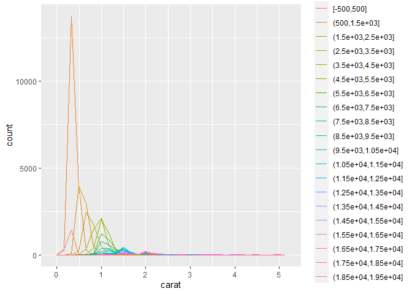
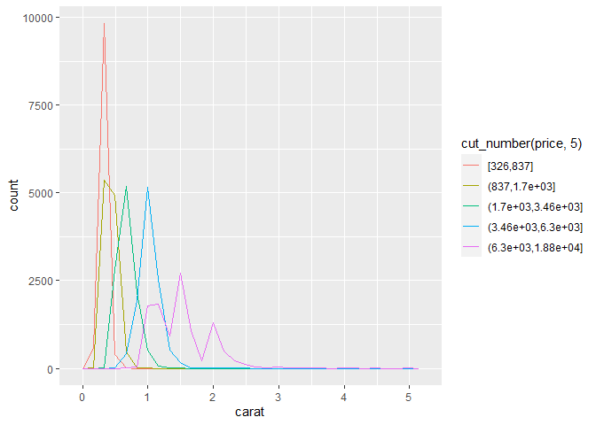
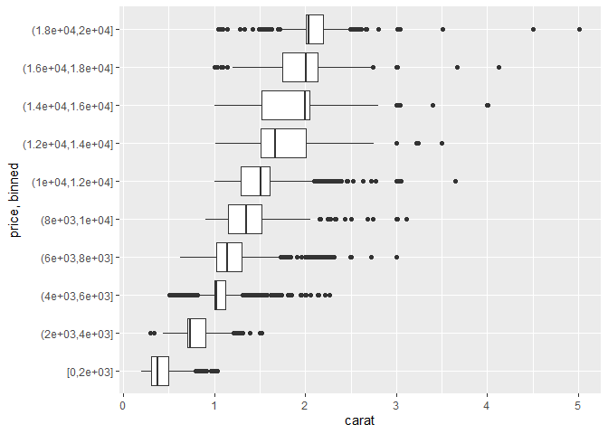
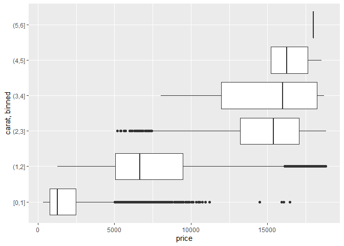
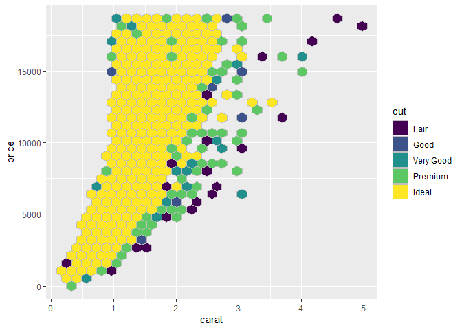
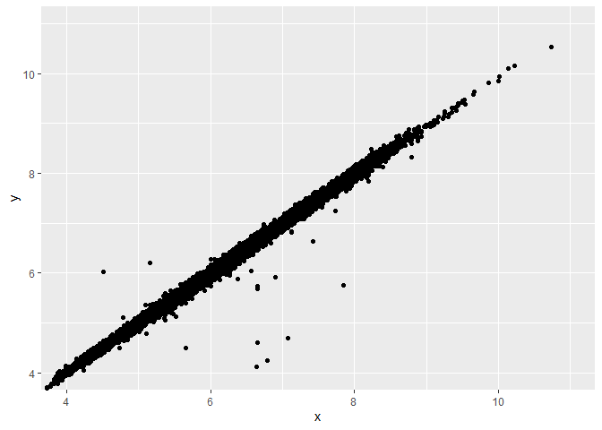
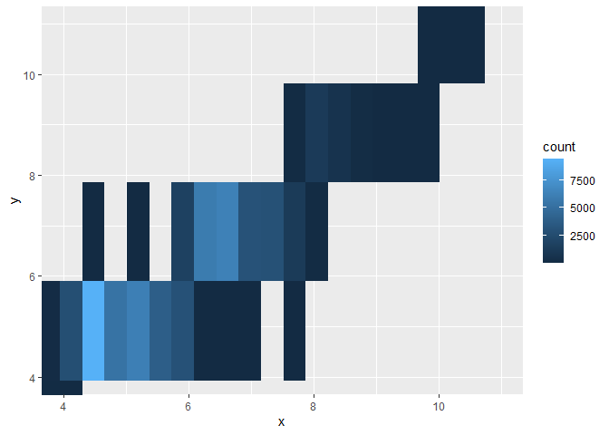

R4DS Study Group - Week 17
================
Pierrette Lo
8/7/2020

  - [This week’s assignment](#this-weeks-assignment)
  - [Ch 7:5 Covariation](#ch-75-covariation)

## This week’s assignment

  - Chapter 7.5-7.8

<!-- end list -->

``` r
library(tidyverse)
```

## Ch 7:5 Covariation

### Exercises - 7:5:3 Continuous + Continuous

> 1.  Instead of summarising the conditional distribution with a
>     boxplot, you could use a frequency polygon. What do you need to
>     consider when using `cut_width()` vs `cut_number()`? How does that
>     impact a visualisation of the 2d distribution of `carat` and
>     `price`?

  - `cut_width()` = specify the size of each bin
  - `cut_number()` = specify number of bins

Things to consider:

  - number of overlapping lines
  - number of different colours for the eye to distinguish
  - whether the bin boundaries are “nice”

E.g. too many lines, too many different colours:

``` r
diamonds %>% 
  ggplot(aes(x = carat)) +
  geom_freqpoly(aes(color = cut_width(price, 1000)))
```

    ## `stat_bin()` using `bins = 30`. Pick better value with `binwidth`.

<!-- -->

Bin boundaries not easy to interpret:

``` r
diamonds %>% 
  ggplot(aes(x = carat)) +
  geom_freqpoly(aes(color = cut_number(price, 5)))
```

    ## `stat_bin()` using `bins = 30`. Pick better value with `binwidth`.

<!-- -->

> 2.  Visualise the distribution of `carat`, partitioned by `price`.

Note that the bins on the y axis are denoted using set notation.

  - Square bracket = number included
  - Round bracket = number excluded

Use `boundary = 0` to make sure 0 is included in the first interval

``` r
diamonds %>% 
  ggplot(aes(x = carat, y = cut_width(price, 2000, boundary = 0))) +
  geom_boxplot() +
  ylab("price, binned")
```

<!-- -->

> 3.  How does the price distribution of very large diamonds compare to
>     small diamonds? Is it as you expect, or does it surprise you?

Plot `price` distribution within bins of `carat`:

``` r
diamonds %>%
  ggplot(aes(x = price, y = cut_width(carat, 1, boundary = 0))) +
  geom_boxplot() +
  ylab("carat, binned")
```

<!-- -->

It looks like the largest diamonds have the least variation in price.
This might be because they are more rare, so maybe they’re always more
expensive? Smaller diamonds might have more variation in other factors
(cut, clarity, color) that also impact price.

Note that the [solutions
manual](https://jrnold.github.io/r4ds-exercise-solutions/exploratory-data-analysis.html#exercise-7.5.3.3)
might be wrong - I think they were looking at the previous plot of
`carat` distribution by `price` when they said there was more variation
in the largest diamonds (I think they were looking at the largest price
bin).

> 4.  Combine two of the techniques you’ve learned to visualise the
>     combined distribution of `cut`, `carat`, and `price`.

Not sure if this is combining 2 techniques, but it looks cool:

``` r
library(hexbin)

ggplot(diamonds, aes(x = carat, y = price)) +
  geom_hex(aes(fill = cut), color = "grey")
```

<!-- -->

> 5.  Two dimensional plots reveal outliers that are not visible in one
>     dimensional plots. For example, some points in the plot below have
>     an unusual combination of `x` and `y` values, which makes the
>     points outliers even though their `x` and `y` values appear normal
>     when examined separately.

``` r
ggplot(data = diamonds) +
  geom_point(mapping = aes(x = x, y = y)) +
  coord_cartesian(xlim = c(4, 11), ylim = c(4, 11))
```

<!-- -->

> Why is a scatterplot a better display than a binned plot for this
> case?

Remember that the `x` and `y` the question refers to are the dimensions
of a diamond in mm.

A binned plot doesn’t highlight the outliers or the strong relationship
between `x` and `y`.

``` r
ggplot(data = diamonds) +
  geom_bin2d(mapping = aes(x = x, y = y)) +
  coord_cartesian(xlim = c(4, 11), ylim = c(4, 11))
```

<!-- -->

### Note on Ch 7:7 ggplot calls

As the text mentions, you can leave out the `x =` and `y =` (in addition
to `data =` and `mapping =`) to make your code more concise. However, I
like to leave in the `x` and `y` as I think it makes the code more
readable (which to me is more important than just being concise).

### Next week: Data Wrangling\!

Chapter 10 and first half of Chapter 11.
