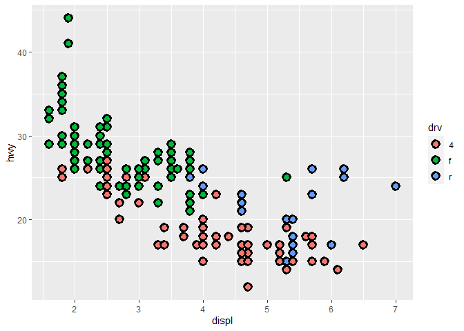
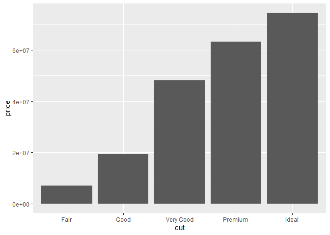

R4DS Study Group - Week 2
================
Pierrette Lo
4/16/2020

  - [This week’s assignment](#this-weeks-assignment)
  - [3.3 Aesthetic mappings](#aesthetic-mappings)
  - [3.5 Facets](#facets)
  - [3.6 Geometric objects](#geometric-objects)
  - [3.7 Statistical transformations](#statistical-transformations)

## This week’s assignment

  - The rest of Chapter 3

## 3.3 Aesthetic mappings

### Notes

  - Briefly introduce the concept of notebooks and scripts
  - You only have to install a package once, but you’ll have to use
    `library()` to load it every time you start a new R session
  - Use `aes()` to connect a visual element to your data
  - Different aesthetics have different levels of effectiveness
    (e.g. shapes can be hard to distinguish if your plot is small)
  - If you want to make a universal change that is NOT linked to your
    data, put it outside of `aes()`

### Exercises:

Again, see
<https://jrnold.github.io/r4ds-exercise-solutions/data-visualisation.html>
for more detailed solutions.

Reload {tidyverse} since I started a new R session:

``` r
library(tidyverse)
```

    ## Warning: package 'tidyverse' was built under R version 3.6.1

    ## -- Attaching packages ------------------------------------------- tidyverse 1.3.0 --

    ## v ggplot2 3.3.0     v purrr   0.3.3
    ## v tibble  3.0.0     v dplyr   0.8.3
    ## v tidyr   1.0.0     v stringr 1.4.0
    ## v readr   1.3.1     v forcats 0.4.0

    ## Warning: package 'ggplot2' was built under R version 3.6.3

    ## Warning: package 'tibble' was built under R version 3.6.3

    ## Warning: package 'tidyr' was built under R version 3.6.1

    ## Warning: package 'purrr' was built under R version 3.6.1

    ## Warning: package 'dplyr' was built under R version 3.6.1

    ## -- Conflicts ---------------------------------------------- tidyverse_conflicts() --
    ## x dplyr::filter() masks stats::filter()
    ## x dplyr::lag()    masks stats::lag()

> 1.  What’s gone wrong with this code? Why are the points not blue?

``` r
ggplot(data = mpg) + 
  geom_point(mapping = aes(x = displ, y = hwy, color = "blue"))
```

<!-- -->

`color` is inside `aes()`, so you are saying you want to map `color` to
the variable “blue”. It will therefore assign the variable “blue” to the
first color in the default palette (pink). There is no variation in
color because the variable “blue” is interpreted as a categorical
variable with a single value (“blue”). (Notice also the unwanted
legend.)

How would you fix it?

``` r
ggplot(data = mpg) + 
  geom_point(mapping = aes(x = displ, y = hwy), color = "blue")
```

<!-- -->

> 2.  Which variables in `mpg` are categorical? Which variables are
>     continuous? (Hint: type `?mpg` to read the documentation for the
>     dataset). How can you see this information when you run `mpg`?

``` r
glimpse(mpg)
```

    ## Rows: 234
    ## Columns: 11
    ## $ manufacturer <chr> "audi", "audi", "audi", "audi", "audi", "audi", "audi"...
    ## $ model        <chr> "a4", "a4", "a4", "a4", "a4", "a4", "a4", "a4 quattro"...
    ## $ displ        <dbl> 1.8, 1.8, 2.0, 2.0, 2.8, 2.8, 3.1, 1.8, 1.8, 2.0, 2.0,...
    ## $ year         <int> 1999, 1999, 2008, 2008, 1999, 1999, 2008, 1999, 1999, ...
    ## $ cyl          <int> 4, 4, 4, 4, 6, 6, 6, 4, 4, 4, 4, 6, 6, 6, 6, 6, 6, 8, ...
    ## $ trans        <chr> "auto(l5)", "manual(m5)", "manual(m6)", "auto(av)", "a...
    ## $ drv          <chr> "f", "f", "f", "f", "f", "f", "f", "4", "4", "4", "4",...
    ## $ cty          <int> 18, 21, 20, 21, 16, 18, 18, 18, 16, 20, 19, 15, 17, 17...
    ## $ hwy          <int> 29, 29, 31, 30, 26, 26, 27, 26, 25, 28, 27, 25, 25, 25...
    ## $ fl           <chr> "p", "p", "p", "p", "p", "p", "p", "p", "p", "p", "p",...
    ## $ class        <chr> "compact", "compact", "compact", "compact", "compact",...

Use `glimpse()` to look at a summary of the data.

General, categorical = <chr> (ie. characters) and continuous = <dbl> or
<int> (ie. numbers)

Categorical: `manufacturer`, `model`, `trans`, `drv`, `fl`, `class`

Continuous: `displ`, `year`, `cyl` (according to solution manual),
`cty`, `hwy`

Note: I disagree with the solution manual regarding `cyl` - even though
it’s a number, I think it could be a categorical variable because it has
a limited possible number of values (4, 6, 8, or 5). Depends on what
analysis you want to do.

> 3.  Map a continuous variable to `color`, `size`, and `shape.` How do
>     these aesthetics behave differently for categorical vs. continuous
>     variables?

``` r
ggplot(data = mpg) +
  geom_point(aes(x = displ, y = hwy, color = cty))
```

<!-- -->

``` r
ggplot(data = mpg) +
  geom_point(aes(x = displ, y = hwy, size = cty))
```

<!-- -->

``` r
ggplot(data = mpg) +
  geom_point(aes(x = displ, y = hwy, shape = cty))
```

    ## Error: A continuous variable can not be mapped to shape

<!-- -->

Color and size work with continuous variables; shape does not. Shapes
are not ordered - is a square greater than a circle?

Color is discrete for cat variables and a spectrum for cont variables.

Size elicits a warning if you try to use it with cont variables - it
will work but is not recommended.

> 4.  What happens if you map the same variable to multiple aesthetics?

``` r
ggplot(data = mpg) +
  geom_point(aes(x = displ, y = hwy, color = cty, size = cty))
```

<!-- -->

You can do this, but the information is redundant and could lead to
confusion - better to stick with one aesthetic per variable.

> 5.  What does the `stroke` aesthetic do? What shapes does it work
>     with? (Hint: use `?geom_point`)

``` r
# For shapes that have a border (like 21), you can colour the inside and
# outside separately. Use the stroke aesthetic to modify the width of the
# border

ggplot(data = mpg) +
  geom_point(aes(x = displ, y = hwy), shape = 21, size = 3, color = "red", fill = "blue", stroke = 5)
```

<!-- -->

color = border fill = inside area stroke = weight of border

> 6.  What happens if you map an aesthetic to something other than a
>     variable name, like `aes(colour = displ < 5)`? Note, you’ll also
>     need to specify x and y.

``` r
ggplot(data = mpg) +
  geom_point(aes(x = displ, y = hwy, color = displ < 5))
```

<!-- -->

You can create new variables “on the fly” within the ggplot command.
(Remember the variable “blue” above?)

In this case you are creating a new variable `displ < 5` which has two
values, TRUE or FALSE, and mapping it to `color`.

## 3.5 Facets

### Notes

### Exercises

> 1.  What happens if you facet on a continuous variable?

``` r
ggplot(data = mpg) +
  geom_point(aes(x = displ, y = hwy)) +
  facet_wrap(~ cty)
```

<!-- -->

The continuous variable is converted to a categorical variable, so there
is a facet for each unique value. Not very useful for `cty` but useful
for a semi-categorical value like `cyl`.

> 2.  What do the empty cells in plot with `facet_grid(drv ~ cyl)` mean?
>     How do they relate to this plot?

``` r
ggplot(data = mpg) + 
  geom_point(mapping = aes(x = displ, y = hwy)) +
  facet_grid(drv ~ cyl)
```

<!-- -->

Blank facets indicate no overlap between the 2 categories (eg. there are
no observations of 4-cylinder, rear wheel drive cars). You can check the
overlap by running the code in the exercise (scatterplot of `drv` vs
`cyl`).

> 3.  What plots does the following code make? What does . do?

``` r
ggplot(data = mpg) + 
  geom_point(mapping = aes(x = displ, y = hwy)) +
  facet_grid(drv ~ .)
```

<!-- -->

Remember the format of the formula in `facet_grid()` is rows \~ columns
(standard notation in R). The `.` means you want to ignore that side of
the formula. So `facet_grid(drv ~ .)` means you want to split the facets
into rows by `drv`, but don’t split into columns.

``` r
ggplot(data = mpg) + 
  geom_point(mapping = aes(x = displ, y = hwy)) +
  facet_grid(. ~ cyl)
```

<!-- -->

`facet_grid(. ~ cyl)` means you want to split the facets into columns by
`cyl`, and don’t split into rows.

> 4.  Take the first faceted plot in this section.
> 
> What are the advantages to using faceting instead of the colour
> aesthetic? What are the disadvantages? How might the balance change if
> you had a larger dataset?

``` r
ggplot(data = mpg) + 
  geom_point(mapping = aes(x = displ, y = hwy)) + 
  facet_wrap(~ class, nrow = 2)
```

<!-- -->

Same plot as above, using color instead of facets:

``` r
ggplot(data = mpg) + 
  geom_point(mapping = aes(x = displ, y = hwy, color = class))
```

<!-- -->

Faceting allows you to look at each category individually, but it can be
hard to compare across categories if there are a lot of them. On the
other hand, it can be difficult to distinguish between many different
colors.

See the [solutions
manual](https://jrnold.github.io/r4ds-exercise-solutions/data-visualisation.html#exercise-3.5.4)
for a more detailed explanation.

> 5.  Read `?facet_wrap`. What does `nrow` do? What does `ncol` do? What
>     other options control the layout of the individual panels? Why
>     doesn’t `facet_grid()` have `nrow` and `ncol` arguments?

`nrow` indicates the number of rows you want to break your facets into;
`ncol` indicates number of columns. If you only want to facet by 1
variable, `facet_wrap` is nice because it will optimize the layout over
the available space.

With `facet_grid`, rows and columns are linked to variables, so the
numbers of each depend on the number of categories in each variable -
you don’t get to specify.

Example of `facet_grid` with 1 variable, `class`:

``` r
ggplot(data = mpg) + 
  geom_point(mapping = aes(x = displ, y = hwy)) + 
  facet_grid(. ~ class)
```

<!-- -->

Example with `facet_wrap`:

``` r
ggplot(data = mpg) + 
  geom_point(mapping = aes(x = displ, y = hwy)) + 
  facet_wrap(~ class)
```

<!-- -->

One option to point out is `scales` - the default is to scale the axes
the same for every facet (`scales = "fixed"`) so it’s easier to compare.
If you want each panel to be scaled according to the data it contains,
use `scales = "free"`.

Or you can free only the x or y axes using `scales = "free_x"` or
`scales = "free_y"`.

``` r
ggplot(data = mpg) + 
  geom_point(mapping = aes(x = displ, y = hwy)) + 
  facet_wrap(~ class, scales = "free")
```

<!-- -->

> 6.  When using `facet_grid()` you should usually put the variable with
>     more unique levels in the columns. Why?

I think this just depends on your final layout for the plot. If it will
be landscape, then you would want more columns. If portrait, you would
want more rows.

## 3.6 Geometric objects

### Notes

  - The link to the RStudio cheatsheets is broken. The correct link is:
    <https://rstudio.com/resources/cheatsheets/>.
  - The specific link to the {ggplot2} cheatsheet is:
    <https://github.com/rstudio/cheatsheets/raw/master/data-visualization-2.1.pdf>
  - I highly recommend browsing through the cheatsheet just to get an
    idea of what’s possible.
  - The link to ggplot2 extensions is also broken; correct link is:
    <http://exts.ggplot2.tidyverse.org/>

### Exercises

> 1.  What geom would you use to draw a line chart? A boxplot? A
>     histogram? An area chart?

`geom_line`, `geom_boxplot`, `geom_histogram`, `geom_area`

See
[cheatsheet](https://github.com/rstudio/cheatsheets/raw/master/data-visualization-2.1.pdf)
for more\!

> 2.  Run this code in your head and predict what the output will look
>     like. Then, run the code in R and check your predictions.

``` r
ggplot(data = mpg, mapping = aes(x = displ, y = hwy, color = drv)) + 
  geom_point() + 
  geom_smooth(se = FALSE)
```

    ## `geom_smooth()` using method = 'loess' and formula 'y ~ x'

<!-- -->

The last line means there is a smoothed line of best fit, for each `drv`
group (remember that `color` automatically groups the variable it is
mapped to) without standard errors.

> 3.  What does `show.legend = FALSE` do? What happens if you remove it?
>     Why do you think I used it earlier in the chapter?

Here’s the example where it was used:

``` r
ggplot(data = mpg) +
  geom_smooth(
    mapping = aes(x = displ, y = hwy, color = drv),
    show.legend = FALSE
  )
```

    ## `geom_smooth()` using method = 'loess' and formula 'y ~ x'

<!-- -->

`show.legend` controls whether the legend is shown. You can see the
difference by changing `FALSE` to `TRUE`. `TRUE` is the default, so if
you want a legend, you don’t need to include `show.legend` at all (note
what happens if you delete it from the code above).

> 4.  What does the se argument to geom\_smooth() do?

``` r
ggplot(data = mpg, mapping = aes(x = displ, y = hwy, color = drv)) + 
  geom_point() + 
  geom_smooth(se = TRUE)
```

    ## `geom_smooth()` using method = 'loess' and formula 'y ~ x'

<!-- -->

`se = TRUE` plots standard error as a grey shaded ribbon. Note the lack
of this in the above answer to question \#2, where `se = FALSE`.

`TRUE` is the default, so if you want the standard error ribbon, you
only need to type `geom_smooth()`.

> 6.  Will these two graphs look different? Why/why not?

They should look the same. `geom_point()` and `geom_smooth()` inherit
the options you supply to `ggplot()`, so specifying the data and
mappings in each individual layer is redundant.

## 3.7 Statistical transformations

### Notes

  - This is a little more “under the hood” - to be honest, I almost
    never use stats for the visualizations that I do.
  - Check out the {ggplot2} cheatsheet for the different types of stats

### Exercises

> 1.  What is the default geom associated with stat\_summary()? How
>     could you rewrite the previous plot to use that geom function
>     instead of the stat function?

First check out `?stat_summary()` - it looks like the default geom is
`pointrange`, which is a point with 2 lines, kind of like an error bar.

The example code (pasted below) is specifying that you want the point
(`fun.y`) to be the median `depth`, and lines to indicate the range of
`depth` (`fun.ymin` and `fun.ymax`). Note that `fun` indicates a
function.

``` r
ggplot(data = diamonds) + 
  stat_summary(
    mapping = aes(x = cut, y = depth),
    fun.ymin = min,
    fun.ymax = max,
    fun.y = median
  )
```

    ## Warning: `fun.y` is deprecated. Use `fun` instead.

    ## Warning: `fun.ymin` is deprecated. Use `fun.min` instead.

    ## Warning: `fun.ymax` is deprecated. Use `fun.max` instead.

<!-- -->

To use `geom_pointrange()` instead of `stat_summary()`:

First check out `?geom_pointrange` to read about how to use this
function.

``` r
ggplot(data = diamonds) + 
  geom_pointrange(
    mapping = aes(x = cut, y = depth), stat = "summary")
```

    ## No summary function supplied, defaulting to `mean_se()`

<!-- -->

This looks different because `stat = "summary` calculates se as the
default for the line. If you want to use min/max as in the example,
specify like this:

(Help\! This solution was copied/pasted from the [solutions
manual](https://jrnold.github.io/r4ds-exercise-solutions/data-visualisation.html#exercise-3.7.1),
but it didn’t work for me. I just updated my {ggplot2} package, so I
wonder if something changed?)

``` r
ggplot(data = diamonds) + 
  geom_pointrange(
    mapping = aes(x = cut, y = depth),
    stat = "summary",
    fun.ymin = min,
    fun.ymax = max,
    fun.y = median
  )
```

    ## Warning: Ignoring unknown parameters: fun.ymin, fun.ymax, fun.y

    ## No summary function supplied, defaulting to `mean_se()`

<!-- -->

This did work for me - I had to summarize the min, max, and median of
the data first, and then feed that into ggplot.

``` r
diamonds %>% 
  group_by(cut) %>% 
  summarise(lower = min(depth), upper = max(depth), med = median(depth)) %>% 
  ggplot(mapping = aes(x = cut, y = med)) +
  geom_pointrange(mapping = aes(ymin = lower, ymax = upper))
```

<!-- -->

> 2.  What does geom\_col() do? How is it different to geom\_bar()?

See the help page for these two geoms (`?geom_col`).

For `geom_col()`, default `stat` is “identity” – meaning for each `x` it
will read the value of `y` directly from the data. So for `geom_col()`
you need to input both `x` and `y`.

For `geom_bar()`, default `stat` = “bin” – meaning it will count the
number of observations for each value of `x`. So for `geom_bar()` you
only need to input `x`, and `y` will automatically be the count.

``` r
ggplot(data = diamonds) +
  geom_bar(aes(x = cut))
```

<!-- -->

``` r
ggplot(data = diamonds) +
  geom_col(aes(x = cut, y = price))
```

<!-- -->

> 3.  Most geoms and stats come in pairs that are almost always used in
>     concert. Read through the documentation and make a list of all the
>     pairs. What do they have in common?

See the [solutions
manual](https://jrnold.github.io/r4ds-exercise-solutions/data-visualisation.html#exercise-3.7.3)
for an extensive list.

> 4.  What variables does stat\_smooth() compute? What parameters
>     control its behaviour?

According to the “Computed variables” section of the help
(`?stat_smooth`): `y`, `ymin`, `ymax`, `se.`

There are several parameters (“Arguments”), including `method`,
`formula`, `se`, `level`, etc.

> 5.  In our proportion bar chart, we need to set group = 1. Why? In
>     other words what is the problem with these two graphs?

The default behavior of `geom_bar` is to bin each value of `x` into
groups and then calculate proportion within groups - thus each group has
a proportion of 100%.

You need a dummy group to force `geom_bar` to calculate proportions
across all values of `x`. Do this by adding `group = 1` (or `group =
"dummy/whatever"`) to the aesthetics as follows:

``` r
ggplot(data = diamonds) + 
  geom_bar(mapping = aes(x = cut, y = stat(prop), group = 1))
```

<!-- -->

With the 2nd example, fill = color is again causing geom\_bar to group
each value of x and calculate proportions for each group as 100%. If you
want to calculate the proportions within each group while showing the
relative proportions of the groups, you need to manually calculate
proportions from counts as follows:

``` r
ggplot(data = diamonds) + 
  geom_bar(mapping = aes(x = cut, y = stat(count)/sum(stat(count)), fill = color))
```

<!-- -->
