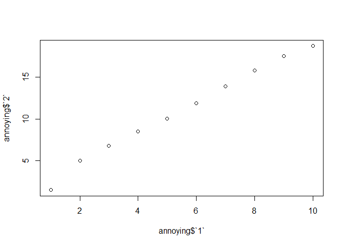

R4DS Study Group - Week 20
================
Pierrette Lo
8/21/2020

  - [This week’s assignment](#this-weeks-assignment)
  - [Ch 10 Tibbles](#ch-10-tibbles)
  - [Ch 11 Data Import](#ch-11-data-import)

## This week’s assignment

  - Chapter 9, 10, first half of 11

<!-- end list -->

``` r
library(tidyverse)
```

## Ch 10 Tibbles

### Notes

  - Note that “print” in R means displaying an object on your screen
    (not sending it to a printer)
  - Also, the tip about `print()` only applies in the console
  - If you want to control the number of rows that appear in an R
    notebook or R Markdown file, use the code chunk option `rows.print=`
  - Or you can add it to the setup chunk to apply to all chunks in that
    document `knitr::opts_chunk$set(rows.print=20)`

### Exercises

> 1.  How can you tell if an object is a tibble? (Hint: try printing
>     `mtcars`, which is a regular data frame).

They both look the same in an R Notebook - you have to go to the console
to see the difference.

Typing `mtcars` in the console will return all of the rows of the
dataframe.

Typing `as.tibble(mtcars)` in the console will print the first 10 rows,
and the first line of the output will say “A tibble: 32 x 11”.

You can also use `is_tibble` to check if an object is a tibble. (Note
that there are several other “is” functions as well.)

``` r
is_tibble(mtcars)
```

    ## [1] FALSE

> 2.  Compare and contrast the following operations on a `data.frame`
>     and equivalent tibble. What is different? Why might the default
>     data frame behaviours cause you frustration?

Start by creating the dataframe as shown in the text:

``` r
df <- data.frame(abc = 1, xyz = "a")

df
```

    ##   abc xyz
    ## 1   1   a

I also set up a tibble for comparison:

``` r
tf <- as_tibble(df)

tf
```

    ## # A tibble: 1 x 2
    ##     abc xyz  
    ##   <dbl> <chr>
    ## 1     1 a

Dataframe allows partial matching - so it will let you select the `xyz`
column by only typing `x`:

``` r
df$x
```

    ## [1] "a"

Tibble does not allow partial matching:

``` r
tf$x
```

    ## Warning: Unknown or uninitialised column: `x`.

    ## NULL

Dataframe sometimes returns a character vector when subsetted:

``` r
df[, "xyz"]
```

    ## [1] "a"

Tibble returns a tibble (check with `is_tibble()`):

``` r
tf[, "xyz"]
```

    ## # A tibble: 1 x 1
    ##   xyz  
    ##   <chr>
    ## 1 a

In this case, dataframe returns a dataframe when subsetted (check with
`is.data.frame()`):

``` r
df[, c("abc", "xyz")]
```

    ##   abc xyz
    ## 1   1   a

Tibble always returns a tibble:

``` r
is_tibble(tf[, c("abc", "xyz")])
```

    ## [1] TRUE

Depending on what you plan to do with the subset, the inconsistency of
dataframes could cause problems.

> 3.  If you have the name of a variable stored in an object, e.g. `var
>     <- "mpg"`, how can you extract the reference variable from a
>     tibble?

Let’s try it:

``` r
var <- "mpg"
```

The `$` doesn’t work because it’s looking for a column named `var`

``` r
mtcars$var
```

    ## NULL

The `[[]]` works:

``` r
mtcars[[var]]
```

    ##  [1] 21.0 21.0 22.8 21.4 18.7 18.1 14.3 24.4 22.8 19.2 17.8 16.4 17.3 15.2 10.4
    ## [16] 10.4 14.7 32.4 30.4 33.9 21.5 15.5 15.2 13.3 19.2 27.3 26.0 30.4 15.8 19.7
    ## [31] 15.0 21.4

> 4.  Practice referring to non-syntactic names in the following data
>     frame by:

Start by making the tibble:

``` r
annoying <- tibble(
  `1` = 1:10,
  `2` = `1` * 2 + rnorm(length(`1`))
)

annoying
```

    ## # A tibble: 10 x 2
    ##      `1`   `2`
    ##    <int> <dbl>
    ##  1     1  1.51
    ##  2     2  5.04
    ##  3     3  6.82
    ##  4     4  8.53
    ##  5     5 10.1 
    ##  6     6 11.9 
    ##  7     7 13.9 
    ##  8     8 15.8 
    ##  9     9 17.6 
    ## 10    10 18.7

> Extracting the variable called `1`.

``` r
annoying$`1`
```

    ##  [1]  1  2  3  4  5  6  7  8  9 10

> Plotting a scatterplot of `1` vs `2`.

Using the base R quick plot function:

``` r
plot(x = annoying$`1`,
     y = annoying$`2`)
```

<!-- -->

> Creating a new column called `3` which is `2` divided by `1.`

``` r
annoying %>% 
  mutate(`3` = `2` / `1`)
```

    ## # A tibble: 10 x 3
    ##      `1`   `2`   `3`
    ##    <int> <dbl> <dbl>
    ##  1     1  1.51  1.51
    ##  2     2  5.04  2.52
    ##  3     3  6.82  2.27
    ##  4     4  8.53  2.13
    ##  5     5 10.1   2.01
    ##  6     6 11.9   1.98
    ##  7     7 13.9   1.99
    ##  8     8 15.8   1.98
    ##  9     9 17.6   1.95
    ## 10    10 18.7   1.87

> Renaming the columns to `one`, `two` and `three.`

``` r
annoying %>% 
  mutate(`3` = `2` / `1`) %>% 
  rename("one" = `1`,
         "two" = `2`,
         "three" = `3`)
```

    ## # A tibble: 10 x 3
    ##      one   two three
    ##    <int> <dbl> <dbl>
    ##  1     1  1.51  1.51
    ##  2     2  5.04  2.52
    ##  3     3  6.82  2.27
    ##  4     4  8.53  2.13
    ##  5     5 10.1   2.01
    ##  6     6 11.9   1.98
    ##  7     7 13.9   1.99
    ##  8     8 15.8   1.98
    ##  9     9 17.6   1.95
    ## 10    10 18.7   1.87

This exercise underscores the importance of good variable names\!

  - Ideally all lowercase
  - No punctuation
  - Don’t start with numbers
  - Use underscores instead of dashes (which R will mistake for
    subtraction)

> 5.  What does tibble::enframe() do? When might you use it?

Per the help (`?enframe`), this function converts a vector or list to a
dataframe - useful if you need to feed it into a function that requires
a dataframe.

Example (`letters` is a built-in set of constants in R; see `?letters`
for more):

``` r
myvector <- letters[1:10]

myvector
```

    ##  [1] "a" "b" "c" "d" "e" "f" "g" "h" "i" "j"

Here `enframe()` uses the sequence positions as names, since I didn’t
specify any names:

``` r
enframe(myvector)
```

    ## # A tibble: 10 x 2
    ##     name value
    ##    <int> <chr>
    ##  1     1 a    
    ##  2     2 b    
    ##  3     3 c    
    ##  4     4 d    
    ##  5     5 e    
    ##  6     6 f    
    ##  7     7 g    
    ##  8     8 h    
    ##  9     9 i    
    ## 10    10 j

> 6.  What option controls how many additional column names are printed
>     at the footer of a tibble?

It’s a bit tricky to find the help document for this option. `print()`
is a “generic function”, meaning that it behaves differently depending
on the class of object it’s applied to. So printing tibbles has its own
set of options that aren’t listed in the main help document `?print`.

I went to the help page for `?tibble` and then clicked the link about
“enhanced printing”. This shows an argument `n_extra` that allows you
to specify how many columns are displayed.

Again, you can only see the difference in the console - not in R
Markdown.

`print(nycflights13::flights)`

vs.

`print(nycflights13::flights, n_extra = 1)`

Not super useful for a small dataset, but could keep your screen from
being overwhelmed if you have a huge dataset with a lot of variables.

## Ch 11 Data Import

### Notes

  - This is briefly mentioned at the end of the chapter - the
    [{readxl}](https://readxl.tidyverse.org/) package is very useful for
    reading in Excel files

  - However, it’s best to use CSV format where possible. Excel files can
    encode a lot of information in formatting (fonts, colors, multiple
    headers, comments, etc.) that will be lost when imported into R.
    Best practice is to embed that information in the data itself, or in
    a separate file, and keep the data as a simple flat text file.

  - Reminder to use `read_csv()` (with underscore - the tidyverse
    version) and not `read.csv` (with period - the base R version) for
    reasons explained in the text.

### Exercises

> 1.  What function would you use to read a file where fields were
>     separated with “|”?

    read_delim("myfile.txt", delim = "|")

> 2.  Apart from `file`, `skip`, and `comment`, what other arguments do
>     `read_csv()` and `read_tsv()` have in common?

Trick question\! All of the arguments are the same - just apply to
different types of files.

> 3.  What are the most important arguments to `read_fwf()`?

A fixed-width file is one where each column is delimited by a
prespecified max width (as opposed to commas, tabs, etc.)

Per the help (`?read_fwf`), the two arguments that you have to specify
(no defaults provided) are `file` and `col_positions` (where each column
starts and ends). There are a few helper functions that help determine
what the column positions are - see `?read_fwf` for more details.

> 4.  Sometimes strings in a CSV file contain commas. To prevent them
>     from causing problems they need to be surrounded by a quoting
>     character, like " or ’. By default, `read_csv()` assumes that the
>     quoting character will be ". What argument to `read_csv()` do you
>     need to specify to read the following text into a data frame?

    "x,y\n1,'a,b'"

This method of creating a dataframe “de novo” is a little weird.

First let’s parse the desired output:

  - This is a CSV input, so columns are separated by commas
  - Remember that means “new line” - i.e. next row
  - Since this is text, the entire input must be surrounded by double
    quotes ("") before you provide it to `read_csv()`
  - One of the cells is a character string ‘a,b’ which is surrounded by
    single quotes (since it is inside the double quotes)

So we want the dataframe to look like this:

    x y
    
    1 a,b

The `quote` argument to `read_csv` is where you specify what your
strings are surrounded by - in this case, single quotes.

``` r
read_csv("x,y\n1,'a,b'", quote = "'")
```

    ## # A tibble: 1 x 2
    ##       x y    
    ##   <dbl> <chr>
    ## 1     1 a,b

Note that in the help `?read_csv`, the default for `quote` is shown as

    "\""

Putting a backslash before a special character is known as “escaping” -
it tells R that you’re referring to the character " literally, not using
it for its usual function of surrounding strings.

This will become useful later when you start using “regular
expressions”, which are sequences of characters used to search for
string patterns - more about this in
[Chapter 14](https://r4ds.had.co.nz/strings.html#matching-patterns-with-regular-expressions).

> 5.  Identify what is wrong with each of the following inline CSV
>     files. What happens when you run the code?

``` r
read_csv("a,b\n1,2,3\n4,5,6")
```

    ## Warning: 2 parsing failures.
    ## row col  expected    actual         file
    ##   1  -- 2 columns 3 columns literal data
    ##   2  -- 2 columns 3 columns literal data

    ## # A tibble: 2 x 2
    ##       a     b
    ##   <dbl> <dbl>
    ## 1     1     2
    ## 2     4     5

As indicated in the error message, the header (a, b) indicates 2
columns, but rows 1 and 2 (1, 2, 3 and 4, 5, 6) have 3 columns, so the
3rd column (3 and 6) is dropped.

``` r
read_csv("a,b,c\n1,2\n1,2,3,4")
```

    ## Warning: 2 parsing failures.
    ## row col  expected    actual         file
    ##   1  -- 3 columns 2 columns literal data
    ##   2  -- 3 columns 4 columns literal data

    ## # A tibble: 2 x 3
    ##       a     b     c
    ##   <dbl> <dbl> <dbl>
    ## 1     1     2    NA
    ## 2     1     2     3

Header shows 3 columns, but row 1 only has 2 (so the last column is
filled with NA), and row 2 has 4 columns, so the last value (4) is
dropped.

``` r
read_csv("a,b\n\"1")
```

    ## Warning: 2 parsing failures.
    ## row col                     expected    actual         file
    ##   1  a  closing quote at end of file           literal data
    ##   1  -- 2 columns                    1 columns literal data

    ## # A tibble: 1 x 2
    ##       a b    
    ##   <dbl> <chr>
    ## 1     1 <NA>

I think they intended for “1” to be a character, not a number, but they
didn’t escape the double quotes correctly.

I couldn’t get it to work inline, but there are better ways to convert
columns to different data types that will be mentioned later.

``` r
read_csv("a,b\n1,2\na,b")
```

    ## # A tibble: 2 x 2
    ##   a     b    
    ##   <chr> <chr>
    ## 1 1     2    
    ## 2 a     b

Not sure exactly what they’re looking for here, but the fact that 1 and
2 have been coerced to characters could be a problem later if you’re
expecting numbers.

``` r
read_csv("a;b\n1;3")
```

    ## # A tibble: 1 x 1
    ##   `a;b`
    ##   <chr>
    ## 1 1;3

Here it looks like the columns are separated by semicolons, not commas,
so you should use `read_csv2` instead:

``` r
read_csv2("a;b\n1;3")
```

    ## Using ',' as decimal and '.' as grouping mark. Use read_delim() for more control.

    ## # A tibble: 1 x 2
    ##       a     b
    ##   <dbl> <dbl>
    ## 1     1     3
