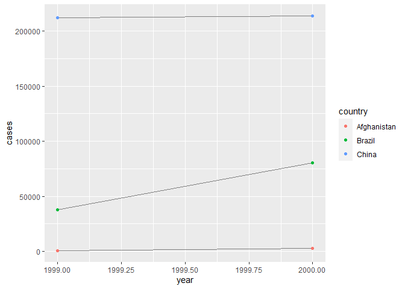

R4DS Study Group - Week 26
================
Pierrette Lo
9/30/2020

  - [This week’s assignment](#this-weeks-assignment)
  - [Ch 12:2 Tidy Data](#ch-122-tidy-data)
  - [Ch 12:3 Pivoting](#ch-123-pivoting)
  - [Ch 12:4 Separating and uniting](#ch-124-separating-and-uniting)
  - [Ch 12:5 Missing values](#ch-125-missing-values)

## This week’s assignment

  - Chapter 12

<!-- end list -->

``` r
library(tidyverse)
```

## Ch 12:2 Tidy Data

### Notes

Off-topic:

There is a great explanation of `stat_` vs. `geom_` and how to use
`stat_`
[here](https://yjunechoe.github.io/posts/2020-09-26-demystifying-stat-layers-ggplot2/).

### Exercises

> 1.  Using prose, describe how the variables and observations are
>     organised in each of the sample tables.

Table 1 = tidy data

  - Each variable (country, year, cases, pop) has its own column
  - Each row contains 1 observation of each variable

<!-- end list -->

``` r
table1
```

    ## # A tibble: 6 x 4
    ##   country      year  cases population
    ##   <chr>       <int>  <int>      <int>
    ## 1 Afghanistan  1999    745   19987071
    ## 2 Afghanistan  2000   2666   20595360
    ## 3 Brazil       1999  37737  172006362
    ## 4 Brazil       2000  80488  174504898
    ## 5 China        1999 212258 1272915272
    ## 6 China        2000 213766 1280428583

Table 2 = long data

  - `type` column has 2 variables (cases, population)
  - 1 observation (count) per row

<!-- end list -->

``` r
table2
```

    ## # A tibble: 12 x 4
    ##    country      year type            count
    ##    <chr>       <int> <chr>           <int>
    ##  1 Afghanistan  1999 cases             745
    ##  2 Afghanistan  1999 population   19987071
    ##  3 Afghanistan  2000 cases            2666
    ##  4 Afghanistan  2000 population   20595360
    ##  5 Brazil       1999 cases           37737
    ##  6 Brazil       1999 population  172006362
    ##  7 Brazil       2000 cases           80488
    ##  8 Brazil       2000 population  174504898
    ##  9 China        1999 cases          212258
    ## 10 China        1999 population 1272915272
    ## 11 China        2000 cases          213766
    ## 12 China        2000 population 1280428583

Table 3 = messy data

  - Each variable has its own column
  - Looks like 1 observation (rate) per row, but it is actually a string
    containing two observations

<!-- end list -->

``` r
table3
```

    ## # A tibble: 6 x 3
    ##   country      year rate             
    ## * <chr>       <int> <chr>            
    ## 1 Afghanistan  1999 745/19987071     
    ## 2 Afghanistan  2000 2666/20595360    
    ## 3 Brazil       1999 37737/172006362  
    ## 4 Brazil       2000 80488/174504898  
    ## 5 China        1999 212258/1272915272
    ## 6 China        2000 213766/1280428583

Table 4a = wide data

  - The variable `year` is spread over 2 columns
  - 1 observation of `cases` per row

<!-- end list -->

``` r
table4a
```

    ## # A tibble: 3 x 3
    ##   country     `1999` `2000`
    ## * <chr>        <int>  <int>
    ## 1 Afghanistan    745   2666
    ## 2 Brazil       37737  80488
    ## 3 China       212258 213766

Table 4b = wide data

  - The variable `year` is spread over 2 columns
  - 1 observation of `population` per row

<!-- end list -->

``` r
table4b
```

    ## # A tibble: 3 x 3
    ##   country         `1999`     `2000`
    ## * <chr>            <int>      <int>
    ## 1 Afghanistan   19987071   20595360
    ## 2 Brazil       172006362  174504898
    ## 3 China       1272915272 1280428583

> 2.  Compute the `rate` for `table2`, and `table4a` + `table4b.` You
>     will need to perform four operations:
> 
> Extract the number of TB cases per country per year. Extract the
> matching population per country per year. Divide cases by population,
> and multiply by 10000. Store back in the appropriate place.
> 
> Which representation is easiest to work with? Which is hardest? Why?

For Table 2:

``` r
table2 %>% 
  pivot_wider(names_from = type,
              values_from = count) %>% 
  mutate(rate = cases/population * 10000)
```

    ## # A tibble: 6 x 5
    ##   country      year  cases population  rate
    ##   <chr>       <int>  <int>      <int> <dbl>
    ## 1 Afghanistan  1999    745   19987071 0.373
    ## 2 Afghanistan  2000   2666   20595360 1.29 
    ## 3 Brazil       1999  37737  172006362 2.19 
    ## 4 Brazil       2000  80488  174504898 4.61 
    ## 5 China        1999 212258 1272915272 1.67 
    ## 6 China        2000 213766 1280428583 1.67

For Tables 4a & 4b:

``` r
table4a_long <- table4a %>% 
  pivot_longer(-country,
               names_to = "year",
               values_to = "cases")

table4b_long <- table4b %>% 
  pivot_longer(-country,
               names_to = "year",
               values_to = "population")

inner_join(table4a_long, table4b_long, 
           by = c("country", "year")) %>% 
  mutate(rate = cases/population * 10000)
```

    ## # A tibble: 6 x 5
    ##   country     year   cases population  rate
    ##   <chr>       <chr>  <int>      <int> <dbl>
    ## 1 Afghanistan 1999     745   19987071 0.373
    ## 2 Afghanistan 2000    2666   20595360 1.29 
    ## 3 Brazil      1999   37737  172006362 2.19 
    ## 4 Brazil      2000   80488  174504898 4.61 
    ## 5 China       1999  212258 1272915272 1.67 
    ## 6 China       2000  213766 1280428583 1.67

Table 4 was more of a hassle than Table 2, but both were suboptimal.
Table 1 (ie. tidy format) would have been the easiest to work with.

> 3.  Recreate the plot showing change in cases over time using `table2`
>     instead of `table1`. What do you need to do first?

The plot from the text:

``` r
ggplot(table1, aes(year, cases)) + 
  geom_line(aes(group = country), colour = "grey50") + 
  geom_point(aes(colour = country))
```

<!-- -->

With Table 2:

``` r
table2 %>% 
  filter(type == "cases") %>% 
  ggplot(aes(x = year, y = count)) +
  geom_line(aes(group = country), colour = "grey50") +
  geom_point(aes(colour = country))
```

<!-- -->

## Ch 12:3 Pivoting

### Notes

  - There are some nice graphics/animations of the tidying process
    [here](https://fromthebottomoftheheap.net/2019/10/25/pivoting-tidily/)

  - In case you come across some old code,
    
      - `pivot_longer` used to be `gather`
      - `pivot_wider` used to be `spread`

### Exercises

> 1.  Why are `pivot_longer()` and `pivot_wider()` not perfectly
>     symmetrical? Carefully consider the following example: (Hint: look
>     at the variable types and think about column names.)
> 
> `pivot_longer()` has a `names_ptype` argument, e.g. `names_ptype =
> list(year = double())`. What does it do?

``` r
stocks <- tibble(
  year   = c(2015, 2015, 2016, 2016),
  half  = c(   1,    2,     1,    2),
  return = c(1.88, 0.59, 0.92, 0.17)
)
```

``` r
stocks %>% 
  pivot_wider(names_from = year, values_from = return) %>% 
  pivot_longer(`2015`:`2016`, names_to = "year", values_to = "return")
```

    ## # A tibble: 4 x 3
    ##    half year  return
    ##   <dbl> <chr>  <dbl>
    ## 1     1 2015    1.88
    ## 2     1 2016    0.92
    ## 3     2 2015    0.59
    ## 4     2 2016    0.17

When you pivot from wide to long, R creates a `year` column from the
`2015` and `2016` column headers with a default format of character.

You can specify the format of the created column using the
`names_transform` argument. (I’m not sure why `names_ptypes` doesn’t
work as expected here, but it is a [known
issue](https://github.com/tidyverse/tidyr/issues/921) and is actively
being worked on.)

``` r
stocks %>% 
  pivot_wider(names_from = year, values_from = return) %>% 
  pivot_longer(`2015`:`2016`, 
               names_to = "year", 
               values_to = "return",
               names_transform = list(year = as.numeric))
```

    ## # A tibble: 4 x 3
    ##    half  year return
    ##   <dbl> <dbl>  <dbl>
    ## 1     1  2015   1.88
    ## 2     1  2016   0.92
    ## 3     2  2015   0.59
    ## 4     2  2016   0.17

> 2.  Why does this code fail?

``` r
table4a %>% 
  pivot_longer(c(1999, 2000), names_to = "year", values_to = "cases")
```

    ## Error: Can't subset columns that don't exist.
    ## x Locations 1999 and 2000 don't exist.
    ## i There are only 3 columns.

Error messages: Can’t subset columns that don’t exist. x Locations 1999
and 2000 don’t exist. i There are only 3 columns.

The first argument to `pivot_longer` is `cols`, indicating which columns
you’re pivoting. If you input a number, eg. 1999, it thinks you want to
pivot column \#1999, which doesn’t exist. You can indicate that 1999 is
a variable name by surrounding it with backticks or double quotes (in
general, variable names shouldn’t start with numbers for this reason).

``` r
table4a %>% 
  pivot_longer(c(`1999`, "2000"), names_to = "year", values_to = "cases")
```

    ## # A tibble: 6 x 3
    ##   country     year   cases
    ##   <chr>       <chr>  <int>
    ## 1 Afghanistan 1999     745
    ## 2 Afghanistan 2000    2666
    ## 3 Brazil      1999   37737
    ## 4 Brazil      2000   80488
    ## 5 China       1999  212258
    ## 6 China       2000  213766

> 3.  What would happen if you widen this table? Why? How could you add
>     a new column to uniquely identify each value?

Note: it looks like the 2nd column was called `key` instead of `names`
in older versions of R4DS - I’ve changed it here because it makes more
sense.

``` r
people <- tribble(
  ~name,             ~key,  ~values,
  #-----------------|--------|------
  "Phillip Woods",   "age",       45,
  "Phillip Woods",   "height",   186,
  "Phillip Woods",   "age",       50,
  "Jessica Cordero", "age",       37,
  "Jessica Cordero", "height",   156
)
```

By default, pivot\_wider will make list-columns if there are non-unique
key-value pairs. In this case, “Phillip Woods” has two values for age,
and it’s not clear which one correlates with the height value.

``` r
people %>% 
  pivot_wider(names_from = key, values_from = values)
```

    ## Warning: Values are not uniquely identified; output will contain list-cols.
    ## * Use `values_fn = list` to suppress this warning.
    ## * Use `values_fn = length` to identify where the duplicates arise
    ## * Use `values_fn = {summary_fun}` to summarise duplicates

    ## # A tibble: 2 x 3
    ##   name            age       height   
    ##   <chr>           <list>    <list>   
    ## 1 Phillip Woods   <dbl [2]> <dbl [1]>
    ## 2 Jessica Cordero <dbl [1]> <dbl [1]>

One solution is to number each age-height pair as it appears in the
table, before pivoting:

``` r
people %>%
  group_by(name, key) %>%
  mutate(obs_no = row_number()) %>% 
  pivot_wider(names_from = key,
              values_from = values)
```

    ## # A tibble: 3 x 4
    ## # Groups:   name [2]
    ##   name            obs_no   age height
    ##   <chr>            <int> <dbl>  <dbl>
    ## 1 Phillip Woods        1    45    186
    ## 2 Phillip Woods        2    50     NA
    ## 3 Jessica Cordero      1    37    156

However, this assumes that height 186 should be paired with age 45.
There’s no other information in this table to indicate whether this is
correct. The better solution would be to go back to the source of the
data and figure out why you have missing data.

> 4.  Tidy the simple tibble below. Do you need to make it wider or
>     longer? What are the variables?

``` r
preg <- tribble(
  ~pregnant, ~male, ~female,
  "yes",     NA,    10,
  "no",      20,    12
)
```

Variables:

  - pregnant (y/n)
  - sex (m/f)
  - count

<!-- end list -->

``` r
preg %>% 
  pivot_longer(c(male, female), 
               names_to = "sex",
               values_to = "count")
```

    ## # A tibble: 4 x 3
    ##   pregnant sex    count
    ##   <chr>    <chr>  <dbl>
    ## 1 yes      male      NA
    ## 2 yes      female    10
    ## 3 no       male      20
    ## 4 no       female    12

## Ch 12:4 Separating and uniting

### Exercises

> 1.  What do the `extra` and `fill` arguments do in `separate()`?
>     Experiment with the various options for the following two toy
>     datasets.

  - `extra` = what to do if there are too many pieces
  - `fill` = what to do if there are not enough pieces

In the first example, by default the extra piece “g” is dropped with a
warning:

``` r
tibble(x = c("a,b,c", "d,e,f,g", "h,i,j")) %>% 
  separate(x, c("one", "two", "three"))
```

    ## Warning: Expected 3 pieces. Additional pieces discarded in 1 rows [2].

    ## # A tibble: 3 x 3
    ##   one   two   three
    ##   <chr> <chr> <chr>
    ## 1 a     b     c    
    ## 2 d     e     f    
    ## 3 h     i     j

Can keep the extra value using “merge”:

``` r
tibble(x = c("a,b,c", "d,e,f,g", "h,i,j")) %>% 
  separate(x, c("one", "two", "three"),
           extra = "merge")
```

    ## # A tibble: 3 x 3
    ##   one   two   three
    ##   <chr> <chr> <chr>
    ## 1 a     b     c    
    ## 2 d     e     f,g  
    ## 3 h     i     j

In the second example, the 2nd row doesn’t have enough pieces, so by
default is filled with `NA` on the right:

``` r
tibble(x = c("a,b,c", "d,e", "f,g,i")) %>% 
  separate(x, c("one", "two", "three"))
```

    ## Warning: Expected 3 pieces. Missing pieces filled with `NA` in 1 rows [2].

    ## # A tibble: 3 x 3
    ##   one   two   three
    ##   <chr> <chr> <chr>
    ## 1 a     b     c    
    ## 2 d     e     <NA> 
    ## 3 f     g     i

Fill from left instead:

``` r
tibble(x = c("a,b,c", "d,e", "f,g,i")) %>% 
  separate(x, c("one", "two", "three"),
           fill = "left")
```

    ## # A tibble: 3 x 3
    ##   one   two   three
    ##   <chr> <chr> <chr>
    ## 1 a     b     c    
    ## 2 <NA>  d     e    
    ## 3 f     g     i

> 2.  Both `unite()` and `separate()` have a remove argument. What does
>     it do? Why would you set it to `FALSE`?

`remove` indicates whether you remove the original column(s) that is
being separated/united. It can be helpful to leave these in so you can
check.

Eg:

``` r
tibble(x = c("a,b,c", "d,e", "f,g,i")) %>% 
  separate(x, c("one", "two", "three"),
           remove = FALSE)
```

    ## Warning: Expected 3 pieces. Missing pieces filled with `NA` in 1 rows [2].

    ## # A tibble: 3 x 4
    ##   x     one   two   three
    ##   <chr> <chr> <chr> <chr>
    ## 1 a,b,c a     b     c    
    ## 2 d,e   d     e     <NA> 
    ## 3 f,g,i f     g     i

> 3.  Compare and contrast `separate()` and `extract()`.

  - separate = split a column by indicating what to separate by
  - extract = split a column by using regular expressions to indicate
    what to capture (more flexible)

e.g. a column where the values are “green1”, “blue2”, “red3”, etc. -
there isn’t a common separator or position number, so you can use regex
to capture all of the alphabets

> Why are there three variations of separation (by position, by
> separator, and with groups), but only one unite?

There are different options for searching for separators to split up a
column, but only one option is needed for merging a column.

## Ch 12:5 Missing values

### Exercises

> 1.  Compare and contrast the fill arguments to pivot\_wider() and
>     complete().

Example copied from text:

  - explicit missing value: 2015 Q4
  - implicit missing value: 2016 Q1

<!-- end list -->

``` r
stocks <- tibble(
  year   = c(2015, 2015, 2015, 2015, 2016, 2016, 2016),
  qtr    = c(   1,    2,    3,    4,    2,    3,    4),
  return = c(1.88, 0.59, 0.35,   NA, 0.92, 0.17, 2.66)
)
```

`complete` fills in NA for 2016 Q1:

``` r
stocks %>% 
  complete(year, qtr)
```

    ## # A tibble: 8 x 3
    ##    year   qtr return
    ##   <dbl> <dbl>  <dbl>
    ## 1  2015     1   1.88
    ## 2  2015     2   0.59
    ## 3  2015     3   0.35
    ## 4  2015     4  NA   
    ## 5  2016     1  NA   
    ## 6  2016     2   0.92
    ## 7  2016     3   0.17
    ## 8  2016     4   2.66

Use `fill` argument to replace NA with 0:

``` r
stocks %>% 
  complete(year, qtr, fill = list(return = 0))
```

    ## # A tibble: 8 x 3
    ##    year   qtr return
    ##   <dbl> <dbl>  <dbl>
    ## 1  2015     1   1.88
    ## 2  2015     2   0.59
    ## 3  2015     3   0.35
    ## 4  2015     4   0   
    ## 5  2016     1   0   
    ## 6  2016     2   0.92
    ## 7  2016     3   0.17
    ## 8  2016     4   2.66

`pivot_wider` also fills 2016 Q1 with NA:

``` r
stocks %>% 
  pivot_wider(names_from = year, values_from = return)
```

    ## # A tibble: 4 x 3
    ##     qtr `2015` `2016`
    ##   <dbl>  <dbl>  <dbl>
    ## 1     1   1.88  NA   
    ## 2     2   0.59   0.92
    ## 3     3   0.35   0.17
    ## 4     4  NA      2.66

Use `values_fill` argument:

(Note that it only fills the implicit values - the NA that was already
there for 2015 Q4 doesn’t get replaced.)

``` r
stocks %>% 
  pivot_wider(names_from = year, 
              values_from = return,
              values_fill = 0)
```

    ## # A tibble: 4 x 3
    ##     qtr `2015` `2016`
    ##   <dbl>  <dbl>  <dbl>
    ## 1     1   1.88   0   
    ## 2     2   0.59   0.92
    ## 3     3   0.35   0.17
    ## 4     4  NA      2.66

> 2.  What does the `.direction` argument to `fill()` do?

Indicates which direction to copy/paste (up or down)

Example from `?fill`:

``` r
tidy_pets <- tibble::tribble(
  ~rank, ~pet_type, ~breed,
  1L,        NA,    "Boston Terrier",
  2L,        NA,    "Retrievers (Labrador)",
  3L,        NA,    "Retrievers (Golden)",
  4L,        NA,    "French Bulldogs",
  5L,        NA,    "Bulldogs",
  6L,     "Dog",    "Beagles",
  1L,        NA,    "Persian",
  2L,        NA,    "Maine Coon",
  3L,        NA,    "Ragdoll",
  4L,        NA,    "Exotic",
  5L,        NA,    "Siamese",
  6L,     "Cat",    "American Short"
)
```

Fill “up”:

``` r
tidy_pets %>% 
  fill(pet_type, .direction = "up")
```

    ## # A tibble: 12 x 3
    ##     rank pet_type breed                
    ##    <int> <chr>    <chr>                
    ##  1     1 Dog      Boston Terrier       
    ##  2     2 Dog      Retrievers (Labrador)
    ##  3     3 Dog      Retrievers (Golden)  
    ##  4     4 Dog      French Bulldogs      
    ##  5     5 Dog      Bulldogs             
    ##  6     6 Dog      Beagles              
    ##  7     1 Cat      Persian              
    ##  8     2 Cat      Maine Coon           
    ##  9     3 Cat      Ragdoll              
    ## 10     4 Cat      Exotic               
    ## 11     5 Cat      Siamese              
    ## 12     6 Cat      American Short

Note that you get the wrong result if you fill “down”:

``` r
tidy_pets %>% 
  fill(pet_type, .direction = "down")
```

    ## # A tibble: 12 x 3
    ##     rank pet_type breed                
    ##    <int> <chr>    <chr>                
    ##  1     1 <NA>     Boston Terrier       
    ##  2     2 <NA>     Retrievers (Labrador)
    ##  3     3 <NA>     Retrievers (Golden)  
    ##  4     4 <NA>     French Bulldogs      
    ##  5     5 <NA>     Bulldogs             
    ##  6     6 Dog      Beagles              
    ##  7     1 Dog      Persian              
    ##  8     2 Dog      Maine Coon           
    ##  9     3 Dog      Ragdoll              
    ## 10     4 Dog      Exotic               
    ## 11     5 Dog      Siamese              
    ## 12     6 Cat      American Short
