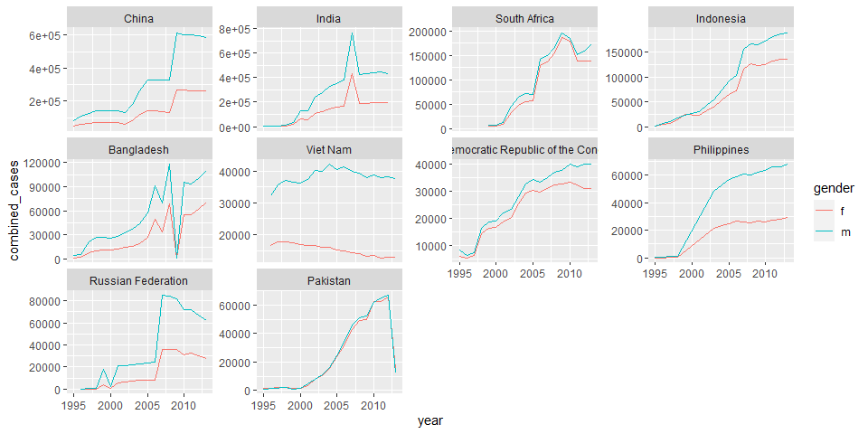

R4DS Study Group - Week 27
================
Pierrette Lo
10/9/2020

  - [This week’s assignment](#this-weeks-assignment)
  - [Ch 12:4 Separating and uniting](#ch-124-separating-and-uniting)
  - [Ch 12:5 Missing values](#ch-125-missing-values)
  - [Ch 12:6 Case study](#ch-126-case-study)

## This week’s assignment

  - Chapter 12

<!-- end list -->

``` r
library(tidyverse)
```

## Ch 12:4 Separating and uniting

### Exercises

> 1.  What do the `extra` and `fill` arguments do in `separate()`?
>     Experiment with the various options for the following two toy
>     datasets.

  - `extra` = what to do if there are too many pieces
  - `fill` = what to do if there are not enough pieces

In the first example, by default the extra piece “g” is dropped with a
warning:

``` r
tibble(x = c("a,b,c", "d,e,f,g", "h,i,j")) %>% 
  separate(x, c("one", "two", "three"))
```

    ## Warning: Expected 3 pieces. Additional pieces discarded in 1 rows [2].

    ## # A tibble: 3 x 3
    ##   one   two   three
    ##   <chr> <chr> <chr>
    ## 1 a     b     c    
    ## 2 d     e     f    
    ## 3 h     i     j

Can keep the extra value using “merge”:

``` r
tibble(x = c("a,b,c", "d,e,f,g", "h,i,j")) %>% 
  separate(x, c("one", "two", "three"),
           extra = "merge")
```

    ## # A tibble: 3 x 3
    ##   one   two   three
    ##   <chr> <chr> <chr>
    ## 1 a     b     c    
    ## 2 d     e     f,g  
    ## 3 h     i     j

In the second example, the 2nd row doesn’t have enough pieces, so by
default is filled with `NA` on the right:

``` r
tibble(x = c("a,b,c", "d,e", "f,g,i")) %>% 
  separate(x, c("one", "two", "three"))
```

    ## Warning: Expected 3 pieces. Missing pieces filled with `NA` in 1 rows [2].

    ## # A tibble: 3 x 3
    ##   one   two   three
    ##   <chr> <chr> <chr>
    ## 1 a     b     c    
    ## 2 d     e     <NA> 
    ## 3 f     g     i

Fill from left instead:

``` r
tibble(x = c("a,b,c", "d,e", "f,g,i")) %>% 
  separate(x, c("one", "two", "three"),
           fill = "left")
```

    ## # A tibble: 3 x 3
    ##   one   two   three
    ##   <chr> <chr> <chr>
    ## 1 a     b     c    
    ## 2 <NA>  d     e    
    ## 3 f     g     i

> 2.  Both `unite()` and `separate()` have a remove argument. What does
>     it do? Why would you set it to `FALSE`?

`remove` indicates whether you remove the original column(s) that is
being separated/united. It can be helpful to leave these in so you can
check.

Eg:

``` r
tibble(x = c("a,b,c", "d,e", "f,g,i")) %>% 
  separate(x, c("one", "two", "three"),
           remove = FALSE)
```

    ## Warning: Expected 3 pieces. Missing pieces filled with `NA` in 1 rows [2].

    ## # A tibble: 3 x 4
    ##   x     one   two   three
    ##   <chr> <chr> <chr> <chr>
    ## 1 a,b,c a     b     c    
    ## 2 d,e   d     e     <NA> 
    ## 3 f,g,i f     g     i

> 3.  Compare and contrast `separate()` and `extract()`.

  - separate = split a column by indicating what to separate by
  - extract = split a column by using regular expressions to indicate
    what to capture (more flexible)

e.g. a column where the values are “green1”, “blue2”, “red3”, etc. -
there isn’t a common separator or position number, so you can use regex
to capture all of the alphabets

> Why are there three variations of separation (by position, by
> separator, and with groups), but only one unite?

There are different options for searching for separators to split up a
column, but only one option is needed for merging a column.

## Ch 12:5 Missing values

### Exercises

> 1.  Compare and contrast the fill arguments to pivot\_wider() and
>     complete().

Example copied from text:

  - explicit missing value: 2015 Q4
  - implicit missing value: 2016 Q1

<!-- end list -->

``` r
stocks <- tibble(
  year   = c(2015, 2015, 2015, 2015, 2016, 2016, 2016),
  qtr    = c(   1,    2,    3,    4,    2,    3,    4),
  return = c(1.88, 0.59, 0.35,   NA, 0.92, 0.17, 2.66)
)
```

`complete` fills in NA for 2016 Q1:

``` r
stocks %>% 
  complete(year, qtr)
```

    ## # A tibble: 8 x 3
    ##    year   qtr return
    ##   <dbl> <dbl>  <dbl>
    ## 1  2015     1   1.88
    ## 2  2015     2   0.59
    ## 3  2015     3   0.35
    ## 4  2015     4  NA   
    ## 5  2016     1  NA   
    ## 6  2016     2   0.92
    ## 7  2016     3   0.17
    ## 8  2016     4   2.66

Use `fill` argument to replace NA with 0:

``` r
stocks %>% 
  complete(year, qtr, fill = list(return = 0))
```

    ## # A tibble: 8 x 3
    ##    year   qtr return
    ##   <dbl> <dbl>  <dbl>
    ## 1  2015     1   1.88
    ## 2  2015     2   0.59
    ## 3  2015     3   0.35
    ## 4  2015     4   0   
    ## 5  2016     1   0   
    ## 6  2016     2   0.92
    ## 7  2016     3   0.17
    ## 8  2016     4   2.66

`pivot_wider` also fills 2016 Q1 with NA:

``` r
stocks %>% 
  pivot_wider(names_from = year, values_from = return)
```

    ## # A tibble: 4 x 3
    ##     qtr `2015` `2016`
    ##   <dbl>  <dbl>  <dbl>
    ## 1     1   1.88  NA   
    ## 2     2   0.59   0.92
    ## 3     3   0.35   0.17
    ## 4     4  NA      2.66

Use `values_fill` argument:

(Note that it only fills the implicit values - the NA that was already
there for 2015 Q4 doesn’t get replaced.)

``` r
stocks %>% 
  pivot_wider(names_from = year, 
              values_from = return,
              values_fill = 0)
```

    ## # A tibble: 4 x 3
    ##     qtr `2015` `2016`
    ##   <dbl>  <dbl>  <dbl>
    ## 1     1   1.88   0   
    ## 2     2   0.59   0.92
    ## 3     3   0.35   0.17
    ## 4     4  NA      2.66

> 2.  What does the `.direction` argument to `fill()` do?

Indicates which direction to copy/paste (up or down)

Example from `?fill`:

``` r
tidy_pets <- tibble::tribble(
  ~rank, ~pet_type, ~breed,
  1L,        NA,    "Boston Terrier",
  2L,        NA,    "Retrievers (Labrador)",
  3L,        NA,    "Retrievers (Golden)",
  4L,        NA,    "French Bulldogs",
  5L,        NA,    "Bulldogs",
  6L,     "Dog",    "Beagles",
  1L,        NA,    "Persian",
  2L,        NA,    "Maine Coon",
  3L,        NA,    "Ragdoll",
  4L,        NA,    "Exotic",
  5L,        NA,    "Siamese",
  6L,     "Cat",    "American Short"
)
```

Fill “up”:

``` r
tidy_pets %>% 
  fill(pet_type, .direction = "up")
```

    ## # A tibble: 12 x 3
    ##     rank pet_type breed                
    ##    <int> <chr>    <chr>                
    ##  1     1 Dog      Boston Terrier       
    ##  2     2 Dog      Retrievers (Labrador)
    ##  3     3 Dog      Retrievers (Golden)  
    ##  4     4 Dog      French Bulldogs      
    ##  5     5 Dog      Bulldogs             
    ##  6     6 Dog      Beagles              
    ##  7     1 Cat      Persian              
    ##  8     2 Cat      Maine Coon           
    ##  9     3 Cat      Ragdoll              
    ## 10     4 Cat      Exotic               
    ## 11     5 Cat      Siamese              
    ## 12     6 Cat      American Short

Note that you get the wrong result if you fill “down”:

``` r
tidy_pets %>% 
  fill(pet_type, .direction = "down")
```

    ## # A tibble: 12 x 3
    ##     rank pet_type breed                
    ##    <int> <chr>    <chr>                
    ##  1     1 <NA>     Boston Terrier       
    ##  2     2 <NA>     Retrievers (Labrador)
    ##  3     3 <NA>     Retrievers (Golden)  
    ##  4     4 <NA>     French Bulldogs      
    ##  5     5 <NA>     Bulldogs             
    ##  6     6 Dog      Beagles              
    ##  7     1 Dog      Persian              
    ##  8     2 Dog      Maine Coon           
    ##  9     3 Dog      Ragdoll              
    ## 10     4 Dog      Exotic               
    ## 11     5 Dog      Siamese              
    ## 12     6 Cat      American Short

## Ch 12:6 Case study

### Notes

Ways to look at a new dataset:

``` r
skimr::skim(who)

glimpse(who)
```

Look at the data dictionary in the help (`?who`): notice that data is
contained in the column headers (not tidy\!)

Data cleaning steps:

1.  Pivot longer, all columns except the first 4 (I didn’t use
    `values_drop_na = TRUE` because I wanted to see the NAs)
2.  Replace “newrel” with “new\_rel” so all variables are consistent
3.  Separate mashed-together variables into their own columns (need to
    do this twice to separate gender/age group)
4.  Remove redundant columns

<!-- end list -->

``` r
who_tidy <- who %>% 
  pivot_longer(cols = c(-country, -iso2, -iso3, -year),
               names_to = "key",
               values_to = "cases") %>% 
  mutate(key = str_replace(key, "newrel", "new_rel")) %>% 
  separate(col = key, 
           into = c("new", "diag_method", "gender_agegroup"),
           sep = "_") %>% 
  separate(col = gender_agegroup, 
           into = c("gender", "age_group"),
           sep = 1) %>% 
  select(-new, -iso2, -iso3)
```

### Exercises

> 1.  In this case study I set `values_drop_na = TRUE` just to make it
>     easier to check that we had the correct values. Is this
>     reasonable? Think about how missing values are represented in this
>     dataset. Are there implicit missing values? What’s the difference
>     between an `NA` and zero?

Look for rows with NA cases:

``` r
who_tidy %>% 
  filter(is.na(cases))
```

    ## # A tibble: 329,394 x 6
    ##    country      year diag_method gender age_group cases
    ##    <chr>       <int> <chr>       <chr>  <chr>     <int>
    ##  1 Afghanistan  1980 sp          m      014          NA
    ##  2 Afghanistan  1980 sp          m      1524         NA
    ##  3 Afghanistan  1980 sp          m      2534         NA
    ##  4 Afghanistan  1980 sp          m      3544         NA
    ##  5 Afghanistan  1980 sp          m      4554         NA
    ##  6 Afghanistan  1980 sp          m      5564         NA
    ##  7 Afghanistan  1980 sp          m      65           NA
    ##  8 Afghanistan  1980 sp          f      014          NA
    ##  9 Afghanistan  1980 sp          f      1524         NA
    ## 10 Afghanistan  1980 sp          f      2534         NA
    ## # ... with 329,384 more rows

Look for rows with 0 cases:

``` r
who_tidy %>% 
  filter(cases == 0)
```

    ## # A tibble: 11,080 x 6
    ##    country      year diag_method gender age_group cases
    ##    <chr>       <int> <chr>       <chr>  <chr>     <int>
    ##  1 Afghanistan  1997 sp          m      014           0
    ##  2 Afghanistan  1997 sp          m      65            0
    ##  3 Afghanistan  1997 sp          f      5564          0
    ##  4 Afghanistan  2007 sn          m      014           0
    ##  5 Afghanistan  2007 sn          m      1524          0
    ##  6 Afghanistan  2007 sn          m      2534          0
    ##  7 Afghanistan  2007 sn          m      3544          0
    ##  8 Afghanistan  2007 sn          m      4554          0
    ##  9 Afghanistan  2007 sn          m      5564          0
    ## 10 Afghanistan  2007 sn          m      65            0
    ## # ... with 11,070 more rows

So it looks like they used 0 to denote no cases, and `NA` means data was
not collected (“explicit” missing values). I suspect that many countries
don’t have data going very far back (the entire dataset is 1980-2013).

“Implicit” missing values means categories that are not represented at
all in the data, not even with `NA.`

Let’s check if there are any of these in the data - start by seeing
whether each country has the same number of observations:

``` r
who_tidy %>% 
  group_by(country) %>% 
  summarize(count = n()) %>% 
  arrange(count)
```

    ## `summarise()` ungrouping output (override with `.groups` argument)

    ## # A tibble: 219 x 2
    ##    country                           count
    ##    <chr>                             <int>
    ##  1 South Sudan                         168
    ##  2 Bonaire, Saint Eustatius and Saba   224
    ##  3 Curacao                             224
    ##  4 Sint Maarten (Dutch part)           224
    ##  5 Montenegro                          504
    ##  6 Serbia                              504
    ##  7 Timor-Leste                         672
    ##  8 Serbia & Montenegro                1400
    ##  9 Netherlands Antilles               1680
    ## 10 Afghanistan                        1904
    ## # ... with 209 more rows

So there are countries with less data than most. Let’s check the year
range for the countries:

``` r
who_tidy %>% 
  group_by(country) %>% 
  summarize(min_year = min(year),
            max_year = max(year)) %>% 
  arrange(desc(min_year))
```

    ## `summarise()` ungrouping output (override with `.groups` argument)

    ## # A tibble: 219 x 3
    ##    country                           min_year max_year
    ##    <chr>                                <int>    <int>
    ##  1 South Sudan                           2011     2013
    ##  2 Bonaire, Saint Eustatius and Saba     2010     2013
    ##  3 Curacao                               2010     2013
    ##  4 Sint Maarten (Dutch part)             2010     2013
    ##  5 Montenegro                            2005     2013
    ##  6 Serbia                                2005     2013
    ##  7 Timor-Leste                           2002     2013
    ##  8 Afghanistan                           1980     2013
    ##  9 Albania                               1980     2013
    ## 10 Algeria                               1980     2013
    ## # ... with 209 more rows

It looks like the implicit missing data are for years where some of the
newer countries didn’t exist yet. E.g. South Sudan became independent in
2011; the Dutch Antilles dissolved in 2010 and formed some new island
nations.

OFF-TOPIC-ISH:

I downloaded the [official data
dictionary](https://extranet.who.int/tme/generateCSV.asp?ds=dictionary)
to see if it says anything about 0’s vs. NA’s.

It doesn’t, but I did discover a discrepancy between the official
dictionary and the very abridged dictionary in the {tidyverse} package:
“newrel” actually means “new and relapsed cases”. “rel” is not a
method of diagnosis, and “newrel” is not a typo that should be corrected
to “new\_rel”. This is a different category that is only associated with
a gender/age group, not a diagnosis method.

I didn’t re-tidy the data with this new knowledge since it didn’t matter
for these exercises, but it’s a good reminder that the actual dataset
may be much more complicated than the abridged {tidyverse} version.

Also, domain expertise is important - the tidyverse dictionary was
probably written by someone who doesn’t understand what “diagnosis
methods” mean. So if you’re working with a dataset that you didn’t
generate, it’s often helpful to talk to the person who did before you
start working on it.

> 2.  What happens if you neglect the `mutate()` step?
>     (`mutate(names_from = stringr::str_replace(key, "newrel",
>     "new_rel"))`)

Note: there is a typo in this version of the text that didn’t exist
previously - the above should read `mutate(key = str_replace(key,
"newrel", "new_rel")`

``` r
who %>% 
  pivot_longer(cols = c(-country, -iso2, -iso3, -year),
               names_to = "key",
               values_to = "cases") %>% 
  #mutate(key = str_replace(key, "newrel", "new_rel")) %>% 
  separate(col = key, 
           into = c("new", "diag_method", "gender_agegroup"),
           sep = "_") %>% 
  separate(col = gender_agegroup, 
           into = c("gender", "age_group"),
           sep = 1) %>% 
  select(-new, -iso2, -iso3)
```

    ## Warning: Expected 3 pieces. Missing pieces filled with `NA` in 101360 rows [43,
    ## 44, 45, 46, 47, 48, 49, 50, 51, 52, 53, 54, 55, 56, 99, 100, 101, 102, 103,
    ## 104, ...].

    ## # A tibble: 405,440 x 6
    ##    country      year diag_method gender age_group cases
    ##    <chr>       <int> <chr>       <chr>  <chr>     <int>
    ##  1 Afghanistan  1980 sp          m      014          NA
    ##  2 Afghanistan  1980 sp          m      1524         NA
    ##  3 Afghanistan  1980 sp          m      2534         NA
    ##  4 Afghanistan  1980 sp          m      3544         NA
    ##  5 Afghanistan  1980 sp          m      4554         NA
    ##  6 Afghanistan  1980 sp          m      5564         NA
    ##  7 Afghanistan  1980 sp          m      65           NA
    ##  8 Afghanistan  1980 sp          f      014          NA
    ##  9 Afghanistan  1980 sp          f      1524         NA
    ## 10 Afghanistan  1980 sp          f      2534         NA
    ## # ... with 405,430 more rows

If you don’t convert “newrel” to “new\_rel”, your `separate` function
doesn’t work correctly, because some rows only have 2 pieces (newrel,
gender/age) and others have 3 (new, diag\_method, gender/age). However,
as mentioned above, we should really be treated “newrel” differently and
`diag_method` should probably be `NA` for those rows.

> 3.  I claimed that `iso2` and `iso3` were redundant with `country.`
>     Confirm this claim.

Check unique values of `iso2` for each country (should be only 1):

  - select `country`, `iso2`, and `iso3` from original `who` dataset
  - keep only unique combinations
  - group by country and see if any countries have more than 1
    combination

<!-- end list -->

``` r
who %>% 
  select(country, iso2, iso3) %>% 
  distinct() %>% 
  group_by(country) %>% 
  filter(n() > 1)
```

    ## # A tibble: 0 x 3
    ## # Groups:   country [0]
    ## # ... with 3 variables: country <chr>, iso2 <chr>, iso3 <chr>

There is only 1 value of `iso2` and `iso3` per country, so these
variables are indeed redundant.

Notice that exploration of large datasets mostly involves counting
things, since it’s too big to eyeball\!

> 4.  For each country, year, and sex compute the total number of cases
>     of TB. Make an informative visualisation of the data.

I decided to plot only the 10 countries with the most total cases (over
the entire time period).

First I modified my dataset to get the count of cases for each
country/year/gender combination:

``` r
plot_data <- who_tidy %>% 
  group_by(country, year, gender) %>%
  drop_na(cases) %>% 
  summarize(combined_cases = sum(cases)) %>%
  group_by(country) %>% 
  mutate(total_cases_ever = sum(combined_cases))
```

    ## `summarise()` regrouping output by 'country', 'year' (override with `.groups` argument)

Then I pulled a list of the top 10 countries:

``` r
top10 <- plot_data %>% 
  select(country, total_cases_ever) %>% 
  distinct() %>% 
  arrange(desc(total_cases_ever)) %>% 
  head(10) %>% 
  pull(country)
```

Then I plotted the data, colored by gender, with facets ordered by
total\_cases\_ever:

``` r
plot_data %>% 
  filter(country %in% top10) %>% 
  ggplot(aes(x = year, y = combined_cases, color = gender)) +
  geom_line() +
  facet_wrap(~fct_reorder(as.factor(country), -total_cases_ever),
             scales = "free_y")
```

<!-- -->

There are some other interesting takes in the [alternative solutions
manual](https://brshallo.github.io/r4ds_solutions/12-tidy-data.html#case-study).
