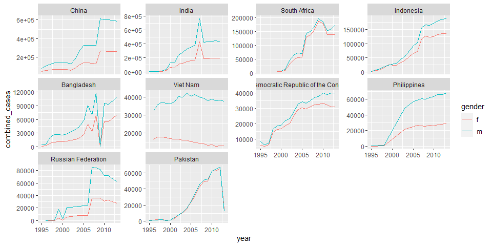

R4DS Study Group - Week 28
================
Pierrette Lo
10/16/2020

  - [This week’s assignment](#this-weeks-assignment)
  - [Ch 12:6 Case study](#ch-126-case-study)

## This week’s assignment

  - Chapter 12

<!-- end list -->

``` r
library(tidyverse)
```

## Ch 12:6 Case study

### Notes

Ways to look at a new dataset:

``` r
skimr::skim(who)

glimpse(who)
```

Look at the data dictionary in the help (`?who`): notice that data is
contained in the column headers (not tidy\!)

Data cleaning steps:

1.  Pivot longer, all columns except the first 4 (I didn’t use
    `values_drop_na = TRUE` because I wanted to see the NAs)
2.  Replace “newrel” with “new\_rel” so all variables are consistent
3.  Separate mashed-together variables into their own columns (need to
    do this twice to separate gender/age group)
4.  Remove redundant columns

<!-- end list -->

``` r
who_tidy <- who %>% 
  pivot_longer(cols = c(-country, -iso2, -iso3, -year),
               names_to = "key",
               values_to = "cases") %>% 
  mutate(key = str_replace(key, "newrel", "new_rel")) %>% 
  separate(col = key, 
           into = c("new", "diag_method", "gender_agegroup"),
           sep = "_") %>% 
  separate(col = gender_agegroup, 
           into = c("gender", "age_group"),
           sep = 1) %>% 
  select(-new, -iso2, -iso3)
```

### Exercises

> 1.  In this case study I set `values_drop_na = TRUE` just to make it
>     easier to check that we had the correct values. Is this
>     reasonable? Think about how missing values are represented in this
>     dataset. Are there implicit missing values? What’s the difference
>     between an `NA` and zero?

Look for rows with NA cases:

``` r
who_tidy %>% 
  filter(is.na(cases))
```

    ## # A tibble: 329,394 x 6
    ##    country      year diag_method gender age_group cases
    ##    <chr>       <int> <chr>       <chr>  <chr>     <int>
    ##  1 Afghanistan  1980 sp          m      014          NA
    ##  2 Afghanistan  1980 sp          m      1524         NA
    ##  3 Afghanistan  1980 sp          m      2534         NA
    ##  4 Afghanistan  1980 sp          m      3544         NA
    ##  5 Afghanistan  1980 sp          m      4554         NA
    ##  6 Afghanistan  1980 sp          m      5564         NA
    ##  7 Afghanistan  1980 sp          m      65           NA
    ##  8 Afghanistan  1980 sp          f      014          NA
    ##  9 Afghanistan  1980 sp          f      1524         NA
    ## 10 Afghanistan  1980 sp          f      2534         NA
    ## # ... with 329,384 more rows

Look for rows with 0 cases:

``` r
who_tidy %>% 
  filter(cases == 0)
```

    ## # A tibble: 11,080 x 6
    ##    country      year diag_method gender age_group cases
    ##    <chr>       <int> <chr>       <chr>  <chr>     <int>
    ##  1 Afghanistan  1997 sp          m      014           0
    ##  2 Afghanistan  1997 sp          m      65            0
    ##  3 Afghanistan  1997 sp          f      5564          0
    ##  4 Afghanistan  2007 sn          m      014           0
    ##  5 Afghanistan  2007 sn          m      1524          0
    ##  6 Afghanistan  2007 sn          m      2534          0
    ##  7 Afghanistan  2007 sn          m      3544          0
    ##  8 Afghanistan  2007 sn          m      4554          0
    ##  9 Afghanistan  2007 sn          m      5564          0
    ## 10 Afghanistan  2007 sn          m      65            0
    ## # ... with 11,070 more rows

So it looks like they used 0 to denote no cases, and `NA` means data was
not collected (“explicit” missing values). I suspect that many countries
don’t have data going very far back (the entire dataset is 1980-2013).

“Implicit” missing values means categories that are not represented at
all in the data, not even with `NA.`

Let’s check if there are any of these in the data - start by seeing
whether each country has the same number of observations:

``` r
who_tidy %>% 
  group_by(country) %>% 
  summarize(count = n()) %>% 
  arrange(count)
```

    ## `summarise()` ungrouping output (override with `.groups` argument)

    ## # A tibble: 219 x 2
    ##    country                           count
    ##    <chr>                             <int>
    ##  1 South Sudan                         168
    ##  2 Bonaire, Saint Eustatius and Saba   224
    ##  3 Curacao                             224
    ##  4 Sint Maarten (Dutch part)           224
    ##  5 Montenegro                          504
    ##  6 Serbia                              504
    ##  7 Timor-Leste                         672
    ##  8 Serbia & Montenegro                1400
    ##  9 Netherlands Antilles               1680
    ## 10 Afghanistan                        1904
    ## # ... with 209 more rows

So there are countries with less data than most. Let’s check the year
range for the countries:

``` r
who_tidy %>% 
  group_by(country) %>% 
  summarize(min_year = min(year),
            max_year = max(year)) %>% 
  arrange(desc(min_year))
```

    ## `summarise()` ungrouping output (override with `.groups` argument)

    ## # A tibble: 219 x 3
    ##    country                           min_year max_year
    ##    <chr>                                <int>    <int>
    ##  1 South Sudan                           2011     2013
    ##  2 Bonaire, Saint Eustatius and Saba     2010     2013
    ##  3 Curacao                               2010     2013
    ##  4 Sint Maarten (Dutch part)             2010     2013
    ##  5 Montenegro                            2005     2013
    ##  6 Serbia                                2005     2013
    ##  7 Timor-Leste                           2002     2013
    ##  8 Afghanistan                           1980     2013
    ##  9 Albania                               1980     2013
    ## 10 Algeria                               1980     2013
    ## # ... with 209 more rows

It looks like the implicit missing data are for years where some of the
newer countries didn’t exist yet. E.g. South Sudan became independent in
2011; the Dutch Antilles dissolved in 2010 and formed some new island
nations.

OFF-TOPIC-ISH:

I downloaded the [official data
dictionary](https://extranet.who.int/tme/generateCSV.asp?ds=dictionary)
to see if it says anything about 0’s vs. NA’s.

It doesn’t, but I did discover a discrepancy between the official
dictionary and the very abridged dictionary in the {tidyverse} package:
“newrel” actually means “new and relapsed cases”. “rel” is not a
method of diagnosis, and “newrel” is not a typo that should be corrected
to “new\_rel”. This is a different category that is only associated with
a gender/age group, not a diagnosis method.

I didn’t re-tidy the data with this new knowledge since it didn’t matter
for these exercises, but it’s a good reminder that the actual dataset
may be much more complicated than the abridged {tidyverse} version.

Also, domain expertise is important - the tidyverse dictionary was
probably written by someone who doesn’t understand what “diagnosis
methods” mean. So if you’re working with a dataset that you didn’t
generate, it’s often helpful to talk to the person who did before you
start working on it.

> 2.  What happens if you neglect the `mutate()` step?
>     (`mutate(names_from = stringr::str_replace(key, "newrel",
>     "new_rel"))`)

Note: there is a typo in this version of the text that didn’t exist
previously - the above should read `mutate(key = str_replace(key,
"newrel", "new_rel")`

``` r
who %>% 
  pivot_longer(cols = c(-country, -iso2, -iso3, -year),
               names_to = "key",
               values_to = "cases") %>% 
  #mutate(key = str_replace(key, "newrel", "new_rel")) %>% 
  separate(col = key, 
           into = c("new", "diag_method", "gender_agegroup"),
           sep = "_") %>% 
  separate(col = gender_agegroup, 
           into = c("gender", "age_group"),
           sep = 1) %>% 
  select(-new, -iso2, -iso3)
```

    ## Warning: Expected 3 pieces. Missing pieces filled with `NA` in 101360 rows [43,
    ## 44, 45, 46, 47, 48, 49, 50, 51, 52, 53, 54, 55, 56, 99, 100, 101, 102, 103,
    ## 104, ...].

    ## # A tibble: 405,440 x 6
    ##    country      year diag_method gender age_group cases
    ##    <chr>       <int> <chr>       <chr>  <chr>     <int>
    ##  1 Afghanistan  1980 sp          m      014          NA
    ##  2 Afghanistan  1980 sp          m      1524         NA
    ##  3 Afghanistan  1980 sp          m      2534         NA
    ##  4 Afghanistan  1980 sp          m      3544         NA
    ##  5 Afghanistan  1980 sp          m      4554         NA
    ##  6 Afghanistan  1980 sp          m      5564         NA
    ##  7 Afghanistan  1980 sp          m      65           NA
    ##  8 Afghanistan  1980 sp          f      014          NA
    ##  9 Afghanistan  1980 sp          f      1524         NA
    ## 10 Afghanistan  1980 sp          f      2534         NA
    ## # ... with 405,430 more rows

If you don’t convert “newrel” to “new\_rel”, your `separate` function
doesn’t work correctly, because some rows only have 2 pieces (newrel,
gender/age) and others have 3 (new, diag\_method, gender/age). However,
as mentioned above, we should really be treated “newrel” differently and
`diag_method` should probably be `NA` for those rows.

> 3.  I claimed that `iso2` and `iso3` were redundant with `country.`
>     Confirm this claim.

Check unique values of `iso2` for each country (should be only 1):

  - select `country`, `iso2`, and `iso3` from original `who` dataset
  - keep only unique combinations
  - group by country and see if any countries have more than 1
    combination

<!-- end list -->

``` r
who %>% 
  select(country, iso2, iso3) %>% 
  distinct() %>% 
  group_by(country) %>% 
  filter(n() > 1)
```

    ## # A tibble: 0 x 3
    ## # Groups:   country [0]
    ## # ... with 3 variables: country <chr>, iso2 <chr>, iso3 <chr>

There is only 1 value of `iso2` and `iso3` per country, so these
variables are indeed redundant.

Notice that exploration of large datasets mostly involves counting
things, since it’s too big to eyeball\!

> 4.  For each country, year, and sex compute the total number of cases
>     of TB. Make an informative visualisation of the data.

I decided to plot only the 10 countries with the most total cases (over
the entire time period).

First I modified my dataset to get the count of cases for each
country/year/gender combination:

``` r
plot_data <- who_tidy %>% 
  group_by(country, year, gender) %>%
  drop_na(cases) %>% 
  summarize(combined_cases = sum(cases)) %>%
  group_by(country) %>% 
  mutate(total_cases_ever = sum(combined_cases))
```

    ## `summarise()` regrouping output by 'country', 'year' (override with `.groups` argument)

Then I pulled a list of the top 10 countries:

``` r
top10 <- plot_data %>% 
  select(country, total_cases_ever) %>% 
  distinct() %>% 
  arrange(desc(total_cases_ever)) %>% 
  head(10) %>% 
  pull(country)
```

Then I plotted the data, colored by gender, with facets ordered by
total\_cases\_ever:

``` r
plot_data %>% 
  filter(country %in% top10) %>% 
  ggplot(aes(x = year, y = combined_cases, color = gender)) +
  geom_line() +
  facet_wrap(~fct_reorder(as.factor(country), -total_cases_ever),
             scales = "free_y")
```

<!-- -->

There are some other interesting takes in the [alternative solutions
manual](https://brshallo.github.io/r4ds_solutions/12-tidy-data.html#case-study).
