R4DS Study Group - Week 3
================
Pierrette Lo
4/24/2020

  - [This week’s assignment](#this-weeks-assignment)
  - [Ch 3:6 Geometric objects](#ch-36-geometric-objects)
  - [Ch 3:7 Statistical
    transformations](#ch-37-statistical-transformations)

## This week’s assignment

  - The rest of Chapter 3

## Ch 3:6 Geometric objects

### Notes

  - The link to the RStudio cheatsheets is broken. The correct link is:
    <https://rstudio.com/resources/cheatsheets/>.
  - The specific link to the {ggplot2} cheatsheet is:
    <https://github.com/rstudio/cheatsheets/raw/master/data-visualization-2.1.pdf>
  - I highly recommend browsing through the cheatsheet just to get an
    idea of what’s possible.
  - The link to ggplot2 extensions is also broken; correct link is:
    <http://exts.ggplot2.tidyverse.org/>

### Exercises

As always, start by loading {tidyverse}

``` r
library(tidyverse)
```

    ## Warning: package 'tidyverse' was built under R version 3.6.1

    ## -- Attaching packages ---------------------------------------------------------------------------------------- tidyverse 1.3.0 --

    ## v ggplot2 3.3.0     v purrr   0.3.3
    ## v tibble  3.0.0     v dplyr   0.8.5
    ## v tidyr   1.0.0     v stringr 1.4.0
    ## v readr   1.3.1     v forcats 0.4.0

    ## Warning: package 'ggplot2' was built under R version 3.6.3

    ## Warning: package 'tibble' was built under R version 3.6.3

    ## Warning: package 'tidyr' was built under R version 3.6.1

    ## Warning: package 'purrr' was built under R version 3.6.1

    ## Warning: package 'dplyr' was built under R version 3.6.3

    ## -- Conflicts ------------------------------------------------------------------------------------------- tidyverse_conflicts() --
    ## x dplyr::filter() masks stats::filter()
    ## x dplyr::lag()    masks stats::lag()

> 1.  What geom would you use to draw a line chart? A boxplot? A
>     histogram? An area chart?

`geom_line`, `geom_boxplot`, `geom_histogram`, `geom_area`

See
[cheatsheet](https://github.com/rstudio/cheatsheets/raw/master/data-visualization-2.1.pdf)
for more\!

> 2.  Run this code in your head and predict what the output will look
>     like. Then, run the code in R and check your predictions.

``` r
ggplot(data = mpg, mapping = aes(x = displ, y = hwy, color = drv)) + 
  geom_point() + 
  geom_smooth(se = FALSE)
```

    ## `geom_smooth()` using method = 'loess' and formula 'y ~ x'

<!-- -->

The last line means there is a smoothed line of best fit, for each `drv`
group (remember that `color` automatically groups the variable it is
mapped to) without standard errors.

> 3.  What does `show.legend = FALSE` do? What happens if you remove it?
>     Why do you think I used it earlier in the chapter?

Here’s the example where it was used:

``` r
ggplot(data = mpg) +
  geom_smooth(
    mapping = aes(x = displ, y = hwy, color = drv),
        show.legend = FALSE
  )
```

    ## `geom_smooth()` using method = 'loess' and formula 'y ~ x'

<!-- -->

`show.legend` controls whether the legend is shown. You can see the
difference by changing `FALSE` to `TRUE`. `TRUE` is the default, so if
you want a legend, you don’t need to include `show.legend` at all (note
what happens if you delete it from the code above).

> 4.  What does the se argument to geom\_smooth() do?

``` r
ggplot(data = mpg, mapping = aes(x = displ, y = hwy, color = drv)) + 
  geom_point() + 
  geom_smooth()
```

    ## `geom_smooth()` using method = 'loess' and formula 'y ~ x'

<!-- -->

`se = TRUE` plots standard error as a grey shaded ribbon. Note the lack
of this in the above answer to question \#2, where `se = FALSE`.

`TRUE` is the default, so if you want the standard error ribbon, you
only need to type `geom_smooth()`.

> 5.  Will these two graphs look different? Why/why not?

They should look the same. `geom_point()` and `geom_smooth()` inherit
the options you supply to `ggplot()`, so specifying the data and
mappings in each individual layer is redundant.

``` r
ggplot(data = mpg, mapping = aes(x = displ, y = hwy)) + 
  geom_point() + 
  geom_smooth()
```

    ## `geom_smooth()` using method = 'loess' and formula 'y ~ x'

<!-- -->

``` r
ggplot() + 
  geom_point(data = mpg, mapping = aes(x = displ, y = hwy)) + 
  geom_smooth(data = mpg, mapping = aes(x = displ, y = hwy))
```

    ## `geom_smooth()` using method = 'loess' and formula 'y ~ x'

<!-- -->

> 6.  Recreate the R code necessary to generate the following graphs.

Top left:

``` r
ggplot(mpg, aes(x = displ, y = hwy)) +
  geom_point(size = 5) +
  geom_smooth(se = F, size = 2)
```

    ## `geom_smooth()` using method = 'loess' and formula 'y ~ x'

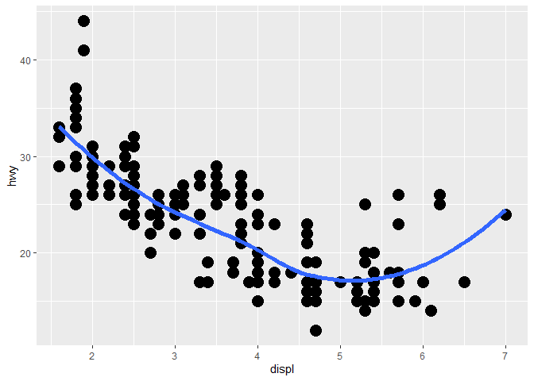<!-- -->

Top right:

``` r
ggplot(mpg, aes(x = displ, y = hwy)) +
  geom_point(size = 5) +
  geom_smooth(aes(group = drv), se = F, size = 2)
```

    ## `geom_smooth()` using method = 'loess' and formula 'y ~ x'

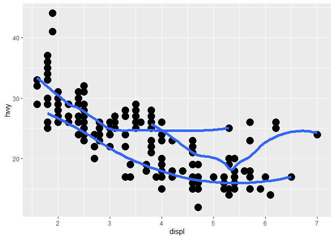<!-- -->

Middle left:

``` r
ggplot(mpg, aes(x = displ, y = hwy, color = drv)) +
  geom_point(size = 5) +
  geom_smooth(se = F, size = 2)
```

    ## `geom_smooth()` using method = 'loess' and formula 'y ~ x'

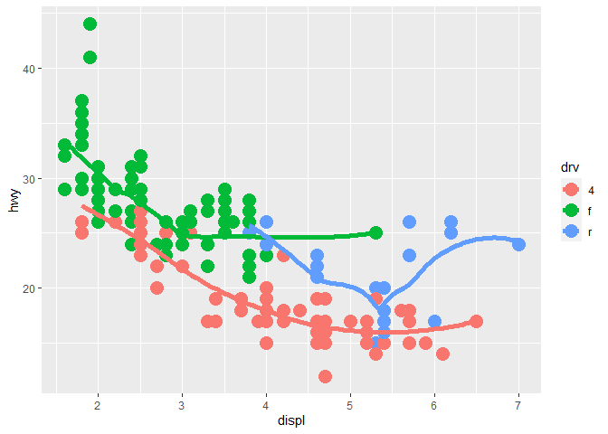<!-- -->

Middle right - you only want the points to be colored by drv, not the
lines

``` r
ggplot(mpg, aes(x = displ, y = hwy)) +
  geom_point(aes(color = drv), size = 5) +
  geom_smooth(se = F, size = 2)
```

    ## `geom_smooth()` using method = 'loess' and formula 'y ~ x'

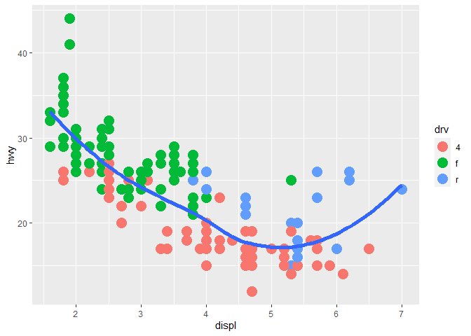<!-- -->

Bottom left - color points by drv, linetype by drv

``` r
ggplot(mpg, aes(x = displ, y = hwy)) +
  geom_point(aes(color = drv), size = 5) +
  geom_smooth(aes(linetype = drv), se = F, size = 2)
```

    ## `geom_smooth()` using method = 'loess' and formula 'y ~ x'

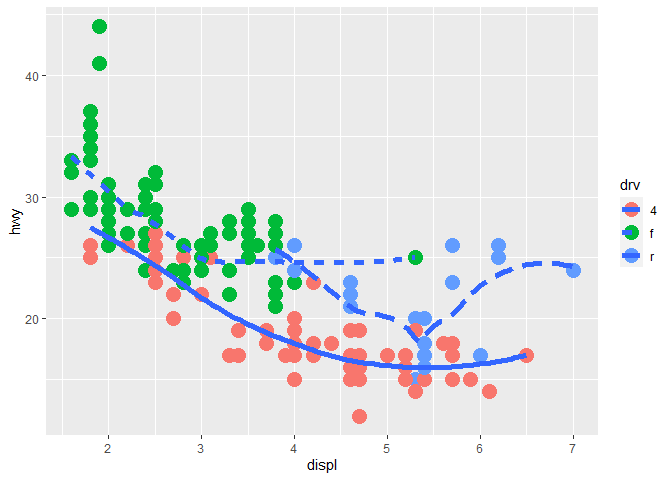<!-- -->

Bottom right - change the shape to 21 (open circle) so you can specify
fill, border color, and border weight=

``` r
ggplot(mpg, aes(x = displ, y = hwy)) +
  geom_point(aes(fill = drv), size = 5, shape = 21, color = "white", stroke = 3)
```

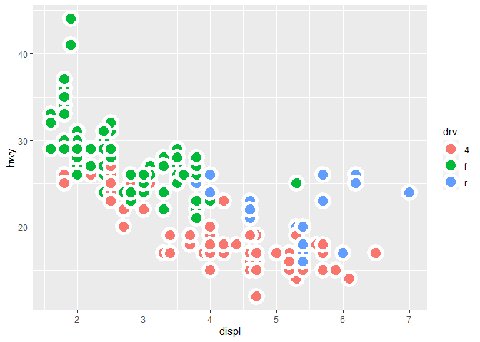<!-- -->

## Ch 3:7 Statistical transformations

### Notes

  - This is a little more “under the hood” - to be honest, I almost
    never use stats for the visualizations that I do. I feel like it’s
    better to calculate the statistics yourself so you can see what’s
    happening in your data and check for mistakes, rather than having
    ggplot do it.
  - Check out the {ggplot2} cheatsheet for the different types of stats

### Exercises

> 1.  What is the default geom associated with stat\_summary()? How
>     could you rewrite the previous plot to use that geom function
>     instead of the stat function?

First check out `?stat_summary` - it looks like the default geom is
`pointrange`, which is a point with 2 lines, kind of like an error bar.

The example code (copied & pasted below) is specifying that you want the
point (`fun.y`) to be the median `depth`, and lines to indicate the
range of `depth` (`fun.ymin` and `fun.ymax`). Note that `fun` indicates
a function.

``` r
ggplot(data = diamonds) + 
  stat_summary(
    mapping = aes(x = cut, y = depth),
    fun.ymin = min,
    fun.ymax = max,
    fun.y = median
  )
```

    ## Warning: `fun.y` is deprecated. Use `fun` instead.

    ## Warning: `fun.ymin` is deprecated. Use `fun.min` instead.

    ## Warning: `fun.ymax` is deprecated. Use `fun.max` instead.

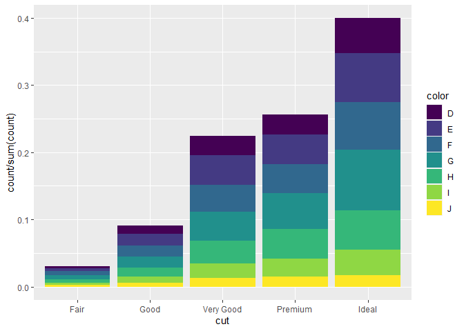<!-- -->

NOTE: If you look at the help for `stat_summary`, you’ll notice in the
Arguments section that `fun.ymin`, `fun.ymax`, and `fun.y` are
“deprecated” (meaning that although they still work, they are not the
preferred version, and you should use `fun.min`, `fun.max`, and `fun`
instead).

So this version of the code with the preferred `fun` arguments returns
the same plot:

``` r
ggplot(data = diamonds) + 
  stat_summary(
    mapping = aes(x = cut, y = depth),
    fun.min = min,
    fun.max = max,
    fun = median
  )
```

<!-- -->

To use `geom_pointrange()` instead of `stat_summary()`:

First check out `?geom_pointrange` to read about how to use this
function.

``` r
ggplot(data = diamonds) + 
  geom_pointrange(
    mapping = aes(x = cut, y = depth), stat = "summary")
```

    ## No summary function supplied, defaulting to `mean_se()`

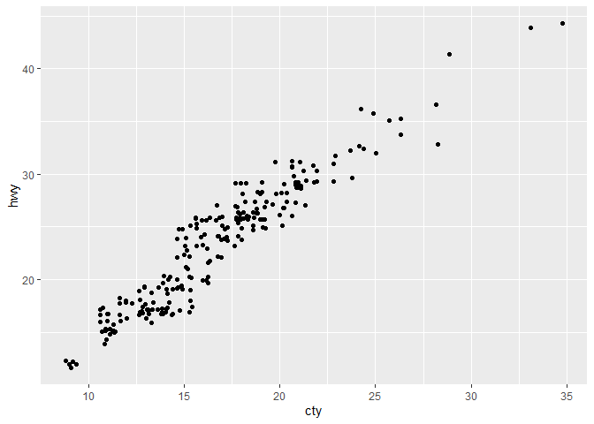<!-- -->

This looks different because `stat = "summary` calculates se as the
default for the line. If you want to use min/max as in the example,
specify using the preferred `fun` arguments for `stat_summary` (the
deprecated arguments will NOT work here for newer versions of the
{ggplot2} package, contrary to the answer in the [solutions
manual](https://jrnold.github.io/r4ds-exercise-solutions/data-visualisation.html#exercise-3.7.1)).

``` r
ggplot(data = diamonds) + 
  geom_pointrange(
    mapping = aes(x = cut, y = depth),
    stat = "summary",
    fun.min = min,
    fun.max = max,
    fun = median
  )
```

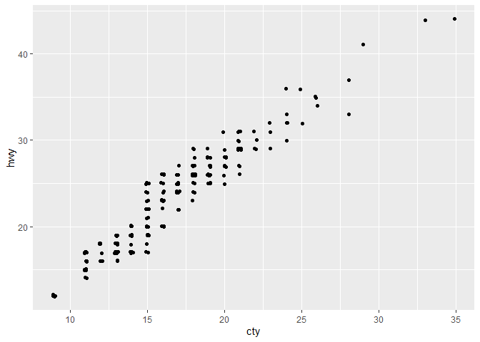<!-- -->

> 2.  What does geom\_col() do? How is it different to geom\_bar()?

See the help page for these two geoms (`?geom_col`).

For `geom_col()`, default `stat` is “identity” – meaning for each `x` it
will read the value of `y` directly from the data. So for `geom_col()`
you need to input both `x` and `y`.

For `geom_bar()`, default `stat` = “bin” – meaning it will count the
number of observations for each value of `x`. So for `geom_bar()` you
only need to input `x`, and `y` will automatically be the count.

``` r
ggplot(data = diamonds) +
  geom_bar(aes(x = cut))
```

<!-- -->

``` r
ggplot(data = diamonds) +
  geom_col(aes(x = cut, y = price))
```

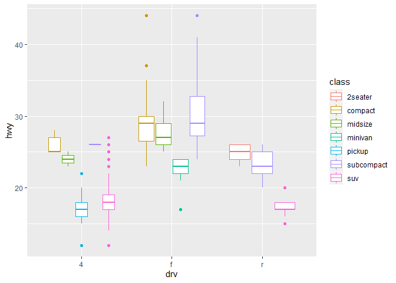<!-- -->

> 3.  Most geoms and stats come in pairs that are almost always used in
>     concert. Read through the documentation and make a list of all the
>     pairs. What do they have in common?

See the [solutions
manual](https://jrnold.github.io/r4ds-exercise-solutions/data-visualisation.html#exercise-3.7.3)
for an extensive list.

> 4.  What variables does stat\_smooth() compute? What parameters
>     control its behaviour?

According to the “Computed variables” section of the help
(`?stat_smooth`): `y`, `ymin`, `ymax`, `se.`

There are several parameters (“Arguments”), including `method`,
`formula`, `se`, `level`, etc.

> 5.  In our proportion bar chart, we need to set group = 1. Why? In
>     other words what is the problem with these two graphs?

The default behavior of `geom_bar` is to bin each value of `x` into
groups and then calculate proportion within groups - thus each group has
a proportion of 100%.

You need a dummy group to force `geom_bar` to calculate proportions
across all values of `x`. Do this by adding `group = 1` (or `group =
"dummy/whatever"`) to the aesthetics as follows:

``` r
# Original code:
  # ggplot(data = diamonds) +
  # geom_bar(mapping = aes(x = cut, y = stat(prop)))

ggplot(data = diamonds) + 
  geom_bar(mapping = aes(x = cut, y = stat(prop), group = "dummy"))
```

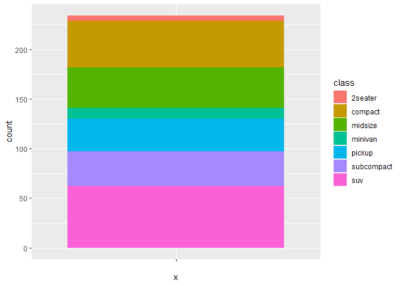<!-- -->

With the 2nd example, fill = color is again causing geom\_bar to group
each value of `cut` as 100% and show the proportion of each VALUE of
`color` (there are 7 values of color, so there are 7 equal portions). If
you want to calculate the relative proportions of the NUMBER of diamonds
of each `color` within each `cut` group, you need to manually calculate
the proportions as follows:

``` r
# Original code:
  ggplot(data = diamonds) +
  geom_bar(mapping = aes(x = cut, y = stat(prop), fill = color))
```

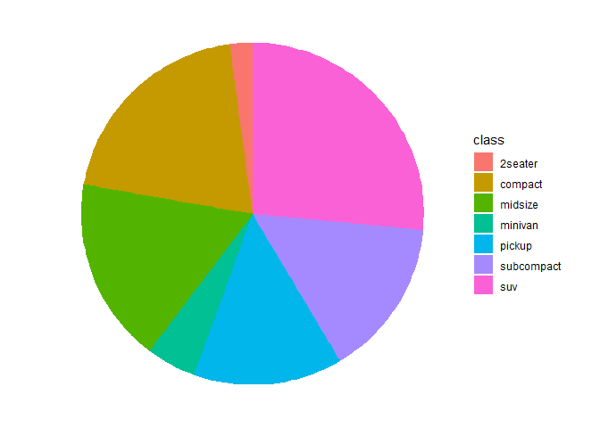<!-- -->

``` r
ggplot(data = diamonds) + 
  geom_bar(mapping = aes(x = cut, y = stat(count)/sum(stat(count)), fill = color))
```

<!-- -->
