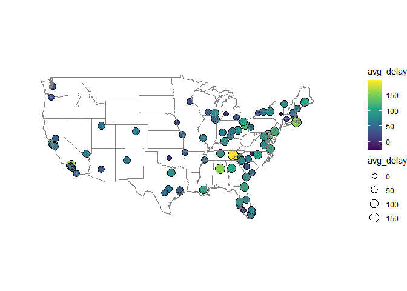

R4DS Study Group - Week 32
================
Pierrette Lo
11/13/2020

  - [This week’s assignment](#this-weeks-assignment)

## This week’s assignment

  - Chapter 13, sections 1-3

<!-- end list -->

``` r
library(tidyverse)
library(nycflights13)
```

\= \#\# Ch 13:4 Mutating joins

### Exercises

> 1.  Compute the average delay by destination, then join on the
>     `airports` data frame so you can show the spatial distribution of
>     delays.

Note about this code copied from text: In this case you use a semi-join
because you only want the rows from the `airports` dataset that are
found in the `dest` column in `flights`. (There are 1458 unique airports
in `airports` and only 105 unique destinations in `flights`.)

``` r
airports %>%
  semi_join(flights, c("faa" = "dest")) %>%
  ggplot(aes(lon, lat)) +
    borders("state") +
    geom_point() +
    coord_quickmap()
```

<!-- -->

Step 1: Use `flights` to summarize average delay by destination (don’t
forget to ignore NAs\!) Step 2: Left join to `airports` to get
coordinates (here you use left join because you’re starting with the
list of `dest`s and pulling in `lat` and `lon`) Step 3: Plot using a
divergent color palette (as opposed to sequential or qualitative - see
[here](https://ggplot2.tidyverse.org/reference/scale_brewer.html) for
details)

``` r
flights %>% 
  group_by(dest) %>% 
  summarize(avg_delay = mean(arr_delay, na.rm = TRUE)) %>% 
  left_join(airports, 
            by = c("dest" = "faa")) %>% 
  select(dest, avg_delay, lat, lon) %>% 
  ggplot(aes(x = lon, y = lat)) +
  geom_point(aes(fill = avg_delay),
             size = 3,
             shape = 21,
             color = "black") +
  borders("state") +
  coord_quickmap() +
  theme_void() +
  scale_fill_viridis_c() +
  # limit axes to continental US
  xlim(-130, -60) +
  ylim(20, 55) +
  ggtitle("Average arrival delay (minutes) by destination")
```

    ## `summarise()` ungrouping output (override with `.groups` argument)

    ## Warning: Removed 6 rows containing missing values (geom_point).

<!-- -->

> 2.  Add the location of the origin and destination (i.e. the `lat` and
>     `lon`) to `flights`.

We’ll need two left joins for this: once to bring in the origin lat/lon,
and a 2nd to bring in the destination lat/lon.

Because we’ll end up with 2 sets of columns names `lat` and `lon`, R
automatically adds a suffix after the 2nd join to distinguish them
(`lat.x`, `lat.y`, `lon.x`, `lon.y`). We can customize from the default
“.x” and “.y” to "\_origin" and "\_dest".

Also note that you can use pipes inside pipes\! (to select only the
columns from `airport` that you want to join)

``` r
flights %>% 
  left_join(airports %>% select(faa, lat, lon),
            by = c("origin" = "faa")) %>% 
  left_join(airports %>% select(faa, lat, lon),
            by = c("dest" = "faa"),
            suffix = c("_origin", "_dest"))
```

    ## # A tibble: 336,776 x 23
    ##     year month   day dep_time sched_dep_time dep_delay arr_time sched_arr_time
    ##    <int> <int> <int>    <int>          <int>     <dbl>    <int>          <int>
    ##  1  2013     1     1      517            515         2      830            819
    ##  2  2013     1     1      533            529         4      850            830
    ##  3  2013     1     1      542            540         2      923            850
    ##  4  2013     1     1      544            545        -1     1004           1022
    ##  5  2013     1     1      554            600        -6      812            837
    ##  6  2013     1     1      554            558        -4      740            728
    ##  7  2013     1     1      555            600        -5      913            854
    ##  8  2013     1     1      557            600        -3      709            723
    ##  9  2013     1     1      557            600        -3      838            846
    ## 10  2013     1     1      558            600        -2      753            745
    ## # ... with 336,766 more rows, and 15 more variables: arr_delay <dbl>,
    ## #   carrier <chr>, flight <int>, tailnum <chr>, origin <chr>, dest <chr>,
    ## #   air_time <dbl>, distance <dbl>, hour <dbl>, minute <dbl>, time_hour <dttm>,
    ## #   lat_origin <dbl>, lon_origin <dbl>, lat_dest <dbl>, lon_dest <dbl>

Final note: I noticed there are 4 destinations that don’t have
coordinates (BQN, SJU, STT, PSE) - these are in Puerto Rico and
St. Thomas, which I guess were not included in `airports`. (You can
identify these airports by adding the following code to the above
chunk):

``` 
 %>% 
  filter(is.na(lat_dest)) %>% 
  distinct(dest)
```

> 3.  Is there a relationship between the age of a plane and its delays?

Start with flights, bring in `year` from `planes` (renamed to avoid
confusion with `year` in `flights`).

Calculate `age` and plot `avg_delay` vs. `age`.

``` r
flights %>% 
  left_join(planes %>% select(tailnum, "year_manufactured" = year),
            by = "tailnum") %>% 
  mutate(age = 2013 - year_manufactured) %>% 
  group_by(age) %>% 
  summarize(avg_delay = mean(arr_delay, na.rm = TRUE)) %>% 
  ggplot(aes(x = age, y = avg_delay)) +
  geom_point() +
  geom_smooth()
```

    ## `summarise()` ungrouping output (override with `.groups` argument)

    ## `geom_smooth()` using method = 'loess' and formula 'y ~ x'

    ## Warning: Removed 1 rows containing non-finite values (stat_smooth).

    ## Warning: Removed 1 rows containing missing values (geom_point).

<!-- -->

Looks like planes around 10 years old have the highest delays - not sure
why? Maybe because older planes that aren’t functioning well get removed
from service, so you’re selecting for the best ones. Or there are
probably many other confounding factors that aren’t considered here.

> 4.  What weather conditions make it more likely to see a delay?

  - Use inner join to only get rows that have both flight and weather
    info (since I noticed there are gaps in the weather dataset)
  - Summarize delays and weather by `time_hour`
  - Pivot delays so I can look at any type of delay (either arr or dep)
  - Pivot weather so I can make a faceted plot

<!-- end list -->

``` r
flights %>% 
  inner_join(weather, by = "time_hour") %>% 
  group_by(time_hour) %>% 
  summarize(avg_arr_delay = mean(arr_delay, na.rm = TRUE),
            avg_dep_delay = mean(dep_delay, na.rm = TRUE),
            avg_temp = mean(temp, na.rm = TRUE),
            avg_wind_speed = mean(wind_speed, na.rm = TRUE),
            avg_precip = mean(precip, na.rm = TRUE),
            avg_visib = mean(visib, na.rm = TRUE)) %>% 
  pivot_longer(cols = ends_with("delay"),
               names_to = "delay_type",
               values_to = "delay") %>% 
  pivot_longer(cols = starts_with("avg"),
               names_to = "weather_metric",
               values_to = "weather_value") %>% 
  ggplot(aes(x = weather_value, y = delay)) +
  geom_point() +
  geom_smooth(method = "lm") +
  facet_wrap(~ weather_metric, scales = "free_x")
```

    ## `summarise()` ungrouping output (override with `.groups` argument)

    ## `geom_smooth()` using formula 'y ~ x'

    ## Warning: Removed 108 rows containing non-finite values (stat_smooth).

    ## Warning: Removed 108 rows containing missing values (geom_point).

<!-- -->

Looks like precipitation has the greatest effect on delay. Wind speed
also slightly increases delay, but maybe it’s not significant. As
expected, greater visibility decreases delay.

> 5.  What happened on June 13 2013? Display the spatial pattern of
>     delays, and then use Google to cross-reference with the weather.

Reference Exercise 1 code to make the map.

``` r
flights %>% 
  filter(month == 6 & day == 13) %>% 
  group_by(dest) %>% 
  summarize(avg_delay = mean(arr_delay, na.rm = TRUE)) %>% 
  left_join(airports, 
            by = c("dest" = "faa")) %>% 
  select(dest, avg_delay, lat, lon) %>%
  ggplot(aes(x = lon, y = lat)) +
  geom_point(aes(fill = avg_delay, size = avg_delay),
             shape = 21,
             color = "black") +
  borders("state") +
  coord_quickmap() +
  theme_void() +
  scale_fill_viridis_c() +
  # limit axes to continental US
  xlim(-130, -60) +
  ylim(20, 55)
```

    ## `summarise()` ungrouping output (override with `.groups` argument)

    ## Warning: Removed 8 rows containing missing values (geom_point).

<!-- -->

Googling “weather June 13 2013” brings up this [Wikipedia
entry](https://en.wikipedia.org/wiki/June_12%E2%80%9313,_2013_derecho_series)
about 2 major storm systems across the Midwest/Mid-Atlantic, and the
Southeast.

A bit hard to tell from this simple map - would be good to have a
comparison with full dataset map:

``` r
library(patchwork)

p1 <- flights %>% 
  group_by(dest) %>% 
  summarize(avg_delay = mean(arr_delay, na.rm = TRUE)) %>% 
  left_join(airports, 
            by = c("dest" = "faa")) %>% 
  select(dest, avg_delay, lat, lon) %>% 
  ggplot(aes(x = lon, y = lat)) +
  geom_point(aes(fill = avg_delay),
             size = 3,
             shape = 21,
             color = "black") +
  borders("state") +
  coord_quickmap() +
  theme_void() +
  scale_fill_viridis_c() +
  # limit axes to continental US
  xlim(-130, -60) +
  ylim(20, 55) +
  ggtitle("Average arrival delay, full 2013 dataset")
```

    ## `summarise()` ungrouping output (override with `.groups` argument)

``` r
p2 <- flights %>% 
  filter(month == 6 & day == 13) %>% 
  group_by(dest) %>% 
  summarize(avg_delay = mean(arr_delay, na.rm = TRUE)) %>% 
  left_join(airports, 
            by = c("dest" = "faa")) %>% 
  select(dest, avg_delay, lat, lon) %>%
  ggplot(aes(x = lon, y = lat)) +
  geom_point(aes(fill = avg_delay),
             size = 3,
             shape = 21,
             color = "black") +
  borders("state") +
  coord_quickmap() +
  theme_void() +
  scale_fill_viridis_c() +
  # limit axes to continental US
  xlim(-130, -60) +
  ylim(20, 55) +
  ggtitle("Average arrival delay, June 13 2013")
```

    ## `summarise()` ungrouping output (override with `.groups` argument)

``` r
p1 / p2
```

    ## Warning: Removed 6 rows containing missing values (geom_point).

    ## Warning: Removed 5 rows containing missing values (geom_point).

<!-- -->

This is still pretty “meh”, although you can at least see that there
were much greater delays on average during June 13.
