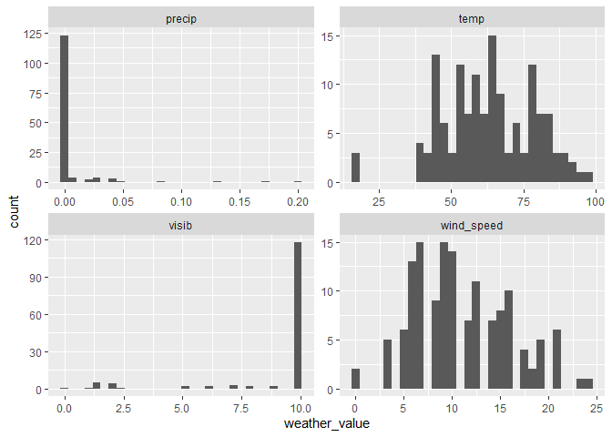

R4DS Study Group - Week 33
================
Pierrette Lo
11/20/2020

  - [This week’s assignment](#this-weeks-assignment)
  - [Ch 13:5 Filtering joins](#ch-135-filtering-joins)

## This week’s assignment

  - Chapter 13, sections 1-3

<!-- end list -->

``` r
library(tidyverse)
library(nycflights13)
```

### Notes

Check out the [{datapasta}](https://milesmcbain.github.io/datapasta/)
package for copying and pasting data to and from R\!

You can paste data as a vector or tibble using commands
(e.g. `vector_paste()`) or RStudio Addins that appear when you install
the package.

My use case:

  - Excel file with continually updated list of samples in Box
  - Don’t want to keep re-downloading the file, and linking directly to
    Box would be complicated (if even possible)

<!-- end list -->

1.  Go to Excel sheet
2.  Copy the cells I want (Ctrl-C)
3.  Go to RStudio -\> Addins menu -\> Paste as vector

<!-- end list -->

``` r
sample_list <- c("14-00153",
                 "14-00154",
                 "14-00155",
                 "14-00156",
                 "14-00157",
                 "14-00158",
                 "14-00159")

sample_df <- tibble::tribble(
               ~`Patient:.Patient.ID`, ~`Specimen:.Lab.ID`,
                                1496L,          "14-00153",
                                1496L,          "14-00154",
                                1496L,          "14-00155",
                                1497L,          "14-00156",
                                1497L,          "14-00157",
                                1498L,          "14-00158",
                                1499L,          "14-00159",
                                1499L,          "14-00160"
               )
```

## Ch 13:5 Filtering joins

### Exercises

> 1.  What does it mean for a flight to have a missing tailnum? What do
>     the tail numbers that don’t have a matching record in planes have
>     in common? (Hint: one variable explains \~90% of the problems.)

Flights that don’t have `tailnum` appear to be ones that were canceled:

``` r
flights %>% 
  filter(is.na(tailnum))
```

    ## # A tibble: 2,512 x 19
    ##     year month   day dep_time sched_dep_time dep_delay arr_time sched_arr_time
    ##    <int> <int> <int>    <int>          <int>     <dbl>    <int>          <int>
    ##  1  2013     1     2       NA           1545        NA       NA           1910
    ##  2  2013     1     2       NA           1601        NA       NA           1735
    ##  3  2013     1     3       NA            857        NA       NA           1209
    ##  4  2013     1     3       NA            645        NA       NA            952
    ##  5  2013     1     4       NA            845        NA       NA           1015
    ##  6  2013     1     4       NA           1830        NA       NA           2044
    ##  7  2013     1     5       NA            840        NA       NA           1001
    ##  8  2013     1     7       NA            820        NA       NA            958
    ##  9  2013     1     8       NA           1645        NA       NA           1838
    ## 10  2013     1     9       NA            755        NA       NA           1012
    ## # ... with 2,502 more rows, and 11 more variables: arr_delay <dbl>,
    ## #   carrier <chr>, flight <int>, tailnum <chr>, origin <chr>, dest <chr>,
    ## #   air_time <dbl>, distance <dbl>, hour <dbl>, minute <dbl>, time_hour <dttm>

Flights whose `tailnum` is not found in `planes`:

``` r
flights %>% 
  anti_join(planes, by = "tailnum") %>% 
  group_by(carrier) %>% 
  summarize(count = n())
```

    ## `summarise()` ungrouping output (override with `.groups` argument)

    ## # A tibble: 10 x 2
    ##    carrier count
    ##    <chr>   <int>
    ##  1 9E       1044
    ##  2 AA      22558
    ##  3 B6        830
    ##  4 DL        110
    ##  5 F9         50
    ##  6 FL        187
    ##  7 MQ      25397
    ##  8 UA       1693
    ##  9 US        699
    ## 10 WN         38

Looks like most of the flights that don’t have info in `planes` are from
AA (American) or MQ (Envoy). If you look at the help (`?planes`), it
says that AA and MQ report fleet numbers rather than tail numbers, so
these can’t be matched with `flights`. I’m not sure what happened with
the planes from other airlines - maybe data entry errors?

> 2.  Filter flights to only show flights with planes that have flown at
>     least 100 flights.

First get list of `tailnum`s that have flown more than 100 flights (be
sure to filter out flights that don’t have `tailnum`). (Like making a
lookup table)

Then join to `flights` to get only the flights with those `tailnum`s

``` r
tailnum_100 <- flights %>% 
  filter(!is.na(tailnum)) %>% 
  group_by(tailnum) %>% 
  summarize(count = n()) %>% 
  filter(count >= 100) %>% 
  arrange(desc(count))
```

    ## `summarise()` ungrouping output (override with `.groups` argument)

``` r
flights %>% 
  semi_join(tailnum_100, by = "tailnum")
```

    ## # A tibble: 228,390 x 19
    ##     year month   day dep_time sched_dep_time dep_delay arr_time sched_arr_time
    ##    <int> <int> <int>    <int>          <int>     <dbl>    <int>          <int>
    ##  1  2013     1     1      517            515         2      830            819
    ##  2  2013     1     1      533            529         4      850            830
    ##  3  2013     1     1      544            545        -1     1004           1022
    ##  4  2013     1     1      554            558        -4      740            728
    ##  5  2013     1     1      555            600        -5      913            854
    ##  6  2013     1     1      557            600        -3      709            723
    ##  7  2013     1     1      557            600        -3      838            846
    ##  8  2013     1     1      558            600        -2      849            851
    ##  9  2013     1     1      558            600        -2      853            856
    ## 10  2013     1     1      558            600        -2      923            937
    ## # ... with 228,380 more rows, and 11 more variables: arr_delay <dbl>,
    ## #   carrier <chr>, flight <int>, tailnum <chr>, origin <chr>, dest <chr>,
    ## #   air_time <dbl>, distance <dbl>, hour <dbl>, minute <dbl>, time_hour <dttm>

> 3.  Combine fueleconomy::vehicles and fueleconomy::common to find only
>     the records for the most common models.

`common` = models with \>= 10 years of data

``` r
library(fueleconomy)
```

    ## Warning: package 'fueleconomy' was built under R version 4.0.3

``` r
vehicles %>% 
  semi_join(common, by = c("make", "model"))
```

    ## # A tibble: 14,531 x 12
    ##       id make  model   year class   trans  drive     cyl displ fuel    hwy   cty
    ##    <dbl> <chr> <chr>  <dbl> <chr>   <chr>  <chr>   <dbl> <dbl> <chr> <dbl> <dbl>
    ##  1  1833 Acura Integ~  1986 Subcom~ Autom~ Front-~     4   1.6 Regu~    28    22
    ##  2  1834 Acura Integ~  1986 Subcom~ Manua~ Front-~     4   1.6 Regu~    28    23
    ##  3  3037 Acura Integ~  1987 Subcom~ Autom~ Front-~     4   1.6 Regu~    28    22
    ##  4  3038 Acura Integ~  1987 Subcom~ Manua~ Front-~     4   1.6 Regu~    28    23
    ##  5  4183 Acura Integ~  1988 Subcom~ Autom~ Front-~     4   1.6 Regu~    27    22
    ##  6  4184 Acura Integ~  1988 Subcom~ Manua~ Front-~     4   1.6 Regu~    28    23
    ##  7  5303 Acura Integ~  1989 Subcom~ Autom~ Front-~     4   1.6 Regu~    27    22
    ##  8  5304 Acura Integ~  1989 Subcom~ Manua~ Front-~     4   1.6 Regu~    28    23
    ##  9  6442 Acura Integ~  1990 Subcom~ Autom~ Front-~     4   1.8 Regu~    24    20
    ## 10  6443 Acura Integ~  1990 Subcom~ Manua~ Front-~     4   1.8 Regu~    26    21
    ## # ... with 14,521 more rows

> 4.  Find the 48 hours (over the course of the whole year) that have
>     the worst delays. Cross-reference it with the weather data. Can
>     you see any patterns?

“Worst” delays could be defined in different ways, but I decided to pull
data on 48 separate (non-contiguous) hours with most cumulative
departure delays (b/c `weather` is about origin airports).

Then use that to filter the `weather` dataset, pivot longer like last
week, and plot histograms to look for any clusters of weather metrics.

``` r
most_delayed <- flights %>% 
  group_by(time_hour) %>% 
  summarize(total_dep_delay = sum(dep_delay)) %>% 
  arrange(desc(total_dep_delay)) %>% 
  head(48)
```

    ## `summarise()` ungrouping output (override with `.groups` argument)

``` r
weather %>% 
  semi_join(most_delayed, by = "time_hour") %>% 
  select(time_hour, temp, wind_speed, precip, visib) %>% 
  pivot_longer(cols = -time_hour,
               names_to = "weather_metric",
               values_to = "weather_value") %>% 
  ggplot(aes(x = weather_value)) +
  geom_histogram() +
  facet_wrap(~ weather_metric, scales = "free")
```

    ## `stat_bin()` using `bins = 30`. Pick better value with `binwidth`.

<!-- -->

The only thing I see in common is almost no precipitation, and very good
visibility\! Maybe it would be more helpful to compare the weather
during “worst” hours to “normal” hours within a certain time frame?

> 5.  What does anti\_join(flights, airports, by = c(“dest” = “faa”))
>     tell you? What does anti\_join(airports, flights, by = c(“faa” =
>     “dest”)) tell you?

The first set is the flights whose destinations are not in `airports` -
as mentioned last week, these are airports in Puerto Rico and Virgin
Islands.

``` r
anti_join(flights, airports, by = c("dest" = "faa")) %>% 
  distinct(dest)
```

    ## # A tibble: 4 x 1
    ##   dest 
    ##   <chr>
    ## 1 BQN  
    ## 2 SJU  
    ## 3 STT  
    ## 4 PSE

The second set is airports that don’t appear in `flights`, so these are
places that did not have any flights from NYC-area airports in 2013.

``` r
anti_join(airports, flights, by = c("faa" = "dest")) %>% 
  distinct(faa)
```

    ## # A tibble: 1,357 x 1
    ##    faa  
    ##    <chr>
    ##  1 04G  
    ##  2 06A  
    ##  3 06C  
    ##  4 06N  
    ##  5 09J  
    ##  6 0A9  
    ##  7 0G6  
    ##  8 0G7  
    ##  9 0P2  
    ## 10 0S9  
    ## # ... with 1,347 more rows

> 6.  You might expect that there’s an implicit relationship between
>     plane and airline, because each plane is flown by a single
>     airline. Confirm or reject this hypothesis using the tools you’ve
>     learned above.

First get list of `tailnum`s that are associated with more than one
carrier (don’t forget to remove NAs).

Then filter `flights` by that list, remove duplicate rows, and pivot
wider so you can see whether there are patterns in co-occurring pairs of
carriers.

``` r
shared_planes <- flights %>% 
  filter(!is.na(tailnum)) %>% 
  group_by(tailnum) %>% 
  summarize(n_carriers = n_distinct(carrier)) %>% 
  filter(n_carriers > 1)
```

    ## `summarise()` ungrouping output (override with `.groups` argument)

``` r
flights %>% 
  select(tailnum, carrier) %>% 
  semi_join(shared_planes, by = "tailnum") %>% 
  distinct() %>%
  group_by(tailnum) %>% 
  mutate(id = row_number()) %>%
  pivot_wider(names_from = id,
              values_from = carrier)
```

    ## # A tibble: 17 x 3
    ## # Groups:   tailnum [17]
    ##    tailnum `1`   `2`  
    ##    <chr>   <chr> <chr>
    ##  1 N978AT  FL    DL   
    ##  2 N977AT  FL    DL   
    ##  3 N935AT  FL    DL   
    ##  4 N232PQ  9E    EV   
    ##  5 N933AT  FL    DL   
    ##  6 N990AT  FL    DL   
    ##  7 N146PQ  9E    EV   
    ##  8 N153PQ  9E    EV   
    ##  9 N981AT  FL    DL   
    ## 10 N979AT  FL    DL   
    ## 11 N181PQ  9E    EV   
    ## 12 N989AT  FL    DL   
    ## 13 N176PQ  9E    EV   
    ## 14 N228PQ  9E    EV   
    ## 15 N994AT  FL    DL   
    ## 16 N200PQ  9E    EV   
    ## 17 N197PQ  9E    EV

The only two pairs are:

  - AirTran + Delta
  - Endeavor + ExpressJet

Per Google, AirTran leased some of its planes to Delta in mid-2013. The
other connection is less clear - ExpressJet transferred part of its
fleet to Endeavor in 2017, but that shouldn’t be reflected in this
dataset. They have both been subsidiaries of Delta, so maybe there’s
some history there.
