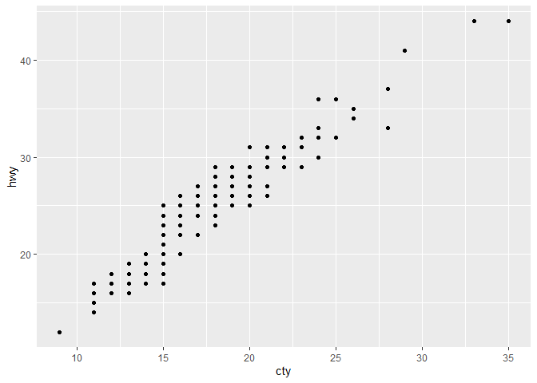
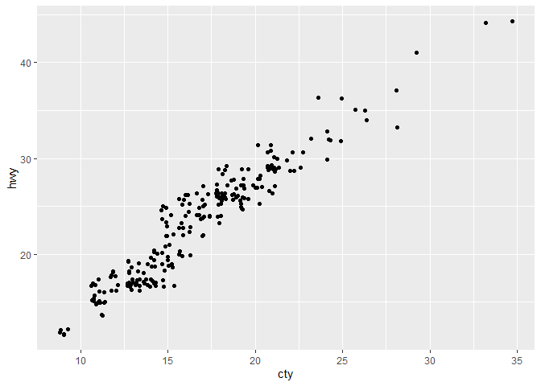
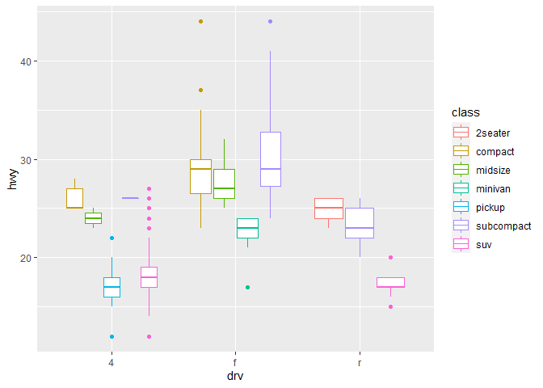
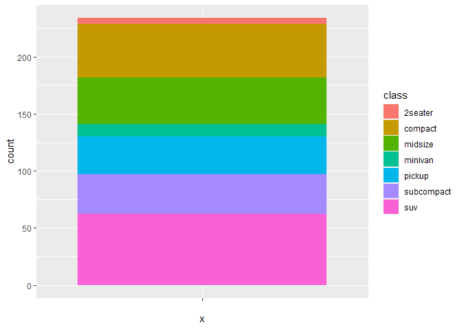
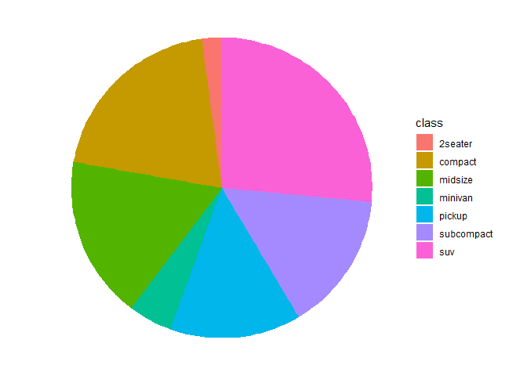
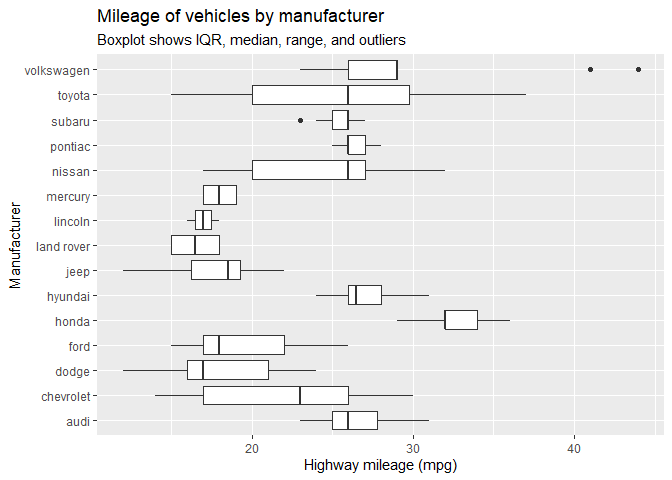
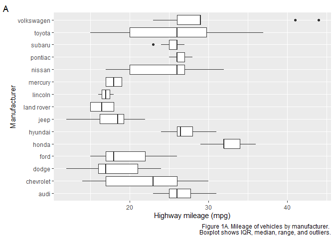
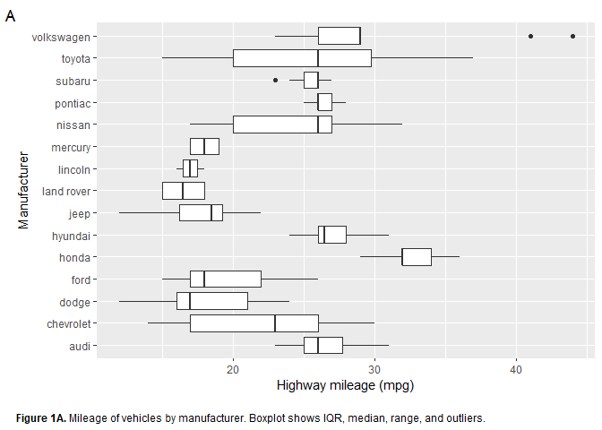

R4DS Study Group - Week 4 (part 1)
================
Pierrette Lo
5/1/2020

  - [This week’s assignment](#this-weeks-assignment)
  - [Ch 3:8 Position adjustments](#ch-38-position-adjustments)
  - [Ch 3:9 Coordinate systems](#ch-39-coordinate-systems)
  - [Next Steps](#next-steps)

## This week’s assignment

  - The rest of Chapter 3

As always, start by loading {tidyverse}

``` r
library(tidyverse)
```

## Ch 3:8 Position adjustments

### Notes

  - For bar graphs, the default position is `"stack"`. That means it
    will take the counts for each group (usually represent by `fill`
    color) and stack them on top of each other (starting from where the
    previous group ended).
  - The `"identity"` position means it will plot the count for each
    `fill` group literally (so starting from 0). Bars will overlap and
    be difficult to see.
  - The `"fill"` position plots proportions of each group, with each bar
    the same height of 1.
  - The `"dodge"` position plots bars next to each other.
  - The `"jitter"` position is for points - it adds a bit of random
    noise to the position of each point so points with the same value
    are scattered apart - this makes it easier to see the distribution.

### Exercises

> 1.  What is the problem with this plot? How could you improve it?

``` r
ggplot(data = mpg, mapping = aes(x = cty, y = hwy)) + 
  geom_point()
```

<!-- -->

Similar to the example in the text, this plot shows overplotting - many
of the points are overlapping (because the values of `hwy` and `cty` are
rounded to the nearest whole number), so you don’t get a true picture of
their distribution.

Solution - add jitter.

``` r
ggplot(data = mpg, mapping = aes(x = cty, y = hwy)) + 
  geom_jitter()
```

<!-- -->

> 2.  What parameters to `geom_jitter()` control the amount of
>     jittering?

According to the help - the parameters are `height` and `width` - add
jitter in vertical and horizontal directions, respectively.

Use 0.5 to spread the points just enough that individual groups can’t be
distinguished (without overspreading).

Use `set.seed(any number you want)` before `ggplot()` to reproduce the
same random noise every time

``` r
set.seed(42)

ggplot(data = mpg, mapping = aes(x = cty, y = hwy)) + 
  geom_jitter(width = 0.5, height = 0.5)
```

<!-- -->

> 3.  Compare and contrast `geom_jitter()` with `geom_count()`.

They are similar in that they allow you to see distributions of
overlapping points, but `geom_jitter` moves the points themselves,
whereas `geom_count` changes the size of the points based on number of
overlapping observations (while keeping the location accurate).

``` r
ggplot(data = mpg, mapping = aes(x = cty, y = hwy)) + 
  geom_count()
```

<!-- -->

> 4.  What’s the default position adjustment for `geom_boxplot()`?
>     Create a visualisation of the `mpg` dataset that demonstrates it.

According to the help, the default is `position = "dodge2"` (which is
basically the same as “dodge”). You will need a grouping variable in
order to observe this. Note what happens if you try `position =
"identity"`.

``` r
ggplot(data = mpg, aes(x = drv, y = hwy, color = class)) +
  geom_boxplot()
```

<!-- -->

## Ch 3:9 Coordinate systems

### Notes:

  - `coord_flip()` has the same effect as reversing the variables you
    specify for x and y. However, it’s more intuitive to have the
    dependent variable on the y axis, so it’s easier to set the plot up
    that way and then flip it, rather than trying to think about having
    the dependent variable on the x axis.

### Exercises

> 1.  Turn a stacked bar chart into a pie chart using `coord_polar()`.

A pie chart is basically a stacked bar graph with a single bar,
translated onto polar coordinates.

Start by making a bar graph with a dummy variable for `x`, since you
don’t want any information on the x axis.

``` r
ggplot(mpg, aes(x = "", fill = class)) +
  geom_bar()
```

<!-- -->

Then use `theta = "y"` in `coord_polar()` to map `y` (counts) to the
angle of each section.

Use `theme_void()` to get rid of the background, axis labels, etc.

``` r
ggplot(mpg, aes(x = "", fill = class)) +
  geom_bar() +
  coord_polar(theta = "y") +
  theme_void()
```

<!-- -->

> 2.  What does labs() do? Read the documentation.

There are various functions (`labs()`, `ggtitle()`, `xlab()`, `ylab()`)
to add labels to your plot and/or axes.

Example:

``` r
ggplot(data = mpg, aes(x = manufacturer, y = hwy)) +
  geom_boxplot() +
  coord_flip() +
  labs(x = "Manufacturer",
       y = "Highway mileage (mpg)",
       title = "Mileage of vehicles by manufacturer",
       subtitle = "Boxplot shows IQR, median, range, and outliers")
```

<!-- -->

Or if this is for a manuscript figure:

``` r
ggplot(data = mpg, aes(x = manufacturer, y = hwy)) +
  geom_boxplot() +
  coord_flip() +
  labs(x = "Manufacturer",
       y = "Highway mileage (mpg)",
       caption = "Figure 1A. Mileage of vehicles by manufacturer. 
       Boxplot shows IQR, median, range, and outliers.",
       tag = "A")
```

<!-- -->

Bonus code to adjust caption formatting, position, etc.

``` r
ggplot(data = mpg, aes(x = manufacturer, y = hwy)) +
  geom_boxplot() +
  coord_flip() +
  labs(x = "Manufacturer",
       y = "Highway mileage (mpg)\n",
       caption = "<b>Figure 1A.</b> Mileage of vehicles by manufacturer. 
       Boxplot shows IQR, median, range, and outliers.",
       tag = "A") +
  theme(plot.caption = ggtext::element_markdown(hjust = 0),
        plot.caption.position = "plot")
```

<!-- -->

## Next Steps

Check out the other built-in datasets in {ggplot2}
[here](https://ggplot2.tidyverse.org/reference/#section-data) and make a
visualization to share.

(You can also use your own dataset if it’s in an appropriate format or
you already know how to get it there.)
