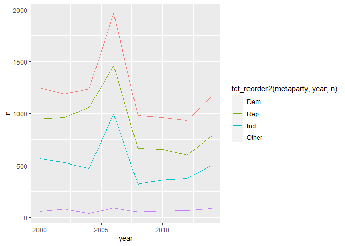

R4DS Study Group - Week 44
================
Pierrette Lo
2/5/2021

  - [This week’s assignment](#this-weeks-assignment)
      - [Notes](#notes)
      - [Exercises 15.3.1 (General Social
        Survey)](#exercises-15.3.1-general-social-survey)
      - [Exercises 15.4.1 (Modifying factor
        order)](#exercises-15.4.1-modifying-factor-order)
      - [Exercises 15.5.1 (Modifying factor
        levels)](#exercises-15.5.1-modifying-factor-levels)

## This week’s assignment

  - Chapter 15

<!-- end list -->

``` r
library(tidyverse)
```

### Notes

1.  There is, of course, a cheat sheet:
    <https://github.com/rstudio/cheatsheets/raw/master/factors.pdf>

2.  I realized that my previous attempts to use factors had problems
    because I had confused base R `factor()` with the functions in the
    tidyverse `{forcats}` package.

Basically, `forcats` allows you to do the same things with factors but
makes it harder to mess up.

Specifically, if you want to “recode” factor levels so they display
nicely, `factor()` requires you to specify levels and labels, whereas
`forcats::fct_recode` only requires levels.

Note that in either case, you’re not changing the data itself - just how
the values in the data are categorized.

Example, copied from
<https://craig.rbind.io/post/2020-08-29-asgr-2-4-factors/#factor-basics>:

``` r
library(gapminder)
```

    ## Warning: package 'gapminder' was built under R version 4.0.3

``` r
levels(gapminder$continent)
```

    ## [1] "Africa"   "Americas" "Asia"     "Europe"   "Oceania"

``` r
#base R's factor()
gapminder %>%
  mutate(continent = factor(continent,  
                            #all existing unique values/levels you want to use
                            #need to be specified
                            levels = c("Africa", "Americas", "Asia", "Europe", "Oceania"),
                            #one label per level needs to be specified, in the
                            #same order as the levels
                            labels = c("Africa", "N&S America", "Asia", "Europe", "Australia"))
         ) %>%
  boxplot(lifeExp ~ continent, data = .) 

#using forcats::fct_recode()
gapminder %>%
  mutate(continent = fct_recode(continent,
                                #only the value(s) you want to recode need to be specified
                                #"new value" = "old value"
                                "N&S America" = "Americas",
                                "Australia" = "Oceania")
         ) %>%
  boxplot(lifeExp ~ continent, data = .) 
```

<!-- -->

### Exercises 15.3.1 (General Social Survey)

> 1.  Explore the distribution of `rincome` (reported income). What
>     makes the default bar chart hard to understand? How could you
>     improve the plot?

``` r
levels(gss_cat$rincome)
```

    ##  [1] "No answer"      "Don't know"     "Refused"        "$25000 or more"
    ##  [5] "$20000 - 24999" "$15000 - 19999" "$10000 - 14999" "$8000 to 9999" 
    ##  [9] "$7000 to 7999"  "$6000 to 6999"  "$5000 to 5999"  "$4000 to 4999" 
    ## [13] "$3000 to 3999"  "$1000 to 2999"  "Lt $1000"       "Not applicable"

``` r
gss_cat %>% 
  ggplot(aes(y = rincome)) +
  geom_bar()
```

<!-- -->

The non-dollar amount categories should be grouped together at the start
(ie. the bottom of the y axis).

Also, Refused/Don’t know/No answer could probably be lumped together.
These functions are explained the next section.

``` r
gss_cat %>% 
  mutate(rincome = fct_other(rincome, 
                             drop = c("Refused", "Don't know", "No answer"), 
                             other_level = "Refused/Don't know/ No answer"),
         rincome = fct_relevel(rincome, "Not applicable", "Refused/Don't know/ No answer")) %>% 
  ggplot(aes(y = rincome)) +
  geom_bar()
```

<!-- -->

> 2.  What is the most common relig in this survey? What’s the most
>     common partyid?

Religion:

``` r
gss_cat %>% 
  ggplot(aes(y = fct_infreq(relig))) +
  geom_bar()
```

<!-- -->

``` r
# OR

fct_count(gss_cat$relig, sort = TRUE)
```

    ## # A tibble: 16 x 2
    ##    f                           n
    ##    <fct>                   <int>
    ##  1 Protestant              10846
    ##  2 Catholic                 5124
    ##  3 None                     3523
    ##  4 Christian                 689
    ##  5 Jewish                    388
    ##  6 Other                     224
    ##  7 Buddhism                  147
    ##  8 Inter-nondenominational   109
    ##  9 Moslem/islam              104
    ## 10 Orthodox-christian         95
    ## 11 No answer                  93
    ## 12 Hinduism                   71
    ## 13 Other eastern              32
    ## 14 Native american            23
    ## 15 Don't know                 15
    ## 16 Not applicable              0

Party:

``` r
gss_cat %>% 
  ggplot(aes(y = fct_infreq(partyid))) +
  geom_bar()
```

<!-- -->

``` r
# OR

fct_count(gss_cat$partyid, sort = TRUE)
```

    ## # A tibble: 10 x 2
    ##    f                      n
    ##    <fct>              <int>
    ##  1 Independent         4119
    ##  2 Not str democrat    3690
    ##  3 Strong democrat     3490
    ##  4 Not str republican  3032
    ##  5 Ind,near dem        2499
    ##  6 Strong republican   2314
    ##  7 Ind,near rep        1791
    ##  8 Other party          393
    ##  9 No answer            154
    ## 10 Don't know             1

> 3.  Which relig does denom (denomination) apply to? How can you find
>     out with a table? How can you find out with a visualisation?

Table method:

``` r
#check levels of denom

levels(gss_cat$denom)
```

    ##  [1] "No answer"            "Don't know"           "No denomination"     
    ##  [4] "Other"                "Episcopal"            "Presbyterian-dk wh"  
    ##  [7] "Presbyterian, merged" "Other presbyterian"   "United pres ch in us"
    ## [10] "Presbyterian c in us" "Lutheran-dk which"    "Evangelical luth"    
    ## [13] "Other lutheran"       "Wi evan luth synod"   "Lutheran-mo synod"   
    ## [16] "Luth ch in america"   "Am lutheran"          "Methodist-dk which"  
    ## [19] "Other methodist"      "United methodist"     "Afr meth ep zion"    
    ## [22] "Afr meth episcopal"   "Baptist-dk which"     "Other baptists"      
    ## [25] "Southern baptist"     "Nat bapt conv usa"    "Nat bapt conv of am" 
    ## [28] "Am bapt ch in usa"    "Am baptist asso"      "Not applicable"

``` r
gss_cat %>% 
  # lump the "non_denom" levels together
  mutate(denom = fct_other(denom, 
                           drop = c("No answer", "Don't know", "No denomination", 
                                    "Other", "Not applicable"),
                            other_level = "non_denom")) %>% 
  # now lump together everything that ISN'T non_denom
  mutate(denom = fct_other(denom, 
                           keep = "non_denom", 
                           other_level = "has_denom")) %>% 
  count(denom, relig)
```

    ## # A tibble: 16 x 3
    ##    denom     relig                       n
    ##    <fct>     <fct>                   <int>
    ##  1 non_denom No answer                  93
    ##  2 non_denom Don't know                 15
    ##  3 non_denom Inter-nondenominational   109
    ##  4 non_denom Native american            23
    ##  5 non_denom Christian                 689
    ##  6 non_denom Orthodox-christian         95
    ##  7 non_denom Moslem/islam              104
    ##  8 non_denom Other eastern              32
    ##  9 non_denom Hinduism                   71
    ## 10 non_denom Buddhism                  147
    ## 11 non_denom Other                     224
    ## 12 non_denom None                     3523
    ## 13 non_denom Jewish                    388
    ## 14 non_denom Catholic                 5124
    ## 15 non_denom Protestant               3821
    ## 16 has_denom Protestant               7025

Visual method:

``` r
gss_cat %>% 
  count(relig, denom) %>% 
  ggplot(aes(x = relig, y = denom, size = n)) + 
  geom_point() +
  theme(axis.text.x = element_text(angle = 45, hjust = 1))
```

<!-- -->

### Exercises 15.4.1 (Modifying factor order)

> 1.  There are some suspiciously high numbers in tvhours. Is the mean a
>     good summary?

Median is probably better than mean if there are a lot of outliers, but
in this case there doesn’t seem to be a huge difference between mean
(2.98) and median (2).

``` r
gss_cat %>% 
  ggplot(aes(tvhours)) +
  geom_histogram(binwidth = 1)
```

    ## Warning: Removed 10146 rows containing non-finite values (stat_bin).

<!-- -->

``` r
mean(gss_cat$tvhours, na.rm = TRUE)
```

    ## [1] 2.980771

``` r
median(gss_cat$tvhours, na.rm = TRUE)
```

    ## [1] 2

> 2.  For each factor in gss\_cat identify whether the order of the
>     levels is arbitrary or principled.

“Arbitrary” vs. “principled” factor order isn’t really defined here, and
this textbook seems to be the only place where these terms are used.

I decided to use these definitions:

  - Strictly “ordered” factor = order of levels was specified when the
    factor was created; `is.ordered(my_factor)` will return `TRUE`
  - “Principled” = levels can/should be organized according to a
    principle
  - “Arbitrary” = order doesn’t matter

A quick way to check out factors in your data is to use the {skimr}
package:

``` r
skimr::skim(gss_cat)
```

|                                                  |          |
| :----------------------------------------------- | :------- |
| Name                                             | gss\_cat |
| Number of rows                                   | 21483    |
| Number of columns                                | 9        |
| \_\_\_\_\_\_\_\_\_\_\_\_\_\_\_\_\_\_\_\_\_\_\_   |          |
| Column type frequency:                           |          |
| factor                                           | 6        |
| numeric                                          | 3        |
| \_\_\_\_\_\_\_\_\_\_\_\_\_\_\_\_\_\_\_\_\_\_\_\_ |          |
| Group variables                                  | None     |

Data summary

**Variable type: factor**

| skim\_variable | n\_missing | complete\_rate | ordered | n\_unique | top\_counts                                 |
| :------------- | ---------: | -------------: | :------ | --------: | :------------------------------------------ |
| marital        |          0 |              1 | FALSE   |         6 | Mar: 10117, Nev: 5416, Div: 3383, Wid: 1807 |
| race           |          0 |              1 | FALSE   |         3 | Whi: 16395, Bla: 3129, Oth: 1959, Not: 0    |
| rincome        |          0 |              1 | FALSE   |        16 | $25: 7363, Not: 7043, $20: 1283, $10: 1168  |
| partyid        |          0 |              1 | FALSE   |        10 | Ind: 4119, Not: 3690, Str: 3490, Not: 3032  |
| relig          |          0 |              1 | FALSE   |        15 | Pro: 10846, Cat: 5124, Non: 3523, Chr: 689  |
| denom          |          0 |              1 | FALSE   |        30 | Not: 10072, Oth: 2534, No : 1683, Sou: 1536 |

**Variable type: numeric**

| skim\_variable | n\_missing | complete\_rate |    mean |    sd |   p0 |  p25 |  p50 |  p75 | p100 | hist  |
| :------------- | ---------: | -------------: | ------: | ----: | ---: | ---: | ---: | ---: | ---: | :---- |
| year           |          0 |           1.00 | 2006.50 |  4.45 | 2000 | 2002 | 2006 | 2010 | 2014 | ▇▃▇▂▆ |
| age            |         76 |           1.00 |   47.18 | 17.29 |   18 |   33 |   46 |   59 |   89 | ▇▇▇▅▂ |
| tvhours        |      10146 |           0.53 |    2.98 |  2.59 |    0 |    1 |    2 |    4 |   24 | ▇▂▁▁▁ |

None of the 6 factor variables are “strictly ordered”.

Get the names of all factor levels using the {purrr} package (will be
covered in Chapter 21, Iteration).

``` r
gss_cat %>% 
  # keep only variables that are factors
  keep(is.factor) %>% 
  # apply the `levels()` function to each remaining column
  map(levels)
```

    ## $marital
    ## [1] "No answer"     "Never married" "Separated"     "Divorced"     
    ## [5] "Widowed"       "Married"      
    ## 
    ## $race
    ## [1] "Other"          "Black"          "White"          "Not applicable"
    ## 
    ## $rincome
    ##  [1] "No answer"      "Don't know"     "Refused"        "$25000 or more"
    ##  [5] "$20000 - 24999" "$15000 - 19999" "$10000 - 14999" "$8000 to 9999" 
    ##  [9] "$7000 to 7999"  "$6000 to 6999"  "$5000 to 5999"  "$4000 to 4999" 
    ## [13] "$3000 to 3999"  "$1000 to 2999"  "Lt $1000"       "Not applicable"
    ## 
    ## $partyid
    ##  [1] "No answer"          "Don't know"         "Other party"       
    ##  [4] "Strong republican"  "Not str republican" "Ind,near rep"      
    ##  [7] "Independent"        "Ind,near dem"       "Not str democrat"  
    ## [10] "Strong democrat"   
    ## 
    ## $relig
    ##  [1] "No answer"               "Don't know"             
    ##  [3] "Inter-nondenominational" "Native american"        
    ##  [5] "Christian"               "Orthodox-christian"     
    ##  [7] "Moslem/islam"            "Other eastern"          
    ##  [9] "Hinduism"                "Buddhism"               
    ## [11] "Other"                   "None"                   
    ## [13] "Jewish"                  "Catholic"               
    ## [15] "Protestant"              "Not applicable"         
    ## 
    ## $denom
    ##  [1] "No answer"            "Don't know"           "No denomination"     
    ##  [4] "Other"                "Episcopal"            "Presbyterian-dk wh"  
    ##  [7] "Presbyterian, merged" "Other presbyterian"   "United pres ch in us"
    ## [10] "Presbyterian c in us" "Lutheran-dk which"    "Evangelical luth"    
    ## [13] "Other lutheran"       "Wi evan luth synod"   "Lutheran-mo synod"   
    ## [16] "Luth ch in america"   "Am lutheran"          "Methodist-dk which"  
    ## [19] "Other methodist"      "United methodist"     "Afr meth ep zion"    
    ## [22] "Afr meth episcopal"   "Baptist-dk which"     "Other baptists"      
    ## [25] "Southern baptist"     "Nat bapt conv usa"    "Nat bapt conv of am" 
    ## [28] "Am bapt ch in usa"    "Am baptist asso"      "Not applicable"

I would say `rincome` has a mostly principled order (salary bins).
`partyid` seems somewhat organized into Republican, Independent, and
Democrat meta-groupings. The rest seem arbitrary.

> 3.  Why did moving “Not applicable” to the front of the levels move it
>     to the bottom of the plot?

Behind the scenes, R associates each factor level with an integer.
Moving a level to the “front” makes it level \#1. Levels are plotted by
their associated integers, so level \#1 will be at the bottom of the y
axis.

This is well illustrated in the cheat sheet.

Notice how the levels of a factor are numbered:

``` r
levels(gss_cat$marital)
```

    ## [1] "No answer"     "Never married" "Separated"     "Divorced"     
    ## [5] "Widowed"       "Married"

Here’s what the first 10 rows of the factor variable `race` looks like
to R:

``` r
unclass(gss_cat$marital) %>% 
  head(10)
```

    ##  [1] 2 4 5 2 4 6 2 4 6 6

And here’s how they look to a human:

``` r
gss_cat$marital %>% head(10)
```

    ##  [1] Never married Divorced      Widowed       Never married Divorced     
    ##  [6] Married       Never married Divorced      Married       Married      
    ## Levels: No answer Never married Separated Divorced Widowed Married

### Exercises 15.5.1 (Modifying factor levels)

**NOTE:** `fct_other` is now the preferred method of lumping levels
together. `fct_lump` has a few different methods it can potentially use
to lump levels by frequency, so it can be inconsistent. See the
[documentation](https://forcats.tidyverse.org/reference/fct_lump.html)
for details.

  - `fct_other` = collapse multiple specified levels into a single level
  - `fct_lump` = collapse multiple levels based on frequency
  - `fct_recode` = change specified levels manually

> 1.  How have the proportions of people identifying as Democrat,
>     Republican, and Independent changed over time?

Factor method:

``` r
levels(gss_cat$partyid)
```

    ##  [1] "No answer"          "Don't know"         "Other party"       
    ##  [4] "Strong republican"  "Not str republican" "Ind,near rep"      
    ##  [7] "Independent"        "Ind,near dem"       "Not str democrat"  
    ## [10] "Strong democrat"

``` r
gss_cat %>%
  mutate(partyid = fct_collapse(partyid,
                                Rep = c("Strong republican", "Not str republican"),
                                Ind = c("Ind,near rep", "Ind,near dem", "Independent"),
                                Dem = c("Not str democrat", "Strong democrat"),
                                Other = c("No answer", "Don't know", "Other party")
  )) %>% 
  count(year, partyid) %>% 
  ggplot(aes(x = year, y = n, color = fct_reorder2(partyid, year, n))) +
    geom_line()
```

<!-- -->

You could also use `mutate` and `str_detect` to add a meta-category and
save a lot of typing:

``` r
gss_cat %>% 
  mutate(metaparty = factor(case_when(str_detect(tolower(partyid), "rep") ~ "Rep",
                                str_detect(tolower(partyid), "dem") ~ "Dem",
                                str_detect(tolower(partyid), "ind") ~ "Ind",
                                TRUE ~ "Other"))) %>% 
  count(year, metaparty) %>% 
  ggplot(aes(x = year, y = n, color = fct_reorder2(metaparty, year, n))) +
    geom_line()
```

<!-- -->

> 2.  How could you collapse rincome into a small set of categories?

Not sure what is meant by “small” - you could use the above method to
define high/medium/low/other categories. Or, my lazy response of 2
categories:

``` r
levels(gss_cat$rincome)
```

    ##  [1] "No answer"      "Don't know"     "Refused"        "$25000 or more"
    ##  [5] "$20000 - 24999" "$15000 - 19999" "$10000 - 14999" "$8000 to 9999" 
    ##  [9] "$7000 to 7999"  "$6000 to 6999"  "$5000 to 5999"  "$4000 to 4999" 
    ## [13] "$3000 to 3999"  "$1000 to 2999"  "Lt $1000"       "Not applicable"

``` r
gss_cat %>%
  mutate(rincome = fct_other(rincome,
                             drop = c("No answer", "Don't know", "Refused", "Not applicable"),
                             other_level = "Income not reported")) %>% 
  mutate(rincome = fct_other(rincome,
                             keep = "Income not reported",
                             other_level = "Income reported")) %>% 
  ggplot(aes(y = rincome)) +
    geom_bar()
```

<!-- -->
