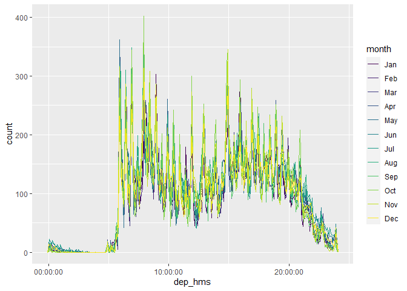

R4DS Study Group - Week 45
================
Pierrette Lo
2/12/2021

  - [This week’s assignment](#this-weeks-assignment)

## This week’s assignment

  - Chapter 16

<!-- end list -->

``` r
library(tidyverse)
library(lubridate)
library(nycflights13)
```

### Notes

{lubridate} cheat sheet:
<https://github.com/rstudio/cheatsheets/raw/master/lubridate.pdf>

Note about current date:

  - `today()` is from the {lubridate} package
  - the base R version is `Sys.Date()`
  - I usually use `Sys.Date()` if I just want to append today’s date to
    a filename or similar, so I don’t need to load up a separate package
    just for that one function
  - use `format()` to format `Sys.Date()`

e.g.

``` r
Sys.Date()
```

    ## [1] "2021-02-26"

``` r
format(Sys.Date(), "%Y_%b_%d")
```

    ## [1] "2021_Feb_26"

``` r
paste0("myfilename_", Sys.Date(), ".csv")
```

    ## [1] "myfilename_2021-02-26.csv"

### 16.2.4 Creating dates and times

> 1.  What happens if you parse a string that contains invalid dates?

You will get an NA and a warning message.

``` r
ymd(c("2010-10-10", "bananas"))
```

    ## Warning: 1 failed to parse.

    ## [1] "2010-10-10" NA

> 2.  What does the `tzone` argument to `today()` do? Why is it
>     important?

This argument specifies the time zone. The default (no argument
specified) is to use the time zone that your computer is set to.

Use `Sys.timezone()` to get your current time zone (“PST” doesn’t work);
use `OlsonNames()` to get a list of all possible time zones.

``` r
Sys.timezone()
```

    ## [1] "America/Los_Angeles"

``` r
now(tzone = "America/Los_Angeles")
```

    ## [1] "2021-02-26 10:25:34 PST"

> 3.  Use the appropriate {lubridate} function to parse each of the
>     following dates:

“Parse” means to convert a character object to a date object. Use
`class()` to confirm whether you have a `character` or a `Date` object.

``` r
d1 <- "January 1, 2010"

class(d1)
```

    ## [1] "character"

``` r
d1_parsed <- mdy(d1)

class(d1_parsed)
```

    ## [1] "Date"

``` r
d2 <- "2015-Mar-07"

ymd(d2)
```

    ## [1] "2015-03-07"

``` r
d3 <- "06-Jun-2017"

dmy(d3)
```

    ## [1] "2017-06-06"

``` r
d4 <- c("August 19 (2015)", "July 1 (2015)")

mdy(d4)
```

    ## [1] "2015-08-19" "2015-07-01"

``` r
d5 <- "12/30/14" # Dec 30, 2014

mdy(d5)
```

    ## [1] "2014-12-30"

### 16.3.4 Date-time components

> 1.  How does the distribution of flight times within a day change over
>     the course of the year?

Start with code from the text to parse the departure and arrival times
from numbers into date-time objects.

Remember these arithmetic operators? When dividing `x` by `y`,

  - `%/%` = the integer portion of the “answer”
  - `%%` = the remainder

<!-- end list -->

``` r
make_datetime_100 <- function(year, month, day, time) {
  make_datetime(year, month, day, 
                hour = time %/% 100, # e.g. 517 %/% 100 = 5
                min = time %% 100)   # e.g. 517 %% 100 = 17
}

flights_dt <- flights %>% 
  filter(!is.na(dep_time), !is.na(arr_time)) %>% 
  mutate(
    dep_time = make_datetime_100(year, month, day, dep_time),
    arr_time = make_datetime_100(year, month, day, arr_time),
    sched_dep_time = make_datetime_100(year, month, day, sched_dep_time),
    sched_arr_time = make_datetime_100(year, month, day, sched_arr_time)
  ) %>% 
  select(origin, dest, ends_with("delay"), ends_with("time"))

flights_dt
```

    ## # A tibble: 328,063 x 9
    ##    origin dest  dep_delay arr_delay dep_time            sched_dep_time     
    ##    <chr>  <chr>     <dbl>     <dbl> <dttm>              <dttm>             
    ##  1 EWR    IAH           2        11 2013-01-01 05:17:00 2013-01-01 05:15:00
    ##  2 LGA    IAH           4        20 2013-01-01 05:33:00 2013-01-01 05:29:00
    ##  3 JFK    MIA           2        33 2013-01-01 05:42:00 2013-01-01 05:40:00
    ##  4 JFK    BQN          -1       -18 2013-01-01 05:44:00 2013-01-01 05:45:00
    ##  5 LGA    ATL          -6       -25 2013-01-01 05:54:00 2013-01-01 06:00:00
    ##  6 EWR    ORD          -4        12 2013-01-01 05:54:00 2013-01-01 05:58:00
    ##  7 EWR    FLL          -5        19 2013-01-01 05:55:00 2013-01-01 06:00:00
    ##  8 LGA    IAD          -3       -14 2013-01-01 05:57:00 2013-01-01 06:00:00
    ##  9 JFK    MCO          -3        -8 2013-01-01 05:57:00 2013-01-01 06:00:00
    ## 10 LGA    ORD          -2         8 2013-01-01 05:58:00 2013-01-01 06:00:00
    ## # ... with 328,053 more rows, and 3 more variables: arr_time <dttm>,
    ## #   sched_arr_time <dttm>, air_time <dbl>

Use the other code from the text (using `update()` to show distribution
of flights across the course of the day) and plot by month:

``` r
flights_dt %>% 
  mutate(dep_hms = hms::as_hms(dep_time),
         month = month(dep_time, label = TRUE)) %>% 
  ggplot(aes(x = dep_hms, color = month)) +
    geom_freqpoly(binwidth = 300)
```

<!-- -->

> 2.  Compare `dep_time`, `sched_dep_time` and `dep_delay.` Are they
>     consistent? Explain your findings.

It looks like the cases where there is a discrepancy between `dep_time`
and the expected value (`sched_dep_time` + `dep_delay`) involve
incorrect dates.

Sorry, I ran out of time and have no further notes for this chapter.
Please see the solutions manuals:

  - <https://jrnold.github.io/r4ds-exercise-solutions/dates-and-times.html>
  - <https://brshallo.github.io/r4ds_solutions/16-dates-and-times.html>
