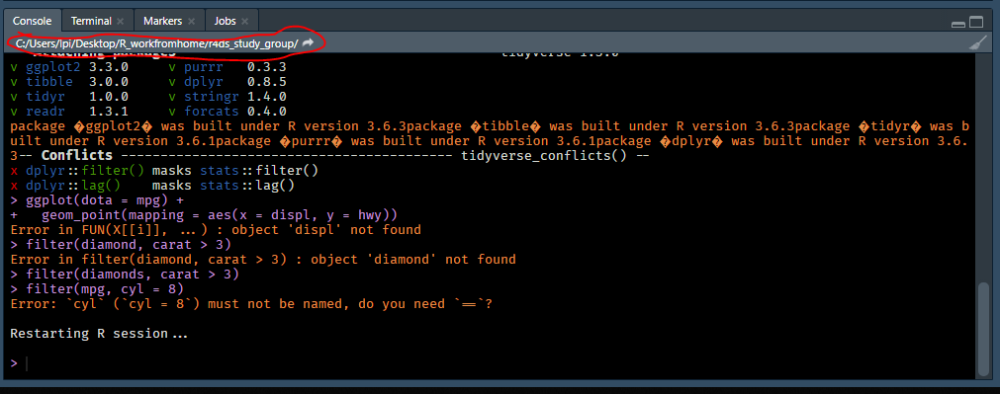

R4DS Study Group - Week 4 (part 2)
================
Pierrette Lo
5/1/2020

  - [This week’s assignment](#this-weeks-assignment)
  - [Ch 4: Workflow - basics](#ch-4-workflow---basics)
  - [Ch 6: Workflow - scripts](#ch-6-workflow---scripts)
  - [Ch 8: Workflow - projects](#ch-8-workflow---projects)
  - [R Markdown readings](#r-markdown-readings)

## This week’s assignment

  - Chapters 4, 6, 8
  - Additional reading on R Markdown

As always, start by loading {tidyverse}

``` r
library(tidyverse)
```

## Ch 4: Workflow - basics

### Exercises

> 1.  Why does this code not work?

``` r
my_variable <- 10
my_varıable
```

    ## [1] 10

It’s subtle - in the second line, the “i” is actually a different
character (“ı”).

Oddly, I did not get an error message - it’s possible that the font I’m
using in RStudio (Fira Code) recognizes both of those characters as
being the same.

Regardless, the point is that you can get tripped up by extremely subtle
typos (missing parentheses, commas, etc.). It’s frustrating at first but
your eyes and brain will adapt eventually\!

> 2.  Tweak each of the following R commands so that they run correctly:

``` r
ggplot(dota = mpg) + 
  geom_point(mapping = aes(x = displ, y = hwy))
```

    ## Error in FUN(X[[i]], ...): object 'displ' not found

<!-- -->

``` r
fliter(mpg, cyl = 8)
```

    ## Error in fliter(mpg, cyl = 8): could not find function "fliter"

``` r
filter(diamond, carat > 3)
```

    ## Error in filter(diamond, carat > 3): object 'diamond' not found

There are typos in all 3 of these commands. If you get an “object not
found” error, it usually means either you’ve forgotten to define the
object earlier in your code, or you’ve made a typo somewhere.

If “object not found” refers to a column in your dataset, it could mean
an error relating to your column name, or an error relating to your
dataset.

There is an additional error in the filtering of `mpg` - you need the
double equals sign `==` to test for equality. The single equals sign is
an assignment operator similar to `<-`.

> 3.  Press Alt + Shift + K. What happens? How can you get to the same
>     place using the menus?

This brings up the keyboard shortcuts menu. You can also access the list
of shortcuts by going to the “Tools” menu and selecting “Keyboard
Shortcuts Help”.

## Ch 6: Workflow - scripts

### Notes

  - Script = code focused. Mark comments with \#
  - R Notebook = code + plain text. Mark comments in code chunks with
    \#, or just type in the text area
  - R Markdown = similar to R Notebook but you can set it up to `knit`
    into a web page, PDF, Word doc, slides, etc.

> 1.  Go to the RStudio Tips twitter account,
>     <https://twitter.com/rstudiotips> and find one tip that looks
>     interesting. Practice using it\!

General note - the R community is super active on Twitter. Follow
[\#rstats](https://twitter.com/hashtag/rstats) for news, tips, example
projects, commiseration, and more from beginners to experts.

Follow [\#tidytuesday](https://twitter.com/hashtag/tidytuesday) to see
what everyone (beginners to experts) is doing with the weekly [Tidy
Tuesday](https://github.com/rfordatascience/tidytuesday) dataset.

> 2.  What other common mistakes will RStudio diagnostics report? Read
>     <https://support.rstudio.com/hc/en-us/articles/205753617-Code-Diagnostics>
>     to find out.

You can paste the above code for exercise 4.2 into an R script to see
what kinds of messages you get when you enable diagnostics.

## Ch 8: Workflow - projects

### Notes

  - If you just open RStudio by clicking on the icon, it loads the last
    project you had open (not sure what loads if you’ve never used
    projects)
  - You can check your working directory by looking at the bar just
    under the Console tab
  - Click on the little arrow beside the directory to open that folder
    in the Files tab (should load by default when you open the project,
    but in case you navigated away and need to get back to it)
  - Don’t save projects or files in the directories that your R or
    RStudio software are installed in



## R Markdown readings

  - Let’s save the R Markdown discussion for a future meeting so we can
    get back to working with data.
