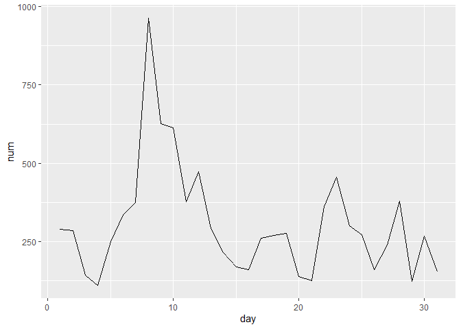
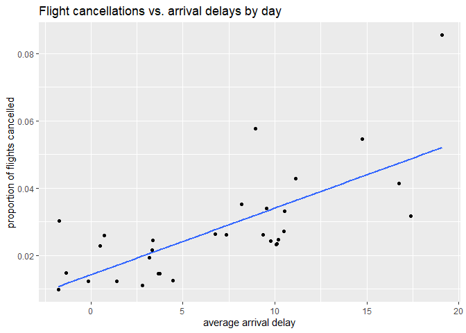

R4DS Study Group - Week 7
================
Pierrette Lo
5/22/2020

  - [This week’s assignment](#this-weeks-assignment)
  - [Ch 5:4 Select](#ch-54-select)
  - [Ch 5:5 Mutate](#ch-55-mutate)
  - [Ch 5:6 Summarise](#ch-56-summarise)
  - [Ch 5:7 Grouped mutates & filters](#ch-57-grouped-mutates-filters)

## This week’s assignment

  - The rest of Chapter 5 (5.4 through 5.7)

<!-- end list -->

``` r
library(tidyverse)
library(nycflights13)
```

### General Notes

  - Alex reminded me that you can change where your chunk output shows
    up by clicking the gear next to the “Knit” button. Choose “Chunk
    Output Inline” to see output under the chunk; choose “Chunk Output
    in Console” to see plots in the Viewer and other output inthe
    console

  - Also, OCTRI’s *Data Wrangling with R* workshops would be a great
    review/complement to R4DS -
    <https://github.com/jminnier/berd_r_courses>

  - Shortcut for `%>%` = Ctrl/Cmd-Shift-M

  - Watch out for common mistake of using `%>%` instead of `+` between
    `ggplot` layers

  - Advantage to piping the dataset into your command - variable names
    will be autofilled

E.g. try typing

``` r
arrange(flights, air_time)

#vs

flights %>% 
  arrange(air_time)
```

## Ch 5:4 Select

### Exercises

> 1.  Brainstorm as many ways as possible to select `dep_time`,
>     `dep_delay`, `arr_time`, and `arr_delay` from flights.

``` r
# use column names
select(flights, dep_time, dep_delay, arr_time, arr_delay)
```

    ## # A tibble: 336,776 x 4
    ##    dep_time dep_delay arr_time arr_delay
    ##       <int>     <dbl>    <int>     <dbl>
    ##  1      517         2      830        11
    ##  2      533         4      850        20
    ##  3      542         2      923        33
    ##  4      544        -1     1004       -18
    ##  5      554        -6      812       -25
    ##  6      554        -4      740        12
    ##  7      555        -5      913        19
    ##  8      557        -3      709       -14
    ##  9      557        -3      838        -8
    ## 10      558        -2      753         8
    ## # ... with 336,766 more rows

``` r
# delete all the columns you don't want
select(flights, -(year:day), -sched_dep_time, - sched_arr_time, -(carrier:time_hour))
```

    ## # A tibble: 336,776 x 4
    ##    dep_time dep_delay arr_time arr_delay
    ##       <int>     <dbl>    <int>     <dbl>
    ##  1      517         2      830        11
    ##  2      533         4      850        20
    ##  3      542         2      923        33
    ##  4      544        -1     1004       -18
    ##  5      554        -6      812       -25
    ##  6      554        -4      740        12
    ##  7      555        -5      913        19
    ##  8      557        -3      709       -14
    ##  9      557        -3      838        -8
    ## 10      558        -2      753         8
    ## # ... with 336,766 more rows

``` r
# use column numbers
select(flights, 4, 6, 7, 9)
```

    ## # A tibble: 336,776 x 4
    ##    dep_time dep_delay arr_time arr_delay
    ##       <int>     <dbl>    <int>     <dbl>
    ##  1      517         2      830        11
    ##  2      533         4      850        20
    ##  3      542         2      923        33
    ##  4      544        -1     1004       -18
    ##  5      554        -6      812       -25
    ##  6      554        -4      740        12
    ##  7      555        -5      913        19
    ##  8      557        -3      709       -14
    ##  9      557        -3      838        -8
    ## 10      558        -2      753         8
    ## # ... with 336,766 more rows

``` r
# use `starts_with()`
select(flights, starts_with("dep_"), starts_with("arr_"))
```

    ## # A tibble: 336,776 x 4
    ##    dep_time dep_delay arr_time arr_delay
    ##       <int>     <dbl>    <int>     <dbl>
    ##  1      517         2      830        11
    ##  2      533         4      850        20
    ##  3      542         2      923        33
    ##  4      544        -1     1004       -18
    ##  5      554        -6      812       -25
    ##  6      554        -4      740        12
    ##  7      555        -5      913        19
    ##  8      557        -3      709       -14
    ##  9      557        -3      838        -8
    ## 10      558        -2      753         8
    ## # ... with 336,766 more rows

In practice, you usually want to avoid using column numbers to pick
columns. If you later add, subtract, or reorder the columns in your
dataset but reuse your old code, the column numbers will now be wrong\!

> 2.  What happens if you include the name of a variable multiple times
>     in a `select()` call?

``` r
select(flights, origin, origin, origin)
```

    ## # A tibble: 336,776 x 1
    ##    origin
    ##    <chr> 
    ##  1 EWR   
    ##  2 LGA   
    ##  3 JFK   
    ##  4 JFK   
    ##  5 LGA   
    ##  6 EWR   
    ##  7 EWR   
    ##  8 LGA   
    ##  9 JFK   
    ## 10 LGA   
    ## # ... with 336,766 more rows

Duplicated columns will be ignored. This is why `everything()` works to
select some columns and then `everything()` else without repeating the
previously selected columns.

``` r
select(flights, origin, everything())
```

    ## # A tibble: 336,776 x 19
    ##    origin  year month   day dep_time sched_dep_time dep_delay arr_time
    ##    <chr>  <int> <int> <int>    <int>          <int>     <dbl>    <int>
    ##  1 EWR     2013     1     1      517            515         2      830
    ##  2 LGA     2013     1     1      533            529         4      850
    ##  3 JFK     2013     1     1      542            540         2      923
    ##  4 JFK     2013     1     1      544            545        -1     1004
    ##  5 LGA     2013     1     1      554            600        -6      812
    ##  6 EWR     2013     1     1      554            558        -4      740
    ##  7 EWR     2013     1     1      555            600        -5      913
    ##  8 LGA     2013     1     1      557            600        -3      709
    ##  9 JFK     2013     1     1      557            600        -3      838
    ## 10 LGA     2013     1     1      558            600        -2      753
    ## # ... with 336,766 more rows, and 11 more variables: sched_arr_time <int>,
    ## #   arr_delay <dbl>, carrier <chr>, flight <int>, tailnum <chr>, dest <chr>,
    ## #   air_time <dbl>, distance <dbl>, hour <dbl>, minute <dbl>, time_hour <dttm>

> 3.  What does the `one_of()` function do? Why might it be helpful in
>     conjunction with this vector?

``` r
vars <- c("year", "month", "day", "dep_delay", "arr_delay")

select(flights, one_of(vars))
```

    ## # A tibble: 336,776 x 5
    ##     year month   day dep_delay arr_delay
    ##    <int> <int> <int>     <dbl>     <dbl>
    ##  1  2013     1     1         2        11
    ##  2  2013     1     1         4        20
    ##  3  2013     1     1         2        33
    ##  4  2013     1     1        -1       -18
    ##  5  2013     1     1        -6       -25
    ##  6  2013     1     1        -4        12
    ##  7  2013     1     1        -5        19
    ##  8  2013     1     1        -3       -14
    ##  9  2013     1     1        -3        -8
    ## 10  2013     1     1        -2         8
    ## # ... with 336,766 more rows

It’s like the `%in%` operator for `filter()`.

> 4.  Does the result of running the following code surprise you? How do
>     the select helpers deal with case by default? How can you change
>     that default?

``` r
select(flights, contains("TIME"))
```

    ## # A tibble: 336,776 x 6
    ##    dep_time sched_dep_time arr_time sched_arr_time air_time time_hour          
    ##       <int>          <int>    <int>          <int>    <dbl> <dttm>             
    ##  1      517            515      830            819      227 2013-01-01 05:00:00
    ##  2      533            529      850            830      227 2013-01-01 05:00:00
    ##  3      542            540      923            850      160 2013-01-01 05:00:00
    ##  4      544            545     1004           1022      183 2013-01-01 05:00:00
    ##  5      554            600      812            837      116 2013-01-01 06:00:00
    ##  6      554            558      740            728      150 2013-01-01 05:00:00
    ##  7      555            600      913            854      158 2013-01-01 06:00:00
    ##  8      557            600      709            723       53 2013-01-01 06:00:00
    ##  9      557            600      838            846      140 2013-01-01 06:00:00
    ## 10      558            600      753            745      138 2013-01-01 06:00:00
    ## # ... with 336,766 more rows

Per the help (`?contains()`), the select helper functions are by default
NOT case-sensitive.

To make it case-sensitive, use `ignore.case = F`

``` r
select(flights, contains("TIME", ignore.case = F))
```

    ## # A tibble: 336,776 x 0

``` r
# returns no rows
```

## Ch 5:5 Mutate

### Notes

  - `%/%` = integer division
  - `%%` = remainder after integer division

### Exercises

> 1.  Currently `dep_time` and `sched_dep_time` are convenient to look
>     at, but hard to compute with because they’re not really continuous
>     numbers. Convert them to a more convenient representation of
>     number of minutes since midnight.

For each time, you’ll need to use the “integer division” and “modulo”
operators, e.g.:

``` r
# integer division to get number of hours since midnight
517 %/% 100
```

    ## [1] 5

``` r
# modulo (remainder) to get minutes
517 %% 100
```

    ## [1] 17

``` r
# also use modulo to convert midnight to 0 (24 * 60 = 1440)
# (any time except midnight) %% 1440 == same
# midnight (1440) %% 1440 == 0
```

``` r
flights %>% 
  mutate(dep_time_minutes = (dep_time %/% 100 * 60 + dep_time %% 100) %% 1440,
         sched_dep_time_minutes = (sched_dep_time %/% 100 * 60 + sched_dep_time %% 100) %% 1440
  ) %>% 
  select(contains("dep_time"))
```

    ## # A tibble: 336,776 x 4
    ##    dep_time sched_dep_time dep_time_minutes sched_dep_time_minutes
    ##       <int>          <int>            <dbl>                  <dbl>
    ##  1      517            515              317                    315
    ##  2      533            529              333                    329
    ##  3      542            540              342                    340
    ##  4      544            545              344                    345
    ##  5      554            600              354                    360
    ##  6      554            558              354                    358
    ##  7      555            600              355                    360
    ##  8      557            600              357                    360
    ##  9      557            600              357                    360
    ## 10      558            600              358                    360
    ## # ... with 336,766 more rows

**Bonus** suggested in the solutions manual
(<https://jrnold.github.io/r4ds-exercise-solutions/transform.html#exercise-5.5.1>):

Write your own function to convert time to minutes\!

``` r
# "time" is a user-defined argument - you can call it whatever you want

time2mins <- function(time){
  (time %/% 100 * 60 + time %% 100) %% 1440
}
```

Now use it in the above code - so much more concise and less repetitive.

``` r
flights %>% 
  mutate(dep_time_minutes = time2mins(dep_time),
         sched_dep_time_minutes = time2mins(sched_dep_time)) %>% 
  select(contains("dep_time"))
```

    ## # A tibble: 336,776 x 4
    ##    dep_time sched_dep_time dep_time_minutes sched_dep_time_minutes
    ##       <int>          <int>            <dbl>                  <dbl>
    ##  1      517            515              317                    315
    ##  2      533            529              333                    329
    ##  3      542            540              342                    340
    ##  4      544            545              344                    345
    ##  5      554            600              354                    360
    ##  6      554            558              354                    358
    ##  7      555            600              355                    360
    ##  8      557            600              357                    360
    ##  9      557            600              357                    360
    ## 10      558            600              358                    360
    ## # ... with 336,766 more rows

General rule is to write a function when you’ve copied and pasted the
same block of code more than twice.

More about functions in Ch. 19: <https://r4ds.had.co.nz/functions.html>

> 2.  Compare `air_time` with `arr_time` - `dep_time`. What do you
>     expect to see? What do you see? What do you need to do to fix it?

This one requires some data detective work\!

You would expect that `arr_time` - `dep_time` == `air_time`, but that
turns out not to be the case.

``` r
flights %>% 
  mutate(arr_dep_diff = arr_time - dep_time) %>% 
  select(air_time, arr_dep_diff)
```

    ## # A tibble: 336,776 x 2
    ##    air_time arr_dep_diff
    ##       <dbl>        <int>
    ##  1      227          313
    ##  2      227          317
    ##  3      160          381
    ##  4      183          460
    ##  5      116          258
    ##  6      150          186
    ##  7      158          358
    ##  8       53          152
    ##  9      140          281
    ## 10      138          195
    ## # ... with 336,766 more rows

Check `?flights` and note that arrival and departure times are in local
time zone. So let’s check the difference between `air_time` and `arr -
dep`:

``` r
flights %>% 
  mutate(arr_dep_diff = time2mins(arr_time) - time2mins(dep_time),
         air_time_diff = air_time - arr_dep_diff) %>% 
  select(air_time, arr_dep_diff, air_time_diff)
```

    ## # A tibble: 336,776 x 3
    ##    air_time arr_dep_diff air_time_diff
    ##       <dbl>        <dbl>         <dbl>
    ##  1      227          193            34
    ##  2      227          197            30
    ##  3      160          221           -61
    ##  4      183          260           -77
    ##  5      116          138           -22
    ##  6      150          106            44
    ##  7      158          198           -40
    ##  8       53           72           -19
    ##  9      140          161           -21
    ## 10      138          115            23
    ## # ... with 336,766 more rows

If it’s just a time zone issue, why are the differences not multiples of
60?

Further digging in `?flights` reveals a link to the original data source
(<https://www.transtats.bts.gov/DL_SelectFields.asp?Table_ID=236>).

If you scroll through the fields and look at the “Departure Performance”
and “Arrival Performance” sections, you’ll see that there are variables
for taxiing that are probably counted in arrival/departure time but not
in air time. I suspect that `WheelsOff` - `WheelsOn` = `air_time`.

So the difference is due to some combination of time zone and taxiing
time.

> 3.  Compare `dep_time`, `sched_dep_time`, and `dep_delay.` How would
>     you expect those three numbers to be related?

I would expect that `dep_time` - `sched_dep_time` == `dep_delay`

`dep_delay` is in minutes, so first convert the two time variables to
minutes, and then create a new column for the difference:

``` r
flights_ex3 <- flights %>%
  mutate(dep_time_mins = time2mins(dep_time),
         sched_dep_time_mins = time2mins(sched_dep_time),
         sched_dep_diff = dep_time_mins - sched_dep_time_mins) %>% 
  select(dep_time_mins, sched_dep_time_mins, sched_dep_diff, dep_delay)
```

Now check whether the difference is identical to `dep_delay` for all
rows:

``` r
flights_ex3 %>% 
  filter(sched_dep_diff != dep_delay)
```

    ## # A tibble: 1,236 x 4
    ##    dep_time_mins sched_dep_time_mins sched_dep_diff dep_delay
    ##            <dbl>               <dbl>          <dbl>     <dbl>
    ##  1           528                1115           -587       853
    ##  2            42                1439          -1397        43
    ##  3            86                1370          -1284       156
    ##  4            32                1439          -1407        33
    ##  5            50                1305          -1255       185
    ##  6           155                1439          -1284       156
    ##  7            25                1439          -1414        26
    ##  8            66                1365          -1299       141
    ##  9            14                1439          -1425        15
    ## 10            37                1350          -1313       127
    ## # ... with 1,226 more rows

Looks like most of the discrepancies occur when a flight is scheduled to
depart before midnight but is delayed until after midnight. There are
also some discrepancies due to daylight savings time. As usual, this
data is more complicated than it first appeared\!

See the solution here for a detailed explanation:
(<https://jrnold.github.io/r4ds-exercise-solutions/transform.html#exercise-5.5.3>)

> 4.  Find the 10 most delayed flights using a ranking function. How do
>     you want to handle ties? Carefully read the documentation for
>     `min_rank()`.

In order to understand how ties are handled, you’ll need to look at
`?rank`. There are several methods, but the two used by the {dplyr}
ranking functions are:

  - “first” (used in the `row_number()` function) - each element gets a
    unique ranking value; first occurrence gets higher rank
  - “min” (used in the `min_rank()` function) - ties will share minimum
    possible rank - this is the most common usage in sports and other
    competitions

Example:

``` r
y <- c(100, 200, 300, 200, 400)

# first occurrence "wins" (gets higher rank)
row_number(y)
```

    ## [1] 1 2 4 3 5

``` r
# ties get same minimum rank, then it skips ahead
min_rank(y)
```

    ## [1] 1 2 4 2 5

``` r
# ties get same minimum rank, but doesn't skip ahead
dense_rank(y)
```

    ## [1] 1 2 3 2 4

Note that you want to use desc() so larger delays get a higher rank

``` r
flights %>% 
  mutate(delay_rank = min_rank(desc(dep_delay))) %>% 
  select(dep_delay, delay_rank) %>% 
  arrange(delay_rank)
```

    ## # A tibble: 336,776 x 2
    ##    dep_delay delay_rank
    ##        <dbl>      <int>
    ##  1      1301          1
    ##  2      1137          2
    ##  3      1126          3
    ##  4      1014          4
    ##  5      1005          5
    ##  6       960          6
    ##  7       911          7
    ##  8       899          8
    ##  9       898          9
    ## 10       896         10
    ## # ... with 336,766 more rows

I also tried the above code with `row_number()` and `dense_rank()` and
got the same top 10.

> 5.  What does 1:3 + 1:10 return? Why?

``` r
1:3 + 1:10
```

    ## Warning in 1:3 + 1:10: longer object length is not a multiple of shorter object
    ## length

    ##  [1]  2  4  6  5  7  9  8 10 12 11

Recall in the text that arithmetic operators (+, -, \*, /, ^) use
“recycling” when applied to vectors.

If one vector is shorter than the other, it will be automatically
restarted and repeated to match the length of the other vector.

1:3 = 1, 2, 3

1:10 = 1, 2, 3, 4, 5, 6, 7, 8, 9, 10

If you’re adding the two vectors with recycling, it will look like this:

1:3 = 1, 2, 3, 1, 2, 3, 1, 2, 3, 1

1:10 = 1, 2, 3, 4, 5, 6, 7, 8, 9, 10

And each element of this pair of vectors will be added.

Note the warning that the length of 1:3 is not a multiple of the length
of 1:10, so 1:3 doesn’t get completely recycled

> 6.  What trigonometric functions does R provide?

There wasn’t an obvious help function, so I googled “R trig functions”
and got
<https://stat.ethz.ch/R-manual/R-devel/library/base/html/Trig.html>

There’s a detailed explanation in the solutions manual:
<https://jrnold.github.io/r4ds-exercise-solutions/transform.html#exercise-5.5.6>

## Ch 5:6 Summarise

### Notes

  - Handle missing values (NA) using the `na.rm = T` argument, or by
    filtering out the rows with NA
  - If you’ve been working with grouped data and you start to get some
    weird error messages while trying to do other things with the
    dataset, make sure you didn’t forget to `ungroup()` (a common
    error\!)

### Exercises

> 1.  Brainstorm at least 5 different ways to assess the typical delay
>     characteristics of a group of flights. Consider the following
>     scenarios:
> 
> <!-- end list -->
> 
>   - A flight is 15 minutes early 50% of the time, and 15 minutes late
>     50% of the time.
> 
>   - A flight is always 10 minutes late.
> 
>   - A flight is 30 minutes early 50% of the time, and 30 minutes late
>     50% of the time.
> 
>   - 99% of the time a flight is on time. 1% of the time it’s 2 hours
>     late.
> 
> Which is more important: arrival delay or departure delay?

I wasn’t really sure what this question was asking.

The [solutions
manual](https://jrnold.github.io/r4ds-exercise-solutions/transform.html#exercise-5.6.1)
basically just answered the last part (arrival delay is more important
because it has a greater impact on the rest of the traveler’s day).

The [alternate
guide](https://brshallo.github.io/r4ds_solutions/05-data-transformations.html#grouped-summaries)
went in depth to code each of the scenarios.

I show a possible method to determine scenario \#1 below, but I defined
“a flight” a bit differently than the alternate guide

What constitutes “a flight”? In previous cases, 1 flight = 1
observation, but in this case when you’re looking at whether a flight is
“always” late, it seems like 1 flight = 1 route (i.e. carrier + flight
num + origin + dest). I noticed that some flights have the same number
but different origin/destination, e.g. 9E 2904 JFK-BOS or JFK-DTW.

So I grouped by unique combination of carrier, flight number, origin,
and destination. Then use `mean()` to get proportions (T / T + F)

``` r
flights %>% 
  group_by(carrier, flight, origin, dest) %>% 
  summarize(n = n(),
            dep_late_prop = mean(dep_delay > 15, na.rm = T),
            arr_late_prop = mean(arr_delay > 15, na.rm = T)) %>% 
  filter(arr_late_prop == 0.5 & dep_late_prop == 0.5)
```

    ## # A tibble: 349 x 7
    ## # Groups:   carrier, flight, origin [325]
    ##    carrier flight origin dest      n dep_late_prop arr_late_prop
    ##    <chr>    <int> <chr>  <chr> <int>         <dbl>         <dbl>
    ##  1 9E        2919 JFK    CLT       4           0.5           0.5
    ##  2 9E        2941 JFK    PHL       2           0.5           0.5
    ##  3 9E        2946 JFK    IAD       4           0.5           0.5
    ##  4 9E        3284 LGA    BUF       2           0.5           0.5
    ##  5 9E        3285 LGA    PIT       2           0.5           0.5
    ##  6 9E        3299 EWR    DTW       4           0.5           0.5
    ##  7 9E        3321 JFK    MSP       2           0.5           0.5
    ##  8 9E        3347 JFK    CVG       2           0.5           0.5
    ##  9 9E        3364 JFK    MSY       2           0.5           0.5
    ## 10 9E        3369 JFK    AUS       2           0.5           0.5
    ## # ... with 339 more rows

Also, what does “late” mean? Arriving or departing?

One last note - many flights arrived late 100% of the time, but most had
only 1 observation per flight, so that info might not be that useful.

``` r
flights %>% 
  group_by(carrier, flight, origin, dest) %>% 
  summarize(n = n(),
            dep_late_prop = mean(dep_delay > 15, na.rm = T),
            arr_late_prop = mean(arr_delay > 15, na.rm = T)) %>%
  arrange(desc(arr_late_prop))
```

    ## # A tibble: 12,075 x 7
    ## # Groups:   carrier, flight, origin [6,872]
    ##    carrier flight origin dest      n dep_late_prop arr_late_prop
    ##    <chr>    <int> <chr>  <chr> <int>         <dbl>         <dbl>
    ##  1 9E        2931 JFK    JAX       1             1             1
    ##  2 9E        3283 LGA    CLT       1             1             1
    ##  3 9E        3284 JFK    ROC       1             1             1
    ##  4 9E        3285 LGA    MSP       1             1             1
    ##  5 9E        3291 JFK    BWI       1             1             1
    ##  6 9E        3291 LGA    CVG       1             1             1
    ##  7 9E        3295 LGA    BNA       1             0             1
    ##  8 9E        3297 LGA    MCI       1             1             1
    ##  9 9E        3305 LGA    BNA       1             1             1
    ## 10 9E        3322 JFK    ORF       1             1             1
    ## # ... with 12,065 more rows

> 2.  Come up with another approach that will give you the same output
>     as `not_cancelled %>% count(dest)` and `not_cancelled %>%
>     count(tailnum, wt = distance)` (without using `count()`).

Here’s the original code for `not_cancelled`:

``` r
not_cancelled <- flights %>% 
  filter(!is.na(dep_delay), !is.na(arr_delay))
```

Original code:

``` r
not_cancelled %>% 
  count(dest)
```

    ## # A tibble: 104 x 2
    ##    dest      n
    ##    <chr> <int>
    ##  1 ABQ     254
    ##  2 ACK     264
    ##  3 ALB     418
    ##  4 ANC       8
    ##  5 ATL   16837
    ##  6 AUS    2411
    ##  7 AVL     261
    ##  8 BDL     412
    ##  9 BGR     358
    ## 10 BHM     269
    ## # ... with 94 more rows

My version:

``` r
not_cancelled %>% 
  group_by(dest) %>% 
  summarize(n = n())
```

    ## # A tibble: 104 x 2
    ##    dest      n
    ##    <chr> <int>
    ##  1 ABQ     254
    ##  2 ACK     264
    ##  3 ALB     418
    ##  4 ANC       8
    ##  5 ATL   16837
    ##  6 AUS    2411
    ##  7 AVL     261
    ##  8 BDL     412
    ##  9 BGR     358
    ## 10 BHM     269
    ## # ... with 94 more rows

``` r
# OR

not_cancelled %>% 
  group_by(dest) %>% 
  tally()
```

    ## # A tibble: 104 x 2
    ##    dest      n
    ##    <chr> <int>
    ##  1 ABQ     254
    ##  2 ACK     264
    ##  3 ALB     418
    ##  4 ANC       8
    ##  5 ATL   16837
    ##  6 AUS    2411
    ##  7 AVL     261
    ##  8 BDL     412
    ##  9 BGR     358
    ## 10 BHM     269
    ## # ... with 94 more rows

``` r
# count = group_by + tally + ungroup
```

Original code:

``` r
not_cancelled %>% 
  count(tailnum, wt = distance)
```

    ## # A tibble: 4,037 x 2
    ##    tailnum      n
    ##    <chr>    <dbl>
    ##  1 D942DN    3418
    ##  2 N0EGMQ  239143
    ##  3 N10156  109664
    ##  4 N102UW   25722
    ##  5 N103US   24619
    ##  6 N104UW   24616
    ##  7 N10575  139903
    ##  8 N105UW   23618
    ##  9 N107US   21677
    ## 10 N108UW   32070
    ## # ... with 4,027 more rows

My version:

``` r
not_cancelled %>% 
  group_by(tailnum) %>% 
  summarize(total_dist = sum(distance))
```

    ## # A tibble: 4,037 x 2
    ##    tailnum total_dist
    ##    <chr>        <dbl>
    ##  1 D942DN        3418
    ##  2 N0EGMQ      239143
    ##  3 N10156      109664
    ##  4 N102UW       25722
    ##  5 N103US       24619
    ##  6 N104UW       24616
    ##  7 N10575      139903
    ##  8 N105UW       23618
    ##  9 N107US       21677
    ## 10 N108UW       32070
    ## # ... with 4,027 more rows

``` r
# OR

not_cancelled %>% 
  group_by(tailnum) %>% 
  tally(distance)
```

    ## # A tibble: 4,037 x 2
    ##    tailnum      n
    ##    <chr>    <dbl>
    ##  1 D942DN    3418
    ##  2 N0EGMQ  239143
    ##  3 N10156  109664
    ##  4 N102UW   25722
    ##  5 N103US   24619
    ##  6 N104UW   24616
    ##  7 N10575  139903
    ##  8 N105UW   23618
    ##  9 N107US   21677
    ## 10 N108UW   32070
    ## # ... with 4,027 more rows

> 3.  Our definition of cancelled flights (`is.na(dep_delay) |
>     is.na(arr_delay)`) is slightly suboptimal. Why? Which is the most
>     important column?

I disagree with the two solutions manuals here - I think `dep_delay` is
the most important to define cancelled flights, because a cancelled
flight will not depart. If you have a flight that didn’t arrive, it
could be because it was diverted or because it crashed (as the solutions
manual points out) - which is not the same as being cancelled.

But if you just want to find flights that were not completed for any
reason, then `arr_delay` is the best choice.

As you can see below, there were 1175 flights that departed but did not
arrive:

``` r
flights %>%
  filter(is.na(dep_delay) | is.na(arr_delay)) %>% 
  count()
```

    ## # A tibble: 1 x 1
    ##       n
    ##   <int>
    ## 1  9430

``` r
# 9430

flights %>%
  filter(is.na(arr_delay)) %>% 
  count()
```

    ## # A tibble: 1 x 1
    ##       n
    ##   <int>
    ## 1  9430

``` r
# 9430

flights %>%
  filter(is.na(dep_delay)) %>% 
  count()
```

    ## # A tibble: 1 x 1
    ##       n
    ##   <int>
    ## 1  8255

``` r
# 8255
```

> 4.  Look at the number of cancelled flights per day. Is there a
>     pattern? Is the proportion of cancelled flights related to the
>     average delay?

Plot the number of cancelled flights by day and look for pattern.

``` r
flights %>% 
  filter(is.na(arr_delay)) %>% 
  group_by(day) %>%
  summarize(num = n()) %>% 
  ggplot(aes(x = day, y = num)) +
  geom_line()
```

<!-- -->

Looks like there are a lot more cancelled flights around the 8th day of
the month - not sure why?

Cancelled flights vs. average delay:

``` r
flights %>% 
  group_by(day) %>% 
  summarize(prop_cancelled = mean(is.na(arr_delay)),
            avg_arr_delay = mean(arr_delay, na.rm = T)) %>% 
  ggplot(aes(x = avg_arr_delay, y = prop_cancelled)) +
  geom_point() +
  geom_smooth(method = "lm", se = F) +
  labs(x = "average arrival delay",
       y = "proportion of flights cancelled",
       title = "Flight cancellations vs. arrival delays by day")
```

    ## `geom_smooth()` using formula 'y ~ x'

<!-- -->

Looks like a positive association.

> 5.  Which carrier has the worst delays? Challenge: can you disentangle
>     the effects of bad airports vs. bad carriers? Why/why not? (Hint:
>     think about `flights %>% group_by(carrier, dest) %>%
>     summarise(n())`)

  - Assume “delayed” = arriving 15+ min late
  - Assume “worst” = largest average arrival delay (could also do
    proportion of flights with arrival delays \>= 15 min, for example)
  - Left join with `airlines` dataframe to get carrier names

<!-- end list -->

``` r
flights %>% 
  group_by(carrier) %>% 
  summarize(avg_arr_delay = mean(arr_delay, na.rm = T)) %>% 
  arrange(desc(avg_arr_delay)) %>% 
  ungroup() %>% 
  left_join(airlines, by = "carrier") %>% 
  select(-carrier)
```

    ## # A tibble: 16 x 2
    ##    avg_arr_delay name                       
    ##            <dbl> <chr>                      
    ##  1        21.9   Frontier Airlines Inc.     
    ##  2        20.1   AirTran Airways Corporation
    ##  3        15.8   ExpressJet Airlines Inc.   
    ##  4        15.6   Mesa Airlines Inc.         
    ##  5        11.9   SkyWest Airlines Inc.      
    ##  6        10.8   Envoy Air                  
    ##  7         9.65  Southwest Airlines Co.     
    ##  8         9.46  JetBlue Airways            
    ##  9         7.38  Endeavor Air Inc.          
    ## 10         3.56  United Air Lines Inc.      
    ## 11         2.13  US Airways Inc.            
    ## 12         1.76  Virgin America             
    ## 13         1.64  Delta Air Lines Inc.       
    ## 14         0.364 American Airlines Inc.     
    ## 15        -6.92  Hawaiian Airlines Inc.     
    ## 16        -9.93  Alaska Airlines Inc.

What about the effect of airports? Could be the origin or the
destination airports (or both) causing delays -\> try comparing delays
by route (origin + dest)?

Average delay per carrier per route:

``` r
(carrier_route_delays <- flights %>% 
  group_by(carrier, origin, dest) %>% 
  summarize(avg_arr_delay = mean(arr_delay, na.rm = T)) %>% 
  arrange(desc(avg_arr_delay)) %>% 
  ungroup() %>% 
  left_join(airlines, by = "carrier") %>% 
  select(name, everything(), -carrier))
```

    ## # A tibble: 439 x 4
    ##    name                     origin dest  avg_arr_delay
    ##    <chr>                    <chr>  <chr>         <dbl>
    ##  1 ExpressJet Airlines Inc. JFK    ATL           128  
    ##  2 ExpressJet Airlines Inc. LGA    XNA           119  
    ##  3 United Air Lines Inc.    EWR    STL           110  
    ##  4 SkyWest Airlines Inc.    LGA    ORD           107  
    ##  5 Endeavor Air Inc.        LGA    MSP           100  
    ##  6 ExpressJet Airlines Inc. LGA    MSY            72.5
    ##  7 SkyWest Airlines Inc.    EWR    DTW            68.5
    ##  8 ExpressJet Airlines Inc. LGA    ATL            63  
    ##  9 United Air Lines Inc.    EWR    RDU            56  
    ## 10 ExpressJet Airlines Inc. EWR    CAE            44.6
    ## # ... with 429 more rows

I’m not sure how to parse this in a useful manner, with so many
combinations.

My idea was to list the rows with the greatest average delay for each
route:

``` r
carrier_route_delays %>% 
  group_by(origin, dest) %>% 
  top_n(1, avg_arr_delay) %>% 
  arrange(origin, dest)
```

    ## # A tibble: 223 x 4
    ## # Groups:   origin, dest [223]
    ##    name                     origin dest  avg_arr_delay
    ##    <chr>                    <chr>  <chr>         <dbl>
    ##  1 ExpressJet Airlines Inc. EWR    ALB           14.4 
    ##  2 United Air Lines Inc.    EWR    ANC           -2.5 
    ##  3 ExpressJet Airlines Inc. EWR    ATL           19.5 
    ##  4 United Air Lines Inc.    EWR    AUS            4.28
    ##  5 ExpressJet Airlines Inc. EWR    AVL            8.80
    ##  6 United Air Lines Inc.    EWR    BDL           22.6 
    ##  7 ExpressJet Airlines Inc. EWR    BNA           17.7 
    ##  8 JetBlue Airways          EWR    BOS            6.87
    ##  9 United Air Lines Inc.    EWR    BQN           10.9 
    ## 10 ExpressJet Airlines Inc. EWR    BTV           12.2 
    ## # ... with 213 more rows

I also realized that we should perhaps have filtered for `arr_delay > 0`
since flights that arrive early aren’t that problematic.

In case you’re interested, the solutions manual linked to an interesting
[article](https://fivethirtyeight.com/features/the-best-and-worst-airlines-airports-and-flights-summer-2015-update/)
on FiveThirtyEight that ran this analysis on airlines/airports across
the US, using the same raw data source that the `nycflights13` data came
from.

> 6.  What does the `sort` argument to `count()` do? When might you use
>     it?

`sort = T` sorts the output of count in descending order. It’s the
equivalent of `count()` followed by `arrange(desc())`.

## Ch 5:7 Grouped mutates & filters

### Notes:

  - Here is the link to the vignette on window functions:
    <https://cran.r-project.org/web/packages/dplyr/vignettes/window-functions.html>

### Exercises

TBD
