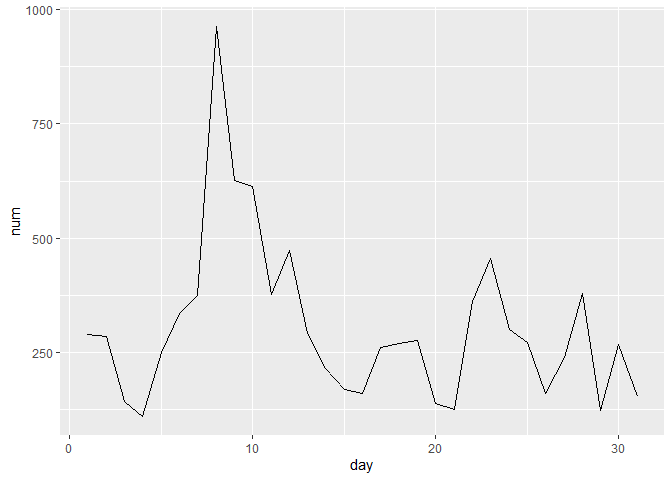
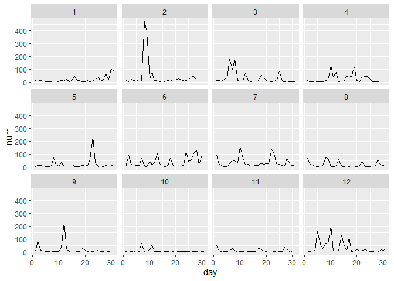
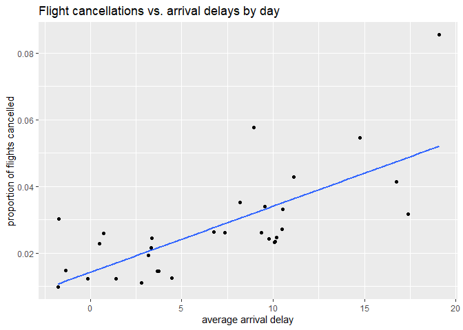

R4DS Study Group - Week 8
================
Pierrette Lo
5/29/2020

  - [This week’s assignment](#this-weeks-assignment)
  - [Ch 5:5 Mutate](#ch-55-mutate)
  - [Ch 5:6 Summarise](#ch-56-summarise)

## This week’s assignment

  - The rest of Chapter 5 (5.5 through 5.7)

<!-- end list -->

``` r
library(tidyverse)
library(nycflights13)
```

## Ch 5:5 Mutate

### Exercises

> 5.  What does 1:3 + 1:10 return? Why?

``` r
1:3 + 1:10
```

    ## Warning in 1:3 + 1:10: longer object length is not a multiple of shorter object
    ## length

    ##  [1]  2  4  6  5  7  9  8 10 12 11

Recall in the text that arithmetic operators (+, -, \*, /, ^) use
“recycling” when applied to vectors.

If one vector is shorter than the other, it will be automatically
restarted and repeated to match the length of the other vector.

1:3 = 1, 2, 3

1:10 = 1, 2, 3, 4, 5, 6, 7, 8, 9, 10

If you’re adding the two vectors with recycling, it will look like this:

1:3 = 1, 2, 3, 1, 2, 3, 1, 2, 3, 1

1:10 = 1, 2, 3, 4, 5, 6, 7, 8, 9, 10

And each element of this pair of vectors will be added.

Note the warning that the length of 1:3 is not a multiple of the length
of 1:10, so 1:3 doesn’t get completely recycled

> 6.  What trigonometric functions does R provide?

There wasn’t an obvious help function, so I googled “R trig functions”
and got
<https://stat.ethz.ch/R-manual/R-devel/library/base/html/Trig.html>

There’s a detailed explanation in the solutions manual:
<https://jrnold.github.io/r4ds-exercise-solutions/transform.html#exercise-5.5.6>

## Ch 5:6 Summarise

### Notes

  - Handle missing values (NA) using the `na.rm = T` argument, or by
    filtering out the rows with NA using `!is.na()`
  - If you’ve been working with grouped data and you start to get some
    weird error messages while trying to do other things with the
    dataset, make sure you didn’t forget to `ungroup()` (a common
    error\!)

### Exercises

> 1.  Brainstorm at least 5 different ways to assess the typical delay
>     characteristics of a group of flights. Consider the following
>     scenarios:
> 
> <!-- end list -->
> 
>   - A flight is 15 minutes early 50% of the time, and 15 minutes late
>     50% of the time.
> 
>   - A flight is always 10 minutes late.
> 
>   - A flight is 30 minutes early 50% of the time, and 30 minutes late
>     50% of the time.
> 
>   - 99% of the time a flight is on time. 1% of the time it’s 2 hours
>     late.
> 
> Which is more important: arrival delay or departure delay?

I wasn’t really sure what this question was asking.

The [solutions
manual](https://jrnold.github.io/r4ds-exercise-solutions/transform.html#exercise-5.6.1)
basically just answered the last part (arrival delay is more important
because it has a greater impact on the rest of the traveler’s day).

The [alternate
guide](https://brshallo.github.io/r4ds_solutions/05-data-transformations.html#grouped-summaries)
went in depth to code each of the scenarios.

I show a possible method to determine scenario \#1 below, but I defined
“a flight” a bit differently than the alternate guide

What constitutes “a flight”? In previous cases, 1 flight = 1
observation, but in this case when you’re looking at whether a flight is
“always” late, it seems like 1 flight = 1 route (i.e. carrier + flight
num + origin + dest). I noticed that some flights have the same number
but different origin/destination, e.g. 9E 2904 JFK-BOS or JFK-DTW.

So I grouped by unique combination of carrier, flight number, origin,
and destination. Then use `mean()` to get proportions (T / T + F)

Scenario 1: A flight is 15 minutes early 50% of the time, and 15 minutes
late 50% of the time.

To find that flight:

``` r
flights %>% 
  group_by(carrier, flight, origin, dest) %>% 
  summarize(n = n(),
            dep_late_prop = mean(dep_delay == 15, na.rm = T),
            arr_early_prop = mean(arr_delay == -15, na.rm = T)) %>%
  filter(arr_early_prop == 0.5 & dep_late_prop == 0.5)
```

    ## # A tibble: 1 x 7
    ## # Groups:   carrier, flight, origin [1]
    ##   carrier flight origin dest      n dep_late_prop arr_early_prop
    ##   <chr>    <int> <chr>  <chr> <int>         <dbl>          <dbl>
    ## 1 UA        1622 EWR    LAX       2           0.5            0.5

Also, what does “late” mean? Arriving or departing?

One last note - many flights arrived late 100% of the time, but most had
only 1 observation per flight, so that info might not be that useful.

``` r
flights %>% 
  group_by(carrier, flight, origin, dest) %>% 
  summarize(n = n(),
            dep_late_prop = mean(dep_delay > 15, na.rm = T),
            arr_late_prop = mean(arr_delay > 15, na.rm = T)) %>%
  arrange(desc(arr_late_prop))
```

    ## # A tibble: 12,075 x 7
    ## # Groups:   carrier, flight, origin [6,872]
    ##    carrier flight origin dest      n dep_late_prop arr_late_prop
    ##    <chr>    <int> <chr>  <chr> <int>         <dbl>         <dbl>
    ##  1 9E        2931 JFK    JAX       1             1             1
    ##  2 9E        3283 LGA    CLT       1             1             1
    ##  3 9E        3284 JFK    ROC       1             1             1
    ##  4 9E        3285 LGA    MSP       1             1             1
    ##  5 9E        3291 JFK    BWI       1             1             1
    ##  6 9E        3291 LGA    CVG       1             1             1
    ##  7 9E        3295 LGA    BNA       1             0             1
    ##  8 9E        3297 LGA    MCI       1             1             1
    ##  9 9E        3305 LGA    BNA       1             1             1
    ## 10 9E        3322 JFK    ORF       1             1             1
    ## # ... with 12,065 more rows

> 2.  Come up with another approach that will give you the same output
>     as `not_cancelled %>% count(dest)` and `not_cancelled %>%
>     count(tailnum, wt = distance)` (without using `count()`).

Here’s the original code for `not_cancelled`:

``` r
not_cancelled <- flights %>% 
  filter(!is.na(dep_delay), !is.na(arr_delay))
```

Original code:

``` r
not_cancelled %>% 
  count(dest)
```

    ## # A tibble: 104 x 2
    ##    dest      n
    ##    <chr> <int>
    ##  1 ABQ     254
    ##  2 ACK     264
    ##  3 ALB     418
    ##  4 ANC       8
    ##  5 ATL   16837
    ##  6 AUS    2411
    ##  7 AVL     261
    ##  8 BDL     412
    ##  9 BGR     358
    ## 10 BHM     269
    ## # ... with 94 more rows

Look at the help for `?count`: `count()` is a “wrapper” (ie. a
convenient shortcut) for `group_by()` + `summarize()` + `ungroup()`.

My version:

``` r
not_cancelled %>% 
  group_by(dest) %>% 
  summarize(num = n()) %>% 
  ungroup()
```

    ## # A tibble: 104 x 2
    ##    dest    num
    ##    <chr> <int>
    ##  1 ABQ     254
    ##  2 ACK     264
    ##  3 ALB     418
    ##  4 ANC       8
    ##  5 ATL   16837
    ##  6 AUS    2411
    ##  7 AVL     261
    ##  8 BDL     412
    ##  9 BGR     358
    ## 10 BHM     269
    ## # ... with 94 more rows

``` r
# OR

not_cancelled %>% 
  group_by(dest) %>% 
  tally()
```

    ## # A tibble: 104 x 2
    ##    dest      n
    ##    <chr> <int>
    ##  1 ABQ     254
    ##  2 ACK     264
    ##  3 ALB     418
    ##  4 ANC       8
    ##  5 ATL   16837
    ##  6 AUS    2411
    ##  7 AVL     261
    ##  8 BDL     412
    ##  9 BGR     358
    ## 10 BHM     269
    ## # ... with 94 more rows

``` r
# count = group_by + tally + ungroup
```

Original code (note that `wt = distance` gives you the sum of distance -
not counts):

``` r
not_cancelled %>% 
  count(tailnum, wt = distance)
```

    ## # A tibble: 4,037 x 2
    ##    tailnum      n
    ##    <chr>    <dbl>
    ##  1 D942DN    3418
    ##  2 N0EGMQ  239143
    ##  3 N10156  109664
    ##  4 N102UW   25722
    ##  5 N103US   24619
    ##  6 N104UW   24616
    ##  7 N10575  139903
    ##  8 N105UW   23618
    ##  9 N107US   21677
    ## 10 N108UW   32070
    ## # ... with 4,027 more rows

My version:

``` r
not_cancelled %>% 
  group_by(tailnum) %>% 
  summarize(total_dist = sum(distance))

# OR

not_cancelled %>% 
  group_by(tailnum) %>% 
  tally(distance)
```

> 3.  Our definition of cancelled flights (`is.na(dep_delay) |
>     is.na(arr_delay)`) is slightly suboptimal. Why? Which is the most
>     important column?

I disagree with the two solutions manuals here - I think `dep_delay` is
the most important to define cancelled flights, because a cancelled
flight will not depart. If you have a flight that didn’t arrive, it
could be because it was diverted or because it crashed (as the solutions
manual points out) - which is not the same as being cancelled.

But if you just want to find flights that were not completed for any
reason, then `arr_delay` is the best choice.

As you can see below, there were 1175 flights that departed but did not
arrive:

``` r
flights %>%
  filter(is.na(dep_delay) | is.na(arr_delay)) %>% 
  count()
```

    ## # A tibble: 1 x 1
    ##       n
    ##   <int>
    ## 1  9430

``` r
# 9430

flights %>%
  filter(is.na(arr_delay)) %>% 
  count()
```

    ## # A tibble: 1 x 1
    ##       n
    ##   <int>
    ## 1  9430

``` r
# 9430

flights %>%
  filter(is.na(dep_delay)) %>% 
  count()
```

    ## # A tibble: 1 x 1
    ##       n
    ##   <int>
    ## 1  8255

``` r
# 8255
```

> 4.  Look at the number of cancelled flights per day. Is there a
>     pattern? Is the proportion of cancelled flights related to the
>     average delay?

Plot the number of cancelled flights by day and look for pattern.

``` r
flights %>% 
  filter(is.na(arr_delay)) %>% 
  group_by(day) %>%
  summarize(num = n()) %>% 
  ggplot(aes(x = day, y = num)) +
  geom_line()
```

<!-- -->

Looks like there are a lot more cancelled flights around the 8th day of
the month - not sure why?

Maybe it’s more helpful to look at month and day:

``` r
flights %>% 
  filter(is.na(arr_delay)) %>% 
  group_by(month, day) %>%
  summarize(num = n()) %>% 
  ggplot(aes(x = day, y = num)) +
  geom_line() +
  facet_wrap(~ month)
```

<!-- -->

I googled Feb 8, 2013 in NYC and found this:
<https://en.wikipedia.org/wiki/Early_February_2013_North_American_blizzard>

Makes sense\!

Cancelled flights vs. average delay:

``` r
flights %>% 
  group_by(day) %>% 
  summarize(prop_cancelled = mean(is.na(arr_delay)),
            avg_arr_delay = mean(arr_delay, na.rm = T)) %>% 
  ggplot(aes(x = avg_arr_delay, y = prop_cancelled)) +
  geom_point() +
  geom_smooth(method = "lm", se = F) +
  labs(x = "average arrival delay",
       y = "proportion of flights cancelled",
       title = "Flight cancellations vs. arrival delays by day")
```

    ## `geom_smooth()` using formula 'y ~ x'

<!-- -->

Looks like a positive association.
